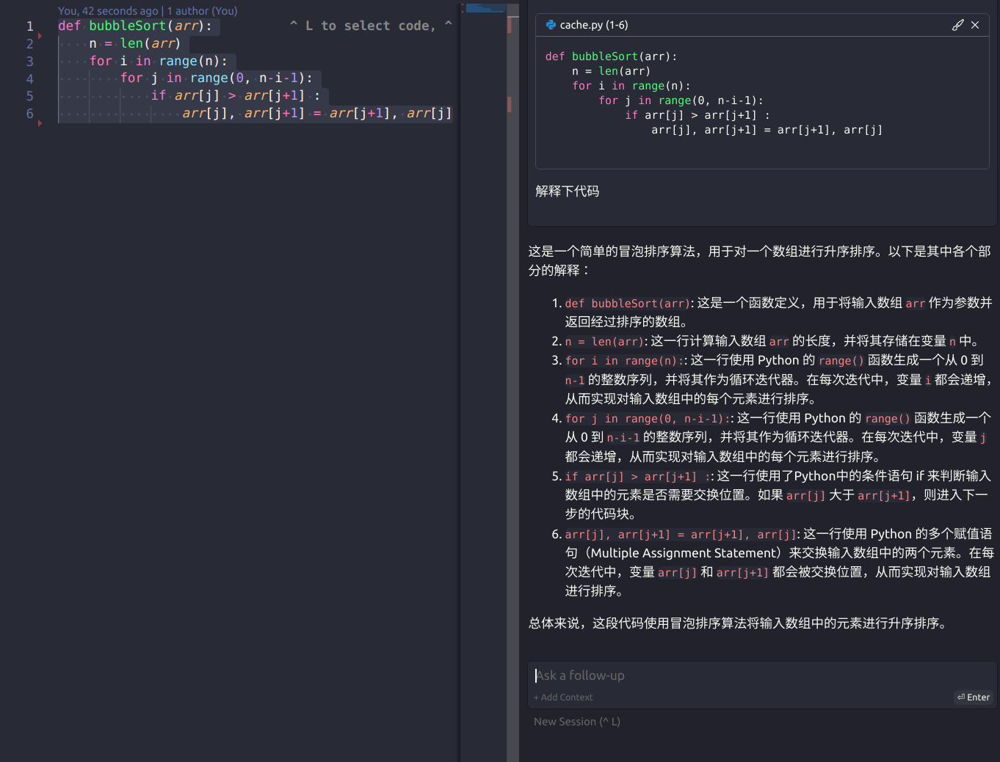
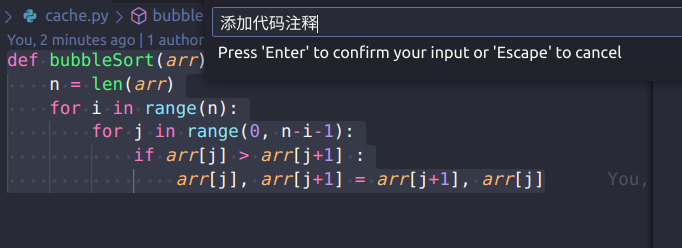
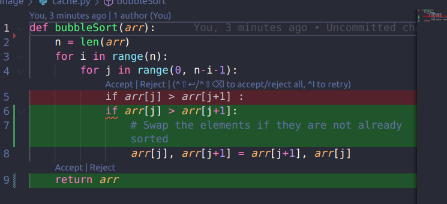

让大模型帮你写代码：[Ollama](https://ollama.com/download) + [Continue](https://github.com/continuedev/continue)。

<!-- more -->


## Ollama

```bash
curl -fsSL https://ollama.com/install.sh | sh
```

我是在服务器上安装的，为了支持远程访问，需要修改下配置文件。

```bash
sudo vim  /etc/systemd/system/ollama.service


[Unit]
Description=Ollama Service
After=network-online.target

[Service]
ExecStart=/usr/local/bin/ollama serve
User=ollama
Group=ollama
Restart=always
RestartSec=3
# 添加下面两行
Environment="OLLAMA_HOST=0.0.0.0"
Environment="OLLAMA_ORIGINS=*"

# Environment="OLLAMA_MODELS=/data/ollama/.ollama/models"

[Install]
WantedBy=default.target

```


ollama所有可用模型：https://ollama.com/library

```bash
# 重启服务
sudo systemctl daemon-reload
sudo systemctl restart ollama

# 下载模型
ollama run codellama:13b
```


## Continue

1. 在vscode的插件库上安装Continue插件。

2. 在`config.json`中添加模型配置文件。

   如果使用本地模型，可以注释掉`"apiBase": "http://your_server_ip:11434"`。

   ```bash
   "models": [
       {
         "title": "Codellama 7b",
         "provider": "ollama",
         "model": "codellama:7b",
         "apiBase": "http://your_server_ip:11434"
       },
       {
         "title": "Codellama 13b",
         "provider": "ollama",
         "model": "codellama:13b",
         "apiBase": "http://your_server_ip:11434"
       },
       {
         "title": "Codellama 34b",
         "provider": "ollama",
         "model": "codellama:34b",
         "apiBase": "http://your_server_ip:11434"
       },
       {
         "title": "Llama2 7b",
         "provider": "ollama",
         "model": "llama2:7b",
         "apiBase": "http://your_server_ip:11434"
       },
       {
         "title": "Llama2 13b",
         "provider": "ollama",
         "model": "llama2:13b",
         "apiBase": "http://your_server_ip:11434"
       },
       {
         "title": "Llama2 70b",
         "provider": "ollama",
         "model": "llama2:70b",
         "apiBase": "http://your_server_ip:11434"
       }
     ],
   ```

   

## 效果

1. `Ctrl + L`选中代码，弹出聊天窗口，可以直接询问LLM，例如编写单元测试，检查bug。

   

2. `Ctrl + I`插入代码，弹出`prompt`输入框，根据需求生成代码。

   



