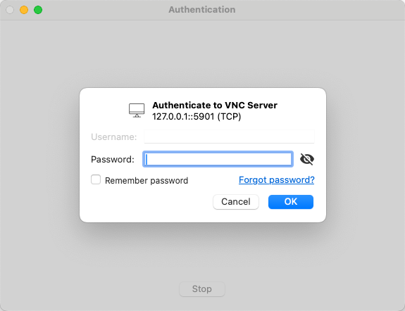
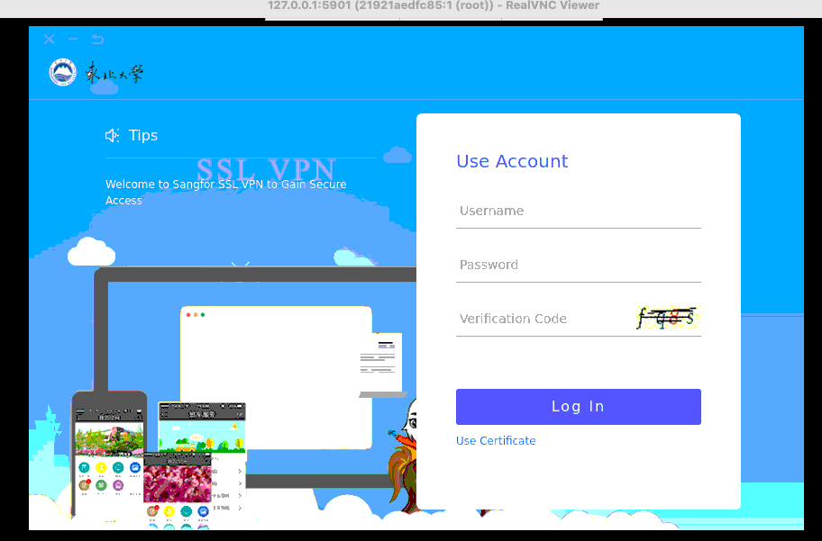

...

<!-- more -->


> EasyConnect的毒瘤行为

- 代理所有系统流量
- 安装自己的 CA 根证书
- 开机自启进程（EasyMonitor）：root 帐号启动，理论可以监听电脑所有行为，无法关闭，否则不能使用vpn服务。


## 清除EasyConnect (macOS)

1. 使用 `sudo su` 获取管理员权限；

2. 删除

   ```bash
   rm /Library/LaunchDaemons/com.sangfor.EasyMonitor.plist
   rm /Library/LaunchAgents/com.sangfor.ECAgentProxy.plist
   ```

3. 重新启动 Mac；

4. 打开钥匙串，删除系统钥匙串-系统-证书下面的证书（关键词 sangfor）。

> 注意一定要 *先重启Mac再删除证书* ，因为在后台的 EasyMonitor 进程会在证书被删除后自动导入。


## 方案1: 使用脚本管理

如果想继续使用EasyConnect在本地进行VPN服务，可以使用下面两个脚本：

**startEasyConnect.sh**

```bash
#! /bin/bash

/Applications/EasyConnect.app/Contents/Resources/bin/EasyMonitor > /dev/null 2>&1 &
/Applications/EasyConnect.app/Contents/MacOS/EasyConnect > /dev/null 2>&1 &
```


**killEasyMonitor.sh**

```bash
#! /bin/bash

pkill EasyMonitor
pkill ECAgent
pkill ECAgentProxy
```


```bash
chmod +x startEasyConnect.sh
chmod +x killEasyMonitor.sh
```


## 方案2: 使用Docker管理(推荐)


> 开启docker服务

```bash
mkdir -p ~/.config/ecdata

docker run \
    --device /dev/net/tun \
    --cap-add NET_ADMIN \
    -d \
    --restart always \
    -e PASSWORD=ecconnect \
    -e URLWIN=1 \
    -v ~/.config/ecdata:/root \
    -p 5901:5901 \
    -p 1080:1080 \
    -p 8888:8888 \
    hagb/docker-easyconnect:7.6.7
```


> 使用RealVNC连接

ip: `127.0.0.1:5901`, passed: `ecconnect`.







> Clash代理配置

```bash
- name: 'NEU-campus#🏫'
	type: http
  port: 8888
  # type: socks5
  # port: 1080
  server: 127.0.0.1


- IP-CIDR,118.202.20.98/32,NEU-campus#🏫
- IP-CIDR,210.30.200.57/32,NEU-campus#🏫
- IP-CIDR,219.216.64.197/32,NEU-campus#🏫
- IP-CIDR,202.118.8.24/32,NEU-campus#🏫
# - DOMAIN-SUFFIX,neu.edu.cn,NEU-campus#🏫
```


> Reference

[解决EasyConnect的毒瘤行为](https://vccv.cc/article/docker-easyconnect.html)

[用docker封印EasyConnect并连接远程桌面和数据库](https://jortana.top/2021/07/13/%E7%94%A8docker%E5%B0%81%E5%8D%B0EasyConnect%E5%B9%B6%E8%BF%9E%E6%8E%A5%E8%BF%9C%E7%A8%8B%E6%A1%8C%E9%9D%A2%E5%92%8C%E6%95%B0%E6%8D%AE%E5%BA%93/)

[封印 Easyconnect](https://blog.ning.moe/posts/fuck-easyconnect/)

[使用 Docker 封印 EasyConnect](https://taoshu.in/easyconnect-in-docker.html#google_vignette)


