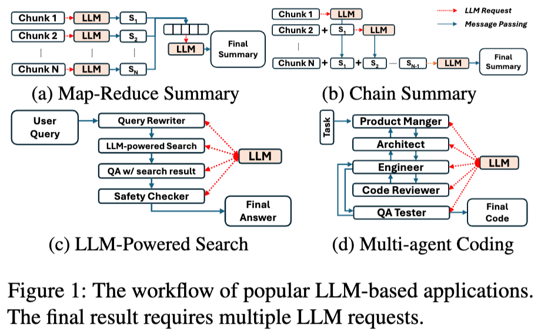

记录一些LLM推理优化相关的论文

<!-- more -->

## [Parrot'OSDI24]

Parrot: Efficient Serving of LLM-based Applications with Semantic Variable. [pdf](https://www.usenix.org/system/files/osdi24-lin-chaofan.pdf) [code](https://github.com/microsoft/ParrotServe) [author](https://chaofanlin.com/)

Parrot这篇论文的主要贡献是提出了**一个全新的推理workload：LLM Applications**。

LLM Application是使用LLM来完成特定的任务（摘要，搜索，代码助手等），在一个应用中通常包含多个LLM请求。

以往推理优化系统是**request-centric**，即对用户的应用是透明的，“一视同仁”的处理用户的请求，缺少**application-level**的信息。

在LLM Application中，请求具有以下特点：

1. 多个连续的LLM请求可能存在**依赖关系**。
2. 即使在单个应用中，LLM请求可能具有不同的**调度偏好**。
3. LLM的请求之前存在大量的**相似性**。

由于缺少application-level的信息，现有的推理优化主要有两个问题：

1. 网络通信开销。
2. 任务调度等待开销。

Parrot设计了一个Semantic Variables的编程抽象，用来将用户的执行逻辑暴露给推理服务端。

基于这个Semantic Variables可以获取到应用内的LLM请求的调用依赖关系，进而做一些系统上的优化，包括DAG-based analysis，Performance Objective Deduction，Application-Centric Scheduling等。

