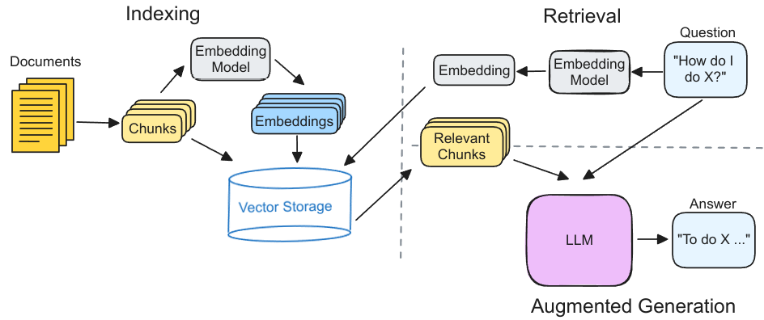
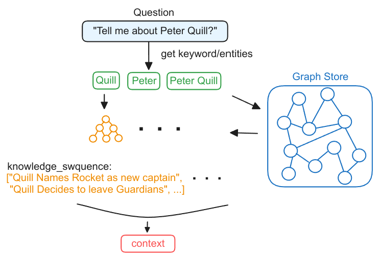
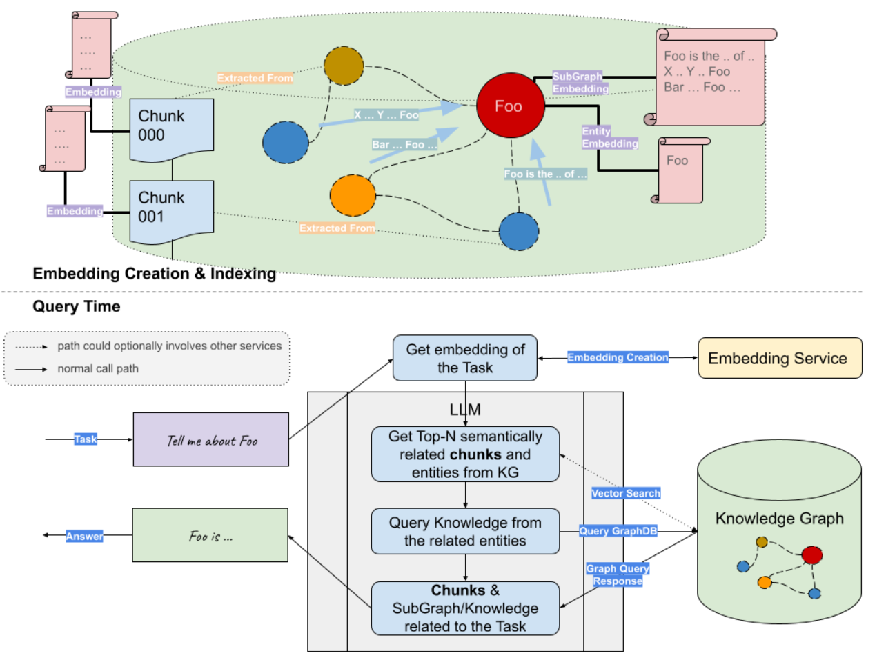

什么是RAG？RAG的研究现状如何？ 这篇博客介绍了RAG的相关知识以及存在的问题。

<!-- more -->

1. RAG的背景：介绍下LLM的背景知识。存在那些问题？
2. RAG是什么？RAG如何解决LLM的问题的？
3. RAG的研究现状？RAG还存在那些问题？

## 背景

> 什么是LLM？

大语言模型（Large Language Model，LLM）是基于海量数据集进行预训练的超大规模的深度学习模型。OpenAI发布的ChatGPT使人们意识到，具有足够的训练数据和巨大的参数的神经网络模型可以捕获人类语言的大部分语法和语义。此外LLM具有一定的常识，通过训练可以基础大量的事实。LLM具有很多的实际应用，例如文案写作，知识问答，文本分类，代码生成，文本生成等。虽然LLM在很多领域具有出色的表现，但是它面临诸如幻觉，过时的知识，缺乏可解释性等挑战。

> 什么是RAG？

检索增强生成（Retrieval Augmented Generation，RAG），RAG通过外挂知识库的方式可以有效缓解LLM的问题。

图1是RAG的执行流程，分为索引，检索和增强生成三个部分。

1. 索引：对外部知识库进行向量索引，用于后续检索。首先，将文档划分为多个文本块（chunk）。每个文本块通过嵌入模型得到对应的向量表示，然后存储这些文本块和向量到向量数据库中。
2. 检索：首先，用户输入的问题经过相同的嵌入模型得到向量表示。然后，向量数据库查找K个相似的向量并返回对应的文本块。
3. 增强生成：检索得到的文本块和用户的问题一起发送到大模型，以生成最终的答案。

## 研究现状

### Graph RAG

在介绍Graph RAG之前，先总结下传统向量RAG存在的问题：

1. 由于信息分散导致的检索不完整性。
2. 由于语义导致的不准确性。

举个具体的例子，例如我们基于《乔布斯自传》来回答用户的问题。与用户问题相关的文本块可能有30个，而且它们分散的存储在书中的不同位置。此时，如果只取top K个片段很难得到这种分散，细粒度的完整信息。而且这种方法容易一楼相互关联的文本块，从而导致检索信息的不完整。

另外，基于嵌入的语义搜索存在不准确的问题，例如“保温杯”和“保温大棚”，这两个关键词在语义空间上存在很大的相似性，然而在真实的场景中，我们并不希望这种通用语义下的相关性出现，进而作为错误的上下文而引入”幻觉“。

Graph RAG是一种使用知识图谱（Knowledge Graph，KG）来组织外部数据的RAG。与向量RAG相比，Graph RAG具有更加细粒度的知识形式，而且，通过在图上查询目标实体的多跳邻居，可以查询相互关联的信息，即使他们不在同一个文本块内部。

Graph RAG的执行过程可以简单概括为以下三步：

- 从问题中提取实体
- 从知识图谱中检索得到子图
- 根据子图构造上下文

图3是Graph和Vector联合RAG的流程图。首先对外部的文档构建索引（向量索引和KG索引），用户后续的数据检索。当用户提交一个问题的查询时，首先通过嵌入模型对用户的问题生成向量表示，然后分别从向量数据库中检索语义相关的文本块；从知识图谱数据库中检索相关的实体，然后遍历得到实体相关的查询子图。最后将向量检索得到的文本块和知识图谱检索得到的查询子图，联合问题一起输入到LLM生成问题的回答。

Graph RAG可以看作是对已有方法的额外扩展。通过将知识图谱引入到RAG中，Graph RAG可以利用现有或者新建的知识图谱，提取细粒度，领域特定且相互关联的知识。

## 参考文献

1. [Retrieval-Augmented Generation for Large Language Models: A Survey](https://arxiv.org/abs/2312.10997)

2. [Graph_RAG_LlamaIndex_Workshop.ipynb](https://colab.research.google.com/drive/1tLjOg2ZQuIClfuWrAC2LdiZHCov8oUbs?usp=sharing#scrollTo=Q4QMkKKTumXn)

   - KG gets Fine-grained Segmentation of info. with the nature of interconnection/global-context-retained, it helps when retriving spread yet important knowledge pieces.

   - Hallucination due to w/ relationship in literal/common sense, but should not be connected in domain Knowledge

3. [Custom Index combining KG Index and VectorStore Index](https://siwei.io/graph-enabled-llama-index/kg_and_vector_RAG.html)

   - Not all cases are advantageous, many other questions do not contain small-grained pieces of knowledges in chunks. In these cases, the extra Knowledge Graph retriever may not that helpful. 
