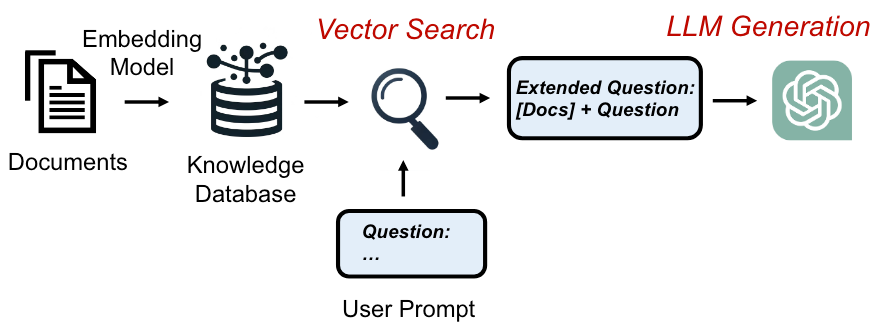
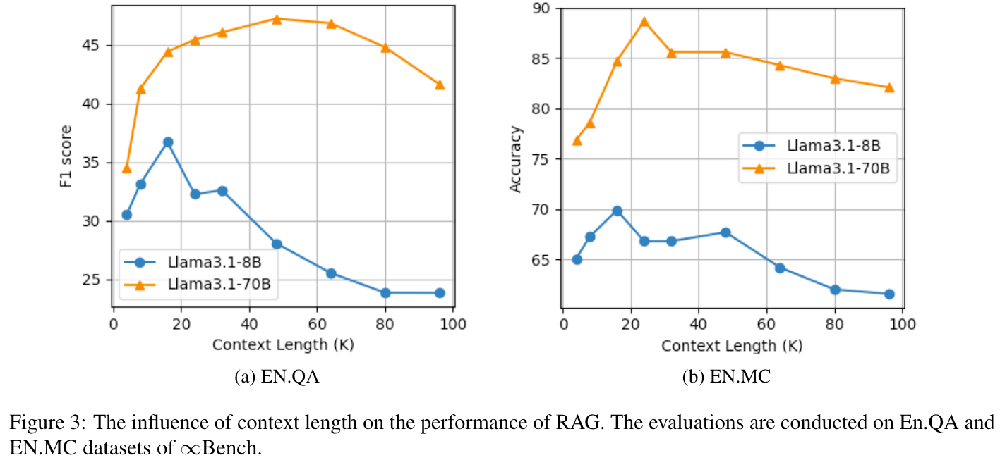

RAG是什么？目前的研究现状如何？

<!-- more -->

## RAG介绍

> 什么是LLM？

大语言模型（Large Language Model，LLM）是基于海量数据集进行预训练的超大规模的深度学习模型。OpenAI发布的ChatGPT使人们意识到，具有**足够的训练数据**和**巨大的参数**的神经网络模型可以捕获人类语言的大部分语法和语义。得益于与LLM出色的语言理解能力，LLM被广泛的应用于各种下游任务，例如文案写作，知识问答，文本分类，代码生成，文本生成等。虽然LLM在很多领域具有出色的表现，但是它面临诸如**幻觉**，**过时的知识**，**缺乏可解释性**等挑战。

> RAG的执行流程

检索增强生成（Retrieval Augmented Generation，RAG）包含检索和生成两部分。如图1所示，在处理用户请求之前，RAG系统首先对外部数据（文档，语音，视频等非结构化数据）进行预处理（生成向量等），并存储到知识数据库中以供后续检索使用。当接收到用户的请求时，RAG系统首先从知识数据库中检索与问题相关的知识，然后将检索得到的知识和用户的问题一起输入到LLM，生成最终的答案。通过外挂知识库的方法，RAG一定程度缓解了LLM的幻觉，时效性差，和不可解释等问题。

目前的RAG形态主要分为VectorRAG和GraphRAG两种。

> VectorRAG

**VectorRAG使用向量来组织外部的知识**。如图2所示，VectorRAG首先将文档划分为多个文本块（chunk）。每个文本块通过嵌入模型得到对应的向量表示，然后存储到向量数据库中。对于用的的请求，VectorRAG对用户的问题生成嵌入向量。然后，从向量数据库检索与问题嵌入向量相似的向量并返回对应的文本块。

VectorRAG的优点是：（1）检索速度快。（2）丰富的上下文语义信息。

VectorRAG的缺点是：（1）由于信息分散导致的检索不完整性。（2）由于语义导致的不准确性。

举个具体的例子，例如我们基于《乔布斯自传》来回答用户的问题。与用户问题相关的文本块可能有30个，而且它们分散的存储在书中的不同位置。此时，如果只取top K个片段很难得到这种分散，细粒度的完整信息。而且这种方法容易一楼相互关联的文本块，从而导致检索信息的不完整。

另外，基于嵌入的语义搜索存在不准确的问题，例如“保温杯”和“保温大棚”，这两个关键词在语义空间上存在很大的相似性，然而在真实的场景中，我们并不希望这种通用语义下的相关性出现，进而作为错误的上下文而引入”幻觉“。

> GraphRAG

**==重新整理==**

GraphRAG是一种使用知识图谱（Knowledge Graph，KG）来组织外部数据的RAG。与向量RAG相比，GraphRAG具有更加细粒度的知识形式，而且，通过在图上查询目标实体的多跳邻居，可以查询相互关联的信息，即使他们不在同一个文本块内部。

GraphRAG的执行过程可以简单概括为以下三步：

- 从问题中提取实体
- 从知识图谱中检索得到子图
- 根据子图构造上下文

图3是Graph和Vector联合RAG的流程图。首先对外部的文档构建索引（向量索引和KG索引），用户后续的数据检索。当用户提交一个问题的查询时，首先通过嵌入模型对用户的问题生成向量表示，然后分别从向量数据库中检索语义相关的文本块；从知识图谱数据库中检索相关的实体，然后遍历得到实体相关的查询子图。最后将向量检索得到的文本块和知识图谱检索得到的查询子图，联合问题一起输入到LLM生成问题的回答。

GraphRAG可以看作是对已有方法的额外扩展。通过将知识图谱引入到RAG中，GraphRAG可以利用现有或者新建的知识图谱，提取细粒度，领域特定且相互关联的知识。

## 研究现状

**==想个分类==**

#### OP-RAG [arixv'24]

[paper](https://arxiv.org/pdf/2409.01666)

这篇论文讨论了RAG在Long-context LLM下是否还是有必要存在的问题？

结论是：Long-context LLM可能会导致对相关信息的关注减少，从而可能降低问答任务中的答案质量。因此RAG还是有必要存在的，通过使用RAG可以有效的输入文本的长度，同时可以获取更高的准确率。

在上下文限制的LLM中，使用RAG可以有效的减少输入大模型的文本长度，然后模型回答的准确率就取决于检索的性能。最近出现了很多Long-context的LLM模型，例如GPT-4o，Claudi-3.5，Llama3.1，Phi-3，Mistral-Large2具有128K的上下文长度，Gemini-1.5-pro甚至达到了1M的上下文窗口大小。因此这里有个问题：在Long-context LLM下，是否还有必要使用RAG？

作者通过实验，对比了RAG在不同上下问长度下的性能。实验结果表明：**随着上下文的增加，RAG性能先上升后下降。**这是因为更多的上下文可能有更大的机会覆盖相关的块。然而，随着上下文长度进一步增加，答案质量会下降，因为更多不相关的块被用作干扰。

另外本文提出了一种保留检索文档原始顺序的方法，order-preserve RAG (OP-RAG)，通过实验发现可以有效的提高准确率。（没有提供insight和分析）。

### Evaluation

#### RGB [AAAI'24]

[paper](https://arxiv.org/pdf/2309.01431.pdf)  [code](https://github.com/chen700564/RGB)

RGB是针对QA场景下的RAG benchmark工作，主要贡献如下：

1. 构建了一个中英文的RAG benchmark。
2. 从以下四个方面对RAG进行了评估，分析总结了LLM和RAG的局限性和缺点。
   - Noise Robustness，表示LLM可以从噪声文档中提取有用的信息。其中噪声文档，是语文题相关但是不包含答案相关的信息。
   - Negative Rejection，表示如果检索的文档不包含与答案相关的信息，LLM应该拒绝回答。
   - information Integration，表示LMM是否可以回答需要整合多个文档信息的复杂问题。
   - Counterfactual Robustness，表示当LLM通过prompt警告检索的信息可能包含事实错误的信息时，LLM可以识别文档中的事实错误。

> 数据集构造

1. QA instances generation，收集最新的新闻文章，然后使用ChatGPT对每个文章生成 (events, questions, and answers)。通过人工检查答案的正确性，并过滤掉一些无法从搜索引擎检索得到的数据。

2. Retrieve using search engine，对于每个问题，使用Google的API获取10个相关的网页，然后提取出相关的文档快。每个文档快包含300个token，使用`dense retrieval model`([m3e-base](https://huggingface.co/moka-ai/m3e-base)，[all-mpnet-base-v2](https://huggingface.co/sentence-transformers/all-mpnet-base-v2)) 选择top-30的文本块。这些文本被分为positive documents and negative documents。

3. Testbeds construction for each ability

   - noise robustness，根据比例采样不同数量的negative documents。

   - negative rejection，只从negative documents中采样外部文档。

   - information integration，对问题进行expanding或者rewriting，使得问题的答案包含多个文档的信息。

     例如："Who won the MVP of Super Bowl 2023?" can be rewrite as "Who won the MVPs of Super Bowl 2022 and 2023?"

   - counterfactual robustness，利用LLM内部的知识生成问题的答案，然后检索出相关的文档，手动修改文档中的信息。

> 评估的metrics

1. Accuracy ，用来评估noise robustness and information integration。生成的回答是否和标准答案一样。
2. Rejection rate，评估negative rejection。当只提供negative documents，LLM应该输出"I can not answer the question because of the insufficient information in documents."。
3. Error detection rate，评估counterfactual robustness。当提供的文档包含错误的事实，LLM应该输出”There are factual errors in the provided documents.“。
4. Error correction rate，评估LLM在识别出检索文档的事实错误后，是否可以回答出正确的答案。

> 实验结果

1. RAG的性能随着噪声比例上升严重下降。存在以下问题：
   - Long-distance information
   - Evidence uncertainty
   - Concept confusion.
2. RAG很容易受到噪音信息的干扰，Negative Rejection很低。
3. RAG在information  integration上表现不佳，存在以下问提：
   - Merging Error，成功识别了两个问题，但是在合并答案出错。
   - Ignoring Error，没有正确识别两个问题，只回答了一个答案。
   - Misalignment Error，两个问题的答案混淆。
4. RAG基本没有识别事实错误的能力，因为这个RAG的基本假设冲突（模型缺乏信息，从外部检索相关信息），现有的LLM缺乏对错误信息的识别能力，严重依赖检索的信息。

## 参考文献

1. [Retrieval-Augmented Generation for Large Language Models: A Survey](https://arxiv.org/abs/2312.10997)

2. [Graph_RAG_LlamaIndex_Workshop.ipynb](https://colab.research.google.com/drive/1tLjOg2ZQuIClfuWrAC2LdiZHCov8oUbs?usp=sharing#scrollTo=Q4QMkKKTumXn)

   - KG gets Fine-grained Segmentation of info. with the nature of interconnection/global-context-retained, it helps when retriving spread yet important knowledge pieces.

   - Hallucination due to w/ relationship in literal/common sense, but should not be connected in domain Knowledge

3. [Custom Index combining KG Index and VectorStore Index](https://siwei.io/graph-enabled-llama-index/kg_and_vector_RAG.html)

   - Not all cases are advantageous, many other questions do not contain small-grained pieces of knowledges in chunks. In these cases, the extra Knowledge Graph retriever may not that helpful. 
