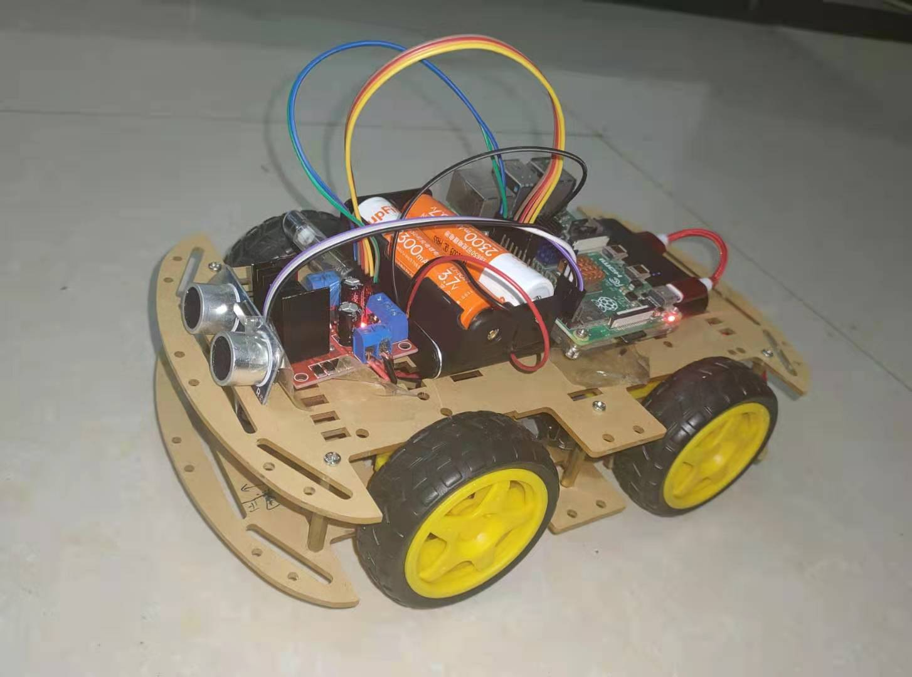
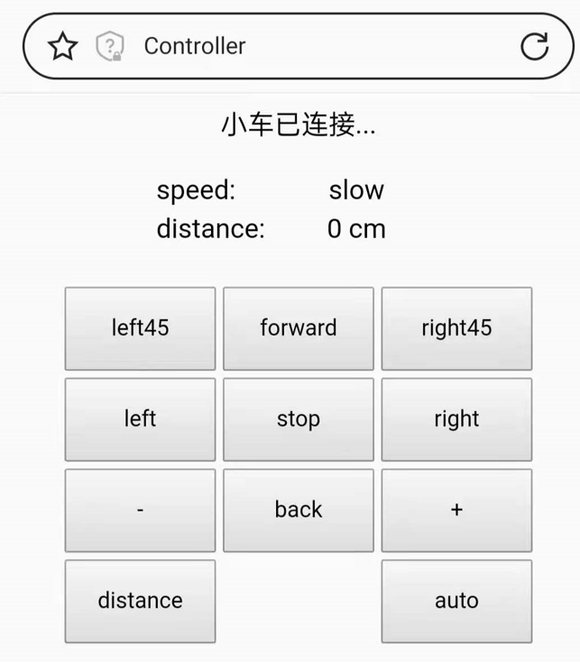
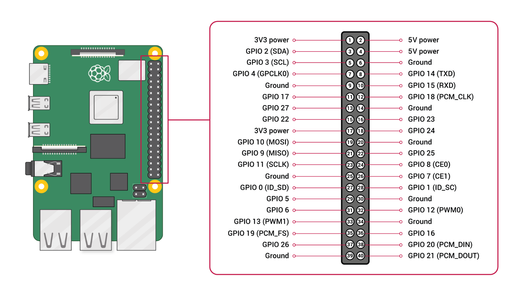
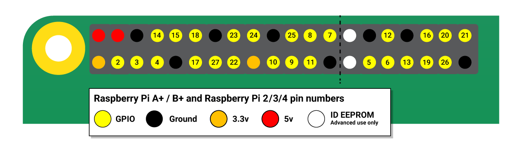
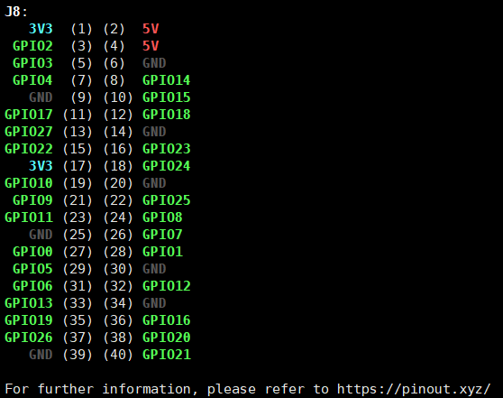
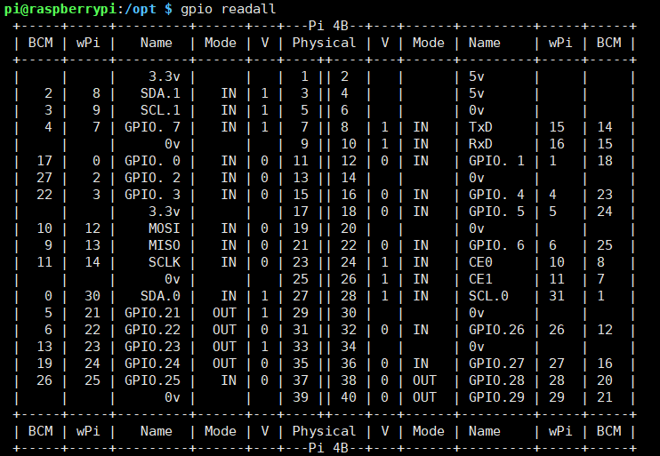
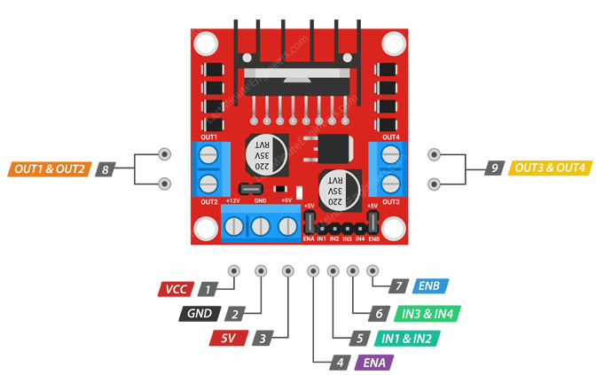
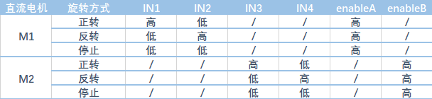
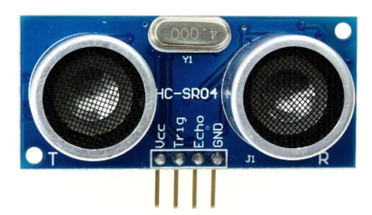

树莓派防吃灰玩具

<!-- more -->


代码地址：[github.com/Sanzo00/pi-car](https://github.com/Sanzo00/pi-car)

树莓派配置：[sanzo.top/RaspberryPi/raspi-setup](https://sanzo.top/RaspberryPi/raspi-setup)



## 功能展示

### 远程控制小车


### PWM变速

小车在低电压情况下跑的比较慢，因此增加变速的功能。




### 超声波自动避障

这里使用超声波测距模块（HC-SR04）实现距离检测，在此基础上实现一个简单的自动避障逻辑。


## GPIO





### pinout

```bash
sudo apt install python3-gpiozero
pinout
```





### gpio readall

```
wget https://project-downloads.drogon.net/wiringpi-latest.deb
sudo dpkg -i wiringpi-latest.deb
```




## 材料与安装

| 名称              | 数量 | 规格                         |
| ----------------- | ---- | ---------------------------- |
| 树莓派4B          | 1    | 4G                           |
| L298N电机驱动模块 | 1    |                              |
| 直流减速电机      | 4    | 工作电压：3-6V，减速比：1:48 |
| 神火18650         | 2    | 3.7V                         |
| 充电宝            | 1    | 5V3A                         |
| HC-SR04           | 1    | 2cm-400cm                    |


### L298N





> 接线

这里使用树莓派的GPIO的BCM编号。

IN1、IN2、IN3、IN4分别接到树莓派的5、6、13、19上。

ENA、ENB接到树莓派的20、21。


### HC-SR04



> 测距原理

将Trig置为高电平10us，HC-SR04发送8个40khz的方波，并检测是否有信号返回，此时Echo为高电平，若有信号返回，Echo自动置为低电平，Echo高电平持续的时间既是超声波从发射到返回的时间，最后利用声波公式计算距离$dis = \frac{time\space \times \space 340m/s}{2}$。


> 接线

VCC接树莓派或L298N的5V电源。

GND接树莓派GND。

Echo、Trig接树莓派GPIO 14、15。


### 电源

树莓派和L298N都单独供电，树莓派使用的是5V3A的充电宝供电，L298N使用电池盒供电。

电池盒的正极和负极，分别接到L298N的+12V、GND。

因为都是单独供电，所以将L298N的GND和树莓派的GND相互连接，这样方便同步逻辑信号。

HC-SR04使用树莓派的5V电源。


<!-- Q.E.D. -->
