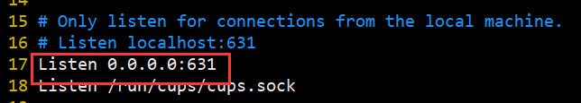
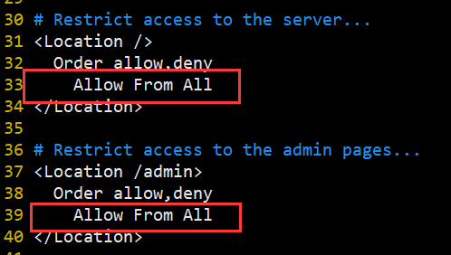
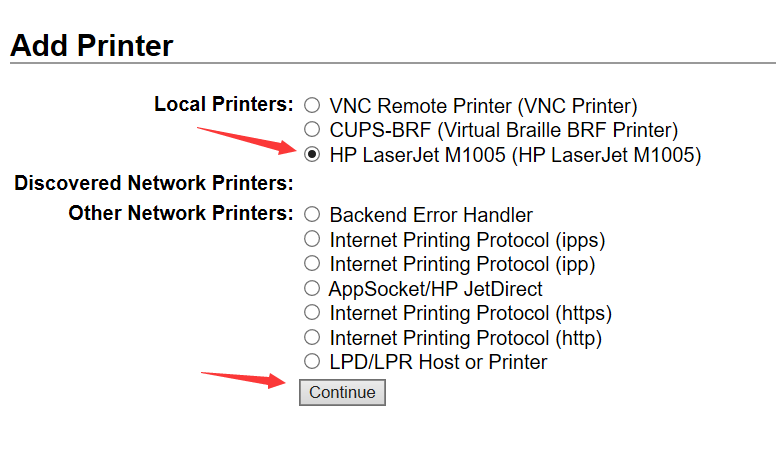
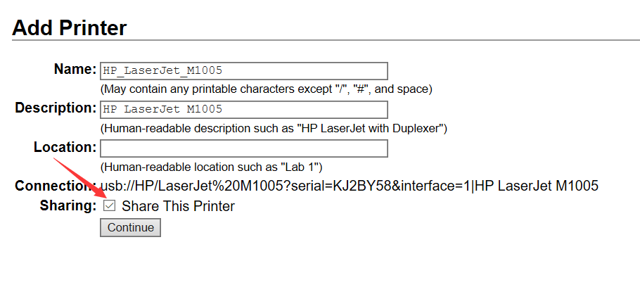
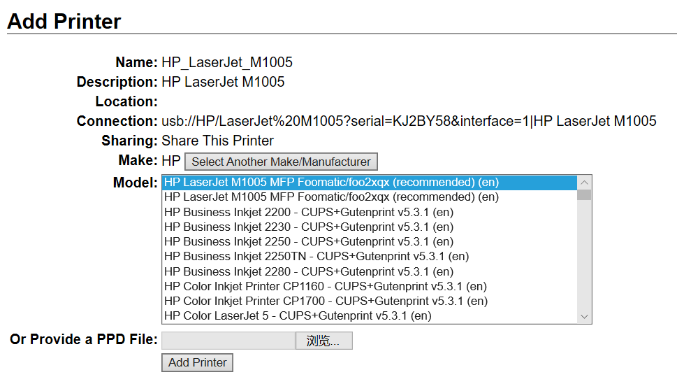
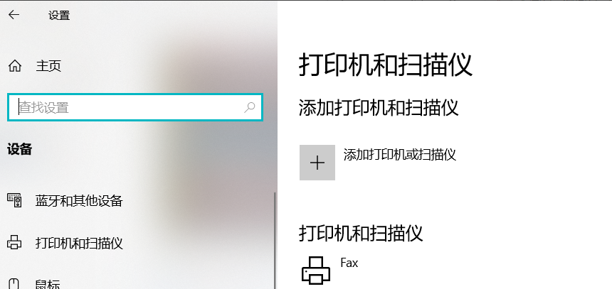
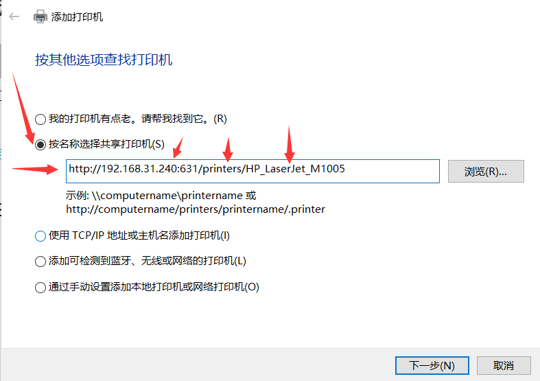
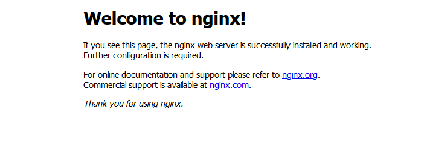
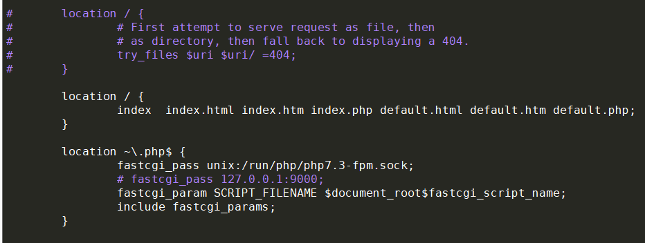
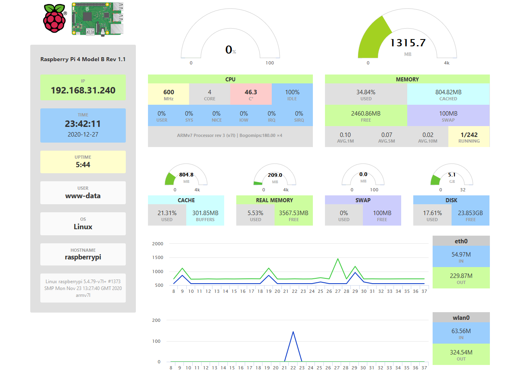

树莓派新机配置

<!-- more -->

---

## 镜像

Ubuntu：https://ubuntu.com/download/raspberry-pi

Pi OS：https://www.raspberrypi.com/software/operating-systems

balena：https://www.balena.io/etcher


## 更新源

```bash
sudo vim /etc/apt/sources.list

deb http://mirrors.tuna.tsinghua.edu.cn/raspbian/raspbian/ buster main non-free contrib rpi
deb-src http://mirrors.tuna.tsinghua.edu.cn/raspbian/raspbian/ buster main non-free contrib rpi


sudo vim /etc/apt/sources.list.d/raspi.list
deb http://mirrors.tuna.tsinghua.edu.cn/raspberrypi/ buster main ui
```


## 修改时区

Asia => Shanghai

```bash
sudo dpkg-reconfigure tzdata
```


## vim配置

http://sanzo.top/Default/vim

```bash
set expandtab
set softtabstop=2
set autoindent
set tabstop=2
set shiftwidth=2
set nu
syntax on

noremap H ^
noremap L $
noremap J G
noremap K gg
nnoremap < <<
nnoremap > >>
```


## 静态IP

`sudo nano /etc/dhcpcd.conf`

```bash
interface eth0
static ip_address=192.168.31.240/24
static routers=192.168.31.1
static domain_name_servers=192.168.31.1

interface wlan0
static ip_address=192.168.31.242/24
static routers=192.168.31.1
static domain_name_servers=192.168.31.1
```

`sudo reboot`


## 安装包

```bash
sudo apt install -y lrzsz git proxychains libboost-all-dev samba samba-common aria2 cmake
```


## proxychains

```bash
sudo vim /etc/proxychains.conf 
最后一行改为对应自己的端口
# socks5    127.0.0.1 9050
socks5    127.0.0.1 10800
```


## v2ray

[v2ray下载地址安装包](https://github.com/v2fly/v2ray-core/releases/)

[config.json格式](https://github.com/Sanzo00/files/blob/master/other/v2ray.json)


脚本下载：

```bash
# auto install
wget https://raw.githubusercontent.com/v2fly/fhs-install-v2ray/master/install-release.sh
sudo bash install-release.sh 
# sudo bash install-release.sh --local v2ray-linux-64.zip

sudo vim /usr/local/etc/v2ray/config.json

# 启动服务
sudo systemctl enable v2ray
sudo systemctl start v2ray
```


安装包下载：

```bash
unzip v2ray-linux-arm64-v8a.zip

# sudo vim /usr/lib/systemd/system/v2ray.service
[Unit]
Description=V2Ray Service
Documentation=https://www.v2fly.org/
After=network.target nss-lookup.target

[Service]
User=nobody
CapabilityBoundingSet=CAP_NET_ADMIN CAP_NET_BIND_SERVICE
AmbientCapabilities=CAP_NET_ADMIN CAP_NET_BIND_SERVICE
NoNewPrivileges=true
ExecStart=/home/ubuntu/software/v2ray/v2ray run -config /home/ubuntu/software/v2ray/config.json
Restart=on-failure
RestartPreventExitStatus=23

[Install]
WantedBy=multi-user.target


# 启动服务
sudo systemctl daemon-reload
sudo systemctl enable v2ray
sudo systemctl start v2ray
```


终端代理设置：

```bash
export ALL_PROXY="socks5://127.0.0.1:7890"
export all_proxy="socks5://127.0.0.1:7890"
export http_proxy="http://127.0.0.1:7890"
export https_proxy="http://127.0.0.1:7890"
```


## zsh

https://sanzo.top/Linux/zsh/


## git

```bash
# 设置账号信息
git config --global user.email "arrangeman@163.com"
git config --global user.name "Sanzo00"

# 生成公钥和私钥
ssh-keygen -t rsa -C "your_email@example.com"

# 将公钥放到github中
vim .ssh/id_rsa.pub 
```


## Docker

```bash
# install
curl -fsSL get.docker.com -o get-docker.sh
sudo sh get-docker.sh --mirror Aliyun

# docker setup
sudo systemctl enable docker
sudo systemctl start docker

# add $USER to docker groups
sudo groupadd docker
sudo usermod -aG docker $USER

# test docker
docker run --rm hello-world
```

> support ipv6

https://www.rectcircle.cn/posts/docker-ipv6/#%E8%87%AA%E5%AE%9A%E4%B9%89%E7%BD%91%E7%BB%9C%E6%94%AF%E6%8C%81-ipv6

```bash
# start ipv6 nat
docker run -d --name ipv6nat --privileged --network host --restart always -v /var/run/docker.sock:/var/run/docker.sock:ro -v /lib/modules:/lib/modules:ro robbertkl/ipv6nat

# create ipv6 network
docker network create my-net-ipv6 --ipv6 --subnet="fd00:1::1/80" --gateway="fd00:1::1"

# run docker image with --network my-net-ipv6

```


## 打印机

### docker安装

```bash
# docker install
# https://yeasy.gitbook.io/docker_practice/install/raspberry-pi
docker pull tigerj/cups-airprint

docker run -d --restart=always --name=cups --net=host -v /var/run/dbus:/var/run/dbus --device /dev/bus -e CUPSADMIN="ubuntu" -e CUPSPASSWORD="ubuntu@print" tigerj/cups-airprint
```


### 手动安装

> 安装CUPS

```bash
# 安装CUPS
sudo proxychains apt install cups

# 修改配置文件
sudo vim /etc/cups/cupsd.conf
```





```bash
# 重启服务
sudo service cups restart
```


> 安装打印机驱动

```bash
# 下载安装打印机驱动
wget -O foo2zjs.tar.gz http://foo2zjs.rkkda.com/foo2zjs.tar.gz

tar -xzvf foo2zjs.tar.gz

cd foo2zjs

# 安装ghostscript依赖
sudo apt install ghostscript
sudo apt install dc

# 编译
make -j10

# 安装
sudo make install
```

浏览器访问cups的配置页面[http://192.168.31.240:631](http://192.168.31.240:631/)，添加对应的打印机。

记得要连接上打印机，而且要用root账号登录。







> Windows添加打印机




https://192.168.31.240:631/printers/HP_LaserJet_M1005




mac：https://support.apple.com/kb/DL1888?viewlocale=en_US&locale=en_US

## 挂载硬盘

```bash
# 查看所用分区
sudo fdisk -l

# 修改配置文件
sudo vim /etc/fstab

# 在末尾添加
/dev/sda1 /home/pi/sanzo ntfs defaults 0 0

# 创建对应文件夹
mkdir /home/pi/sanzo

# 重新挂载
sudo mount -a
```


## Samba

```bash
# 安装samba
sudo apt install samba samba-common

sudo vim /etc/samba/smb.conf

# 需要账号的登录文件夹	
[share]
	comment = share
	# 注意读写权限, 需要在对应位置创建文佳夹
	path = /home/pi/sanzo		
	
	# 允许游客访问
	public = no
	
	# 可查看
	browseable = yes
	
	# 允许登录的用户
	valid users = root, pi

	# 所用用户可写
	#writable = yes			

	# 允许个别用户可写
	write list = root,pi
	# 如果writable和write list同时存在，则以writable为准

# 不需要账号登录的文件夹	
[public]
	comment = public
	# 注意读写权限, 需要在对应位置创建文佳夹
	path = /home/pi/sanzo/public
	
	# 允许游客访问
	public = yes	
	
	# 可查看
	browseable = yes	
	
	# 所用用户可写
	writable = yes	

	# 允许个别用户可写
	# write list = test
	# 如果writable和write list同时存在，则以writable为准
```

配置用户和密码

```bash
# 创建密码文件
#sudo bash -c "cat /etc/passwd |mksmbpasswd > /etc/samba/smbpasswd"

# 启动加密口令
#sudo vim /etc/samba/smb.conf
#encrypt passwords = yes
#smb passwd file = /etc/samba/smbpasswd

# 修改密码文件的权限
#sudo chmod 600 /etc/samba/smbpasswd

# 为用户设置samba口令
sudo smbpasswd -a pi

# 重启服务
sudo service smbd restart
```

在我的电脑地址栏输入\\192.168.31.240登录即可


清除windows下的net缓冲

```bash
# 查看
net use

# 删除对应的缓冲
net use \\192.168.31.240\share /d

```

若清除缓存后依然自动登录，则需要进入控制面板→用户账户→选择当前账户→管理你的凭据→Windows凭据→删除


## qBittorrent

https://hub.docker.com/r/linuxserver/qbittorrent


```bash
# download image
docker pull linuxserver/qbittorrent:latest

# run image
docker run -d \
  --name=qbittorrent \
  -e PUID=1000 \
  -e PGID=1000 \
  -e TZ=Etc/UTC \
  -e WEBUI_PORT=18000 \
  -p 18000:18000 \
  -p 46881:46881 \
  -p 46881:46881/udp \
  -v /home/sanzo/disk/data/qbittorrent-config:/config \
  -v /home/sanzo/disk/data/private/qbittorrent:/downloads \
  --restart unless-stopped \
  linuxserver/qbittorrent:latest
```


在使用内网穿透访问局域网的qbittorrent服务时，需要取消勾选`设置`=>`Web UI`=>`启动Host header属性验证`。


## WebDAV

```bash
docker pull bytemark/webdav

docker run --restart always \
		-v local-dir:/var/lib/dav/data \ 
    -e AUTH_TYPE=Digest -e USERNAME=User -e PASSWORD=PASSWRD \
    --publish port:80 --name webdav \
    -e LOCATION=/webdav -d bytemark/webdav
```


> 中文乱码

```bash
docker exec -it webdav /bin/bash

vi conf/conf-enabled/dav.conf

DavLockDB "/var/lib/dav/DavLock"
Alias /webdav /var/lib/dav/data/
<Directory "/var/lib/dav/data/">
  Dav On
  Options Indexes FollowSymLinks
  ####### add this line (start)
  IndexOptions Charset=utf-8
  ##################### (end)
  AuthType Digest
  AuthName "WebDAV"
  AuthUserFile "/user.passwd"
```

> 添加用户

```bash
htdigest /user.passwd "WebDAV" user
```


## frp内网穿透

### frps

```bash
# configuration of frps
vim /root/sanzo/frp/frps.toml

[common]
bind_port = 60000
vhost_http_port = 60080
vhost_https_port = 60443
dashboard_addr = 0.0.0.0
dashboard_port = 60001
dashboard_user = YOUR_NAME
dashboard_pwd = YOUR_PASSWD
token = YOUR_TOKEN
```


```bash
# install image
docker pull snowdreamtech/frps

# run image
docker run --restart=always --net host -d -v /root/sanzo/frp/frps.toml:/etc/frp/frps.toml^C-name frps snowdreamtech/frps

# access frps vis this link
YOUR_IP:60001
```


### frpc

```bash
# configuration of frpc
vim /home/sanzo/software/frpc/frpc.toml


[common]
server_addr = SERVER_IP
server_port = 60000
token = SERVER_TOKEN

http_proxy = http://127.0.0.1:7890
https_proxy = https://127.0.0.1:7890

[ssh]
type = tcp
local_ip = 127.0.0.1
local_port = 22
remote_port = SERVER_PORT

[qbt]
type = tcp
local_ip = 127.0.0.1
local_port = 18000
remote_port = SERVER_PORT

[pi-dashboard]
type = tcp
local_ip = 127.0.0.1
local_port = 80
remote_port = SERVER_PORT
```


```bash
# install image
docker pull snowdreamtech/frpc

# run image
docker run --restart=always --network host -d -v /home/sanzo/software/frpc/frpc.toml:/etc/frp/frpc.toml --name frpc snowdreamtech/frpc

```


## Aria2

海盗湾：https://thepiratebay.org/index.html

1337X：https://1337x.to/

LIMETORRENTS：https://www.limetorrents.pro/

TORLOCK：https://www.torlock.com/

ZOOQLE：https://zooqle.com/

YTS：https://yts.mx/

RARBG：https://rarbg.to/


> 使用容器

https://hub.docker.com/r/p3terx/aria2-pro

```bash
mkdir aria2-pro && cd aria2-pro

# 下载配置文件
wget git.io/aria2-pro.yml

# 运行
docker-compose -f aria2-pro.yml up -d
```


> 手动安装

```bash
sudo apt install -y aria2 

# 创建文件夹和文件
mkdir .aria2
touch .aria2/aria2.session
vim .aria2/aria2.config

# 测试运行 
aria2c --conf-path=/home/pi/.aria2/aria2.config
```

设置开机自启

```bash
# 重新载入服务，并设置开机启动
sudo systemctl daemon-reload
sudo systemctl enable aria

# 查看aria服务状态
sudo systemctl status aria

# 启动，停止，重启aria服务
sudo systemctl（start、stop、restart） aria
```

AriaNg http://ariang.mayswind.net/latest


## 仪表盘


### docker

```
https://hub.docker.com/r/ecat/docker-pi-dashboard
```


### 手动安装


> 安装软件包

```bash
sudo apt-get install nginx php7.3-fpm php7.3-cli php7.3-curl php7.3-gd php7.3-cgi
```


> 开启系统服务

```bash
sudo service nginx restart
sudo service php7.3-fpm restart
```

浏览器访问`http://树莓派ip`



> 修改配置文件


`sudo vim /etc/nginx/sites-available/default`

```bash
location / {
	# First attempt to serve request as file, then
	# as directory, then fall back to displaying a 404.
	try_files $uri $uri/ =404;
}
```

替换为

```bash
location / {
	index  index.html index.htm index.php default.html default.htm default.php;
}
 
location ~\.php$ {
	fastcgi_pass unix:/run/php/php7.3-fpm.sock;
	# fastcgi_pass 127.0.0.1:9000;
	fastcgi_param SCRIPT_FILENAME $document_root$fastcgi_script_name;
	include fastcgi_params;
}
```




重启服务`sudo service nginx restart`


> 部署项目

```bash
sudo git clone https://github.com/nxez/pi-dashboard.git /var/www/html/pi-dashboard

sudo chown -R www-data /var/www/html/pi-dashboard
```

浏览器访问`http://树莓派ip/pi-dashboard`





## VNC

> 开启VNC服务

```bash
sudo raspi-config
```

选择Interface Options => VNC，开启VNC服务。


>下载VNC客户端

下载地址：[realvnc](https://www.realvnc.com/en/connect/download/viewer/)


> 修改分辨率

如果VNC不能正常访问，可以通过修改树莓派分辨率解决。

```bash
sudo raspi-config
```

选择Display Options => Resolution => Mode4，接着重启机器即可。


<!-- Q.E.D. -->
