<!-- more -->

## 什么是自动微分？

在深度学习的模型训练过程中，需要根据目标函数值来不断的更新模型的参数，例如：$W = W - \eta \nabla L$，其中$W$是模型参数，$\eta$是学习率，$L$是损失函数。

模型计算得到输出值后，需要对一些变量求微分，即$\nabla L$用于模型参数的更新，求解变量的微分一般有以下4种方法：

- 手动微分
- 数值微分
- 符号微分
- 自动微分

> 手动微分

早期的OpenCV和Caffe使用的是手动微分，利用求导规则推导出梯度公式，然后带入数值得到最终的梯度。

手动微分需要人工计算，而且当模型改变后，需要重新计算梯度同时，在模型比较复杂的情况下，手动微分计算困难。

> 数值微分

数值微分是根据导数的定义来求解梯度的近似值。

$$f'(x) = \lim_{h\rightarrow 0} \frac{f(x+h) - f(x)}{h}$$

数值微分的缺点是计算量大，另外$h$通常取很小的值，所有会出现一些误差，一般使用数值微分验证梯度计算的正确性。

> 符号微分

符号微分通过代数软件替代了人工计算梯度公式。

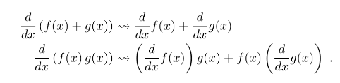

符号微分主要有以下问题：

- 求解的表达式不一定是最简的，对于复杂的函数，结果表达式可能呈指数级增大。
- 保存中间的表达式是浪费的，因为只需要一个梯度值。

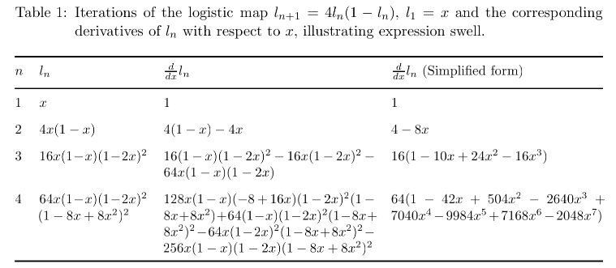

> 自动微分

自动微分介于数值微分和符号微分，自动微分将符号微分应用到基本的算子，然后带入数值保留中间结果，用于整个函数的计算。自动微分实际上是一种图计算，因此可以应用很多优化，而且更加灵活。

自动微分分为前向计算模式和反向计算模式。

### 前向计算

对于函数$f(x1, x2) = ln(x_1) + x1x2 - sim(x_2)$我们可以构建一个计算图：

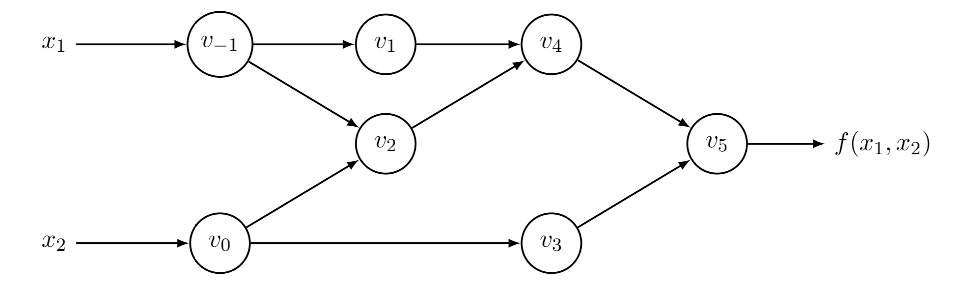

计算图是一个有向无环图，图中的节点表示计算，边表示数据的依赖关系。

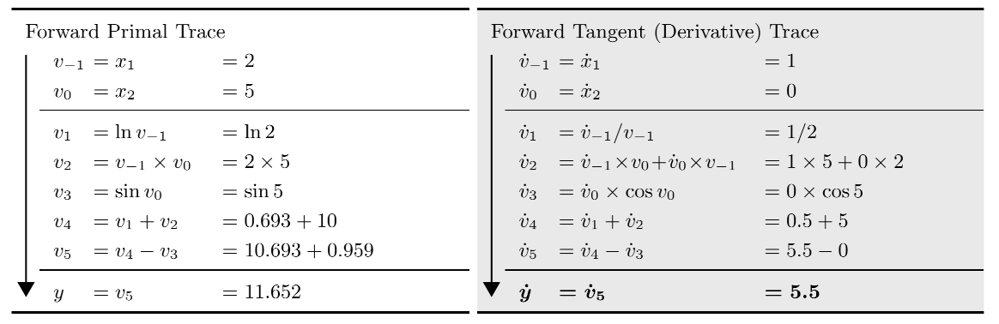

上图左侧是每个节点的计算以及结果，右侧是每个节点对$x_1$的求导和结果。

如果输入的向量维度是n维，就需要对整张图执行n次计算，得到每个维度上的导数，因此前向计算模式计算量大而且内存占用高。

### 反向计算

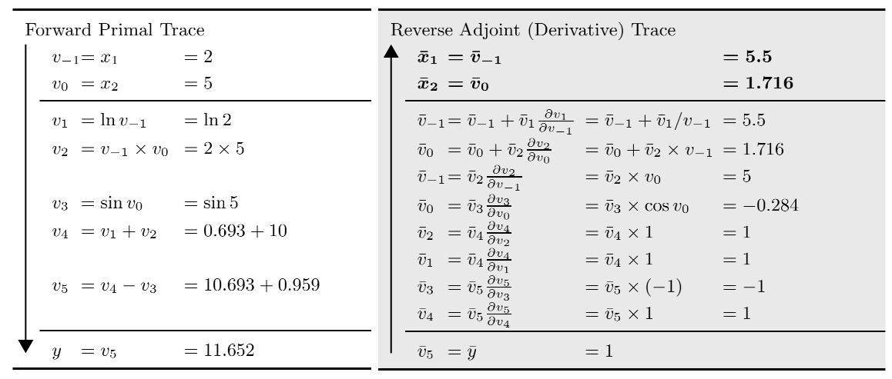

反向计算刚好相反，首先根据符号微分计算当前节点的梯度公式，然后根据链式法则计算输出节点对当前节点的梯度。通过一次反向计算就可以得到所有维度的梯度值。

## 如何实现自动微分？

对于函数$f = \frac{1}{1 + e^{-(w_0+w_1x_1+w_2x_2)}}$，我们可以得到如下计算图：

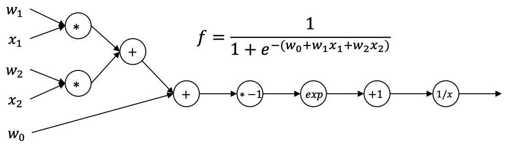

和前向计算一样，我们可以为反向的梯度计算构建一个有向无环图DAG：

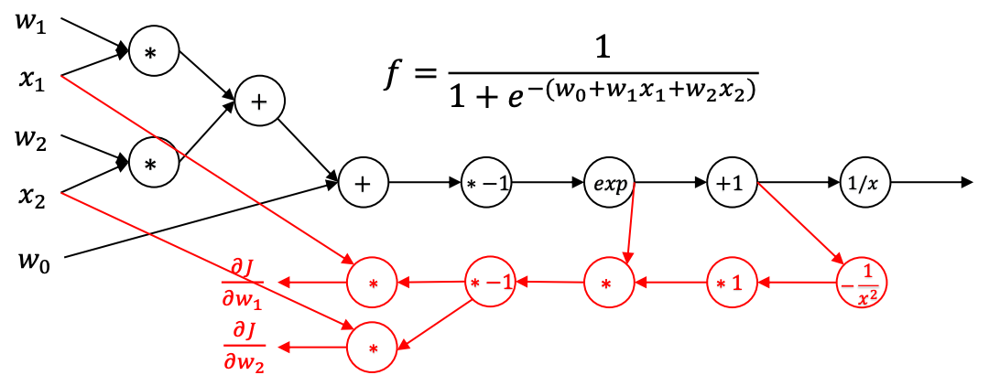

在具体编码时令最后输出的节点的梯度值为1，按照反向计算的节点顺序，计算每个节点的梯度。

具体计算节点的梯度时，首先按照出边对节点的梯度进行求和，得到当前节点的梯度，然后将梯度传递给入边的节点（计算图存的是入边节点），计算入边节点的梯度值，保存节点的梯度值，用于其他节点的计算。

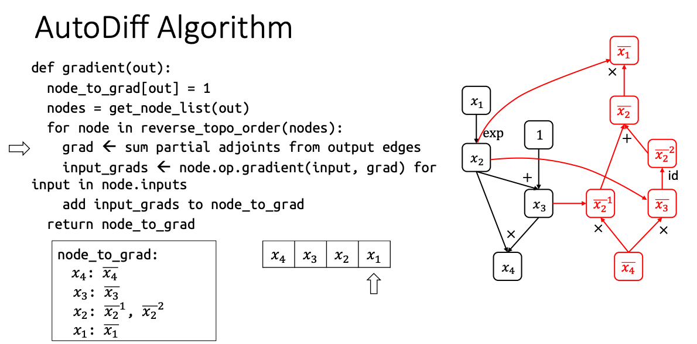

下面具体看下如何实现自动微分：

> 节点

首先定义计算图中节点，其中包括了节点入边、运算类型、

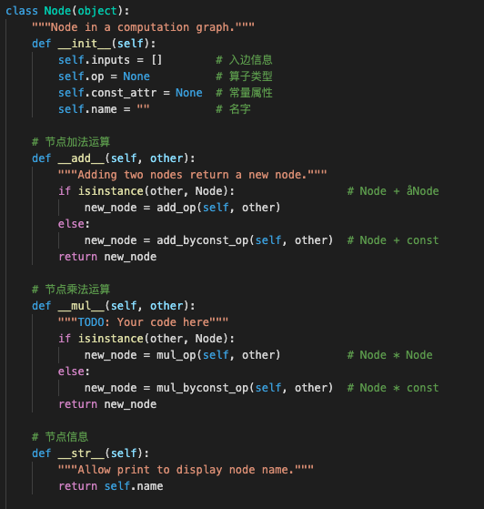

> 算子

每个算子包括前向计算（compute）和梯度计算（gradient）两部分，Op类作为算子的父类。负责为每个算子创建一个新的节点，同时标识节点的的算子类型。

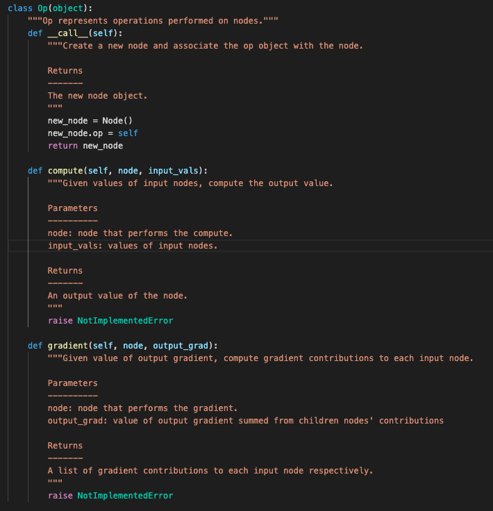

其他算子在实现的时候，需要继承Op类，然后重写compute和gradient方法。

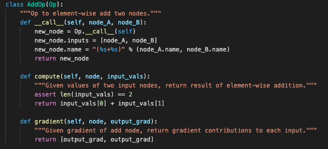

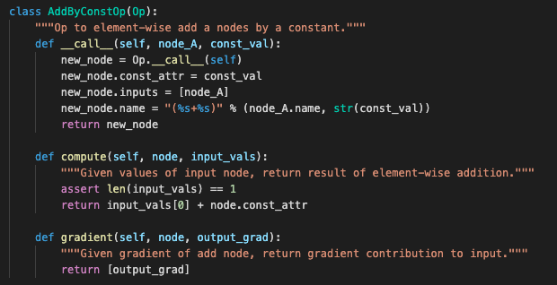

除了负责计算的算子，还有一些其他的算子，例如：

PlaceholerOp算子，它和Variable一起使用，用于输入节点的表示，使用占位符可以让所有输入数据共用一个计算图，节省了内存的开销。

占位符只是用于表示输入节点，本身没有数据，没有compute和gradient的逻辑。

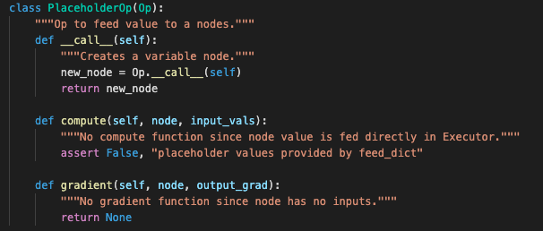

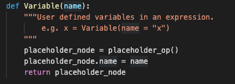

OnesLikeOp和ZerosLikeOp一般用于生成一个指定维度的全1张量和全0张量。

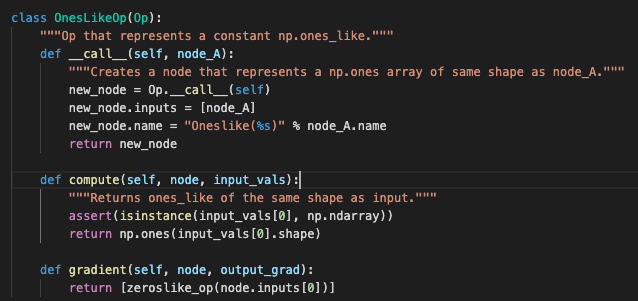

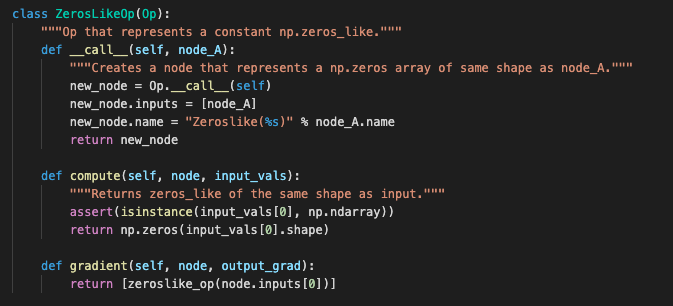

> 梯度的反向计算图

根据上面介绍的自动微分算法，从输出节点开始，从后往前计算每个节点的梯度。

传入参数node_list是用户希望得到的梯度的节点，在反向构建计算图的过程中，记录为这些节点生成的梯度节点，作为参数返回给用户。

在构建反向计算图时，首先计算输出节点对应的拓扑序，然后按照逆序，即从最后一个节点往前，调用每个节点的gradient方法计算梯度值。

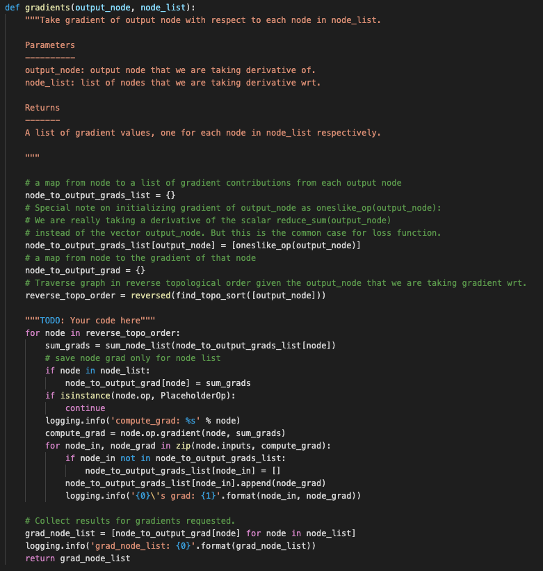

> 执行计算图

Executor类负责计算图的执行。

类初始化的参数eval_node_list是用户想得到计算结果的节点。

run方法负责计算，参数feed_dict对应占位符的输入值。

第一步是得到计算的拓扑序，然后按照拓扑序调用节点的compute方法完成计算，最后返回用户指定节点的计算结果。

因为我们已经生成了梯度的反向计算图，所以梯度的计算和前向的计算逻辑完全一致，只需调用compute即可得到结果。

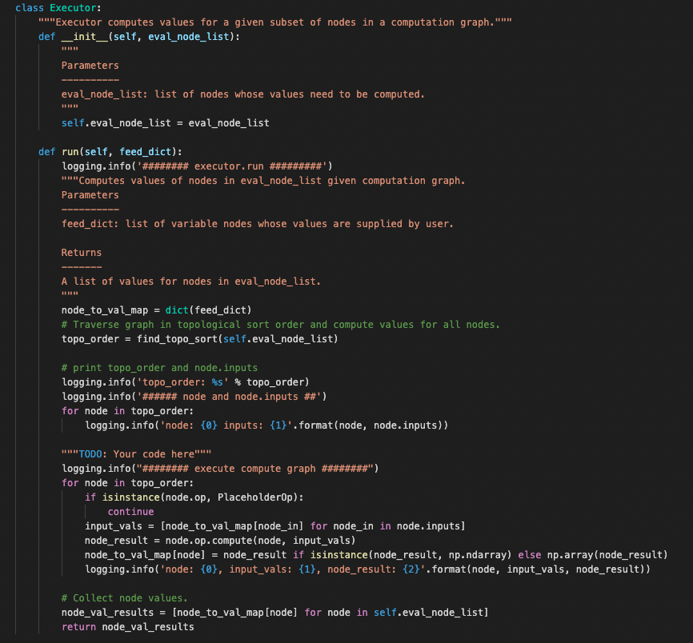

## 实现一个简单的逻辑回归

算子实现：[autodiff.py](https://github.com/Sanzo00/CSE-599W/blob/main/assignment1-2018/autodiff.py)

逻辑回归模型实现：[log_regression.py](https://github.com/Sanzo00/CSE-599W/blob/main/assignment1-2018/log_regression.py)

通过上一节我们可以得到了一个简易版的自动微分计算框架，接下来我们利用这个框架来实现一个逻辑回归模型。

逻辑回归是一个解决分类问题的模型，需要用到sigmoid激活函数和对数函数。

$$h(x)=\frac{1}{1+e^{-x}}$$

$$L(x) = -[ylog(h(x)) + (1-y)log(1-h(x))]$$

因此我们需要对算子进行扩充，需要新增的算子有：negOp（负），subOp（减法），DivOp（除法），ExpOp（指数），LnOp（对数）。

实现这些算子之后，就可以搭建一个简单的逻辑回归模型，下面是程序运行的结果：

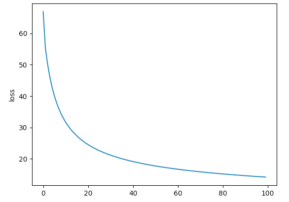

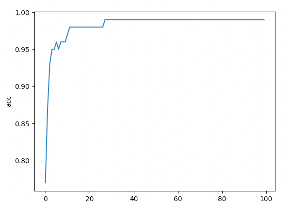

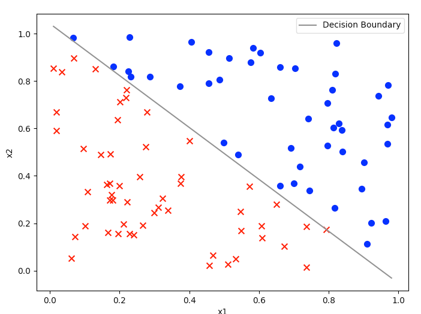

> 注意事项

1. 减法的`Node - const`和`const - Node`的梯度计算是不同的，除法也是，因此需要单独定义`__rsub__`和`__rtruediv__`的梯度计算逻辑。

2. 在实现算子后尽量对算子写一个测试样例，来检查算子的正确性，在写测试样例的时候尽可能的复杂一些，例如在测试除法算子时，可以这样写测试样例：

   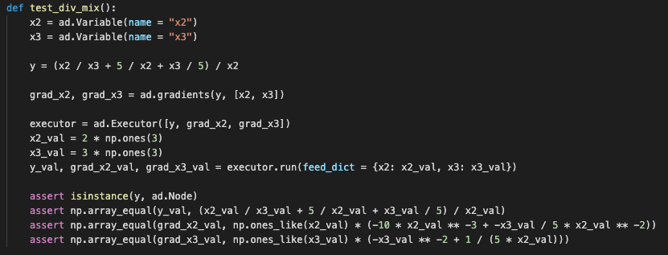

   我之前写的样例过于简单，没能检查出算子中的bug，导致在实现逻辑回归的时候出现了梯度爆炸的问题（梯度计算错误）。

3. 在训练逻辑回归时，需要对数据进行归一化，否则会出现exp(x)特别大，导致sigmoid函数为0，在log计算时出现错误。

## 参考文献

1. http://dlsys.cs.washington.edu/pdf/lecture4.pdf

   

2. https://arxiv.org/pdf/1502.05767.pdf

   

<!-- Q.E.D. -->