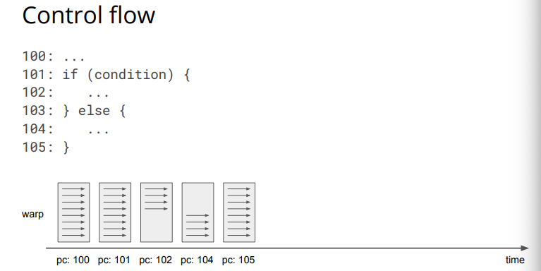

<!-- more -->

GPU（Graphics processing unit）在计算机图形学和图像处理上非常高效，GPU相比CPU有更多的计算单元，因此适合做并行计算。


## GPU架构

下图是GPU的一种架构图：

每个GPU都有多个GPCs（Graphics Processing Clusters），单个GPC包含一个Raster Engine（光栅引擎）为了提高计算图形学和图像的处理，另外还有多个SM（Streaming Multiprocessors）。SM封装了所有关键的图形处理单元。

GPC可以理解为一个单独的GPU，从Fermi架构之后所有的GPU都有GPCs。

早期的Fermi，SMs和Texture Units组合成TPCs（Texture Processing Clusters），但是现在SM有4个专用的Texture Units，因此不再需要TPC。


下图是不同GPU之间的对比，主要区别是SM、CUDA core的数量，以及缓存的大小。


### 流多处理器


### 内存等级


 

### 内存延迟


## CUDA编程模型

### SIMT

SIMT（单指令多线程），多个线程执行相同的代码，可以有不同执行路径（条件判断）。

多个thread组成一个block，block内部的线程可以同步的执行。

多个block组成一个grid，这些block之间独立的在GPU上调度。

kernel函数是以grid的形式执行的。


### Kernel Execution

每一个block由一个SM负责执行，而且不能改变。

多个并发的blocks可以分配到同一个SM中，SM中block的数量取决于SM内存资源以及block的内存需求。


SM以warp（32个线程）为单位来调度block中的线程，每个时钟周期warp调度器选择一个准备好的warp，然后将其dispatch给CUDA cores执行。


### Control flow

由于条件分支的存在，warp中的线程可能存在不同的运行状态。




### 线程索引

Grid通过Block来组织线程的分布，一个Grid可以包含多个Blocks，这些Block可以是1维、2维或3维，同时Block内部的线程也可以有三个维度。

```cpp
kernel<<<Dg, Db, Ns, S>>>(param list);
```

- `Dg`：int型或者dim3类型(x,y,z)，用于定义一个Grid中Block是如何组织的，如果是int型，则表示一维组织结构
- `Db`：int型或者dim3类型(x,y,z)，用于定义一个Block中Thread是如何组织的，如果是int型，则表示一维组织结构
- `Ns`：size_t类型，可缺省，默认为0； 用于设置每个block除了静态分配的共享内存外，最多能动态分配的共享内存大小，单位为byte。 0表示不需要动态分配。
- `S`：cudaStream_t类型，可缺省，默认为0。 表示该核函数位于哪个流。

```cpp
# 二维
dim3 grid(3,2,1), block(4,3,1);
kernel_name<<<grid, block>>>(...);

# 一维
kernel_name<<<5,8>>>(...);
```


在对线程进行索引的时候，一般是先定位线程所在的block，然后计算线程在block内部的索引。


例如对二维线程的索引：

```cpp
dim3 grid(3,2,1), block(4,3,1);

int tid = (blockIdx.y * gridDim.x + blockIdx.x) * (blockDim.x * blockDim.y) + threadIdx.y * blockDim.x + threadIdx.x;
```


## 代码示例

完整代码：[cuda-examples](https://github.com/Sanzo00/CSE-599W/tree/main/cuda-examples)

### Vector Add

利用GPU的线程同时进行计算。


### Sliding Window Sum


朴素的方法是每个线程遍历A中长度为2 * RADIUS的元素，然后进行求和。这里每个元素的计算都需要进行多次的访存，而且数组A是在Global Memory上，所以效率较低。

一种优化方法是，利用SM中的Shared Memory，每个block中的线程在做计算前，首先将对应的数据加载到shared memroy，后续需要访存的时候，直接从shared memory上拿数据，这样比从Global Memory上拿快很多。


## 踩坑

- cudaMalloc和cudaMemcpy函数的长度参数是size_t类型，创建空间的时候不能太大。
- shared memory在使用前最好初始化下，可能会有脏数据。


## 参考文献

1. [Hardware backends: GPU](http://dlsys.cs.washington.edu/pdf/lecture5.pdf)

   

2. [Analyzing GPGPU Pipeline Latency](http://lpgpu.org/wp/wp-content/uploads/2013/05/poster_andresch_acaces2014.pdf)

   
   
2. [【CUDA】grid、block、thread的关系及thread索引的计算](https://blog.csdn.net/hujingshuang/article/details/53097222)

4. [关于cudaMalloc内存分配以及二重指针](https://blog.csdn.net/weixin_43260254/article/details/104162207)

<!-- Q.E.D. -->
