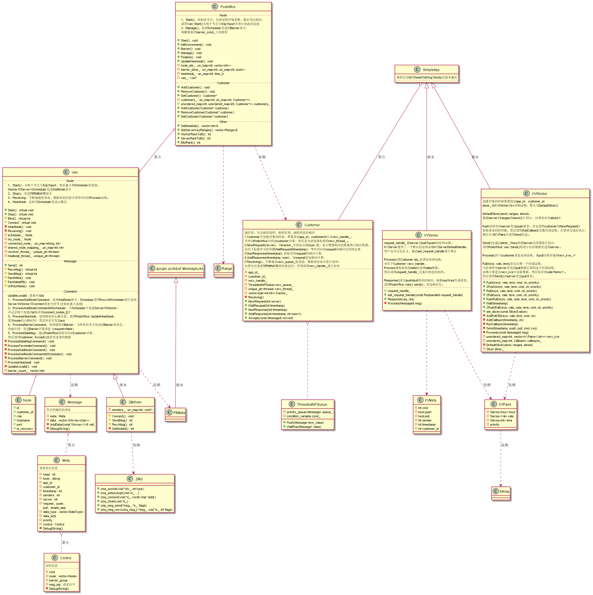
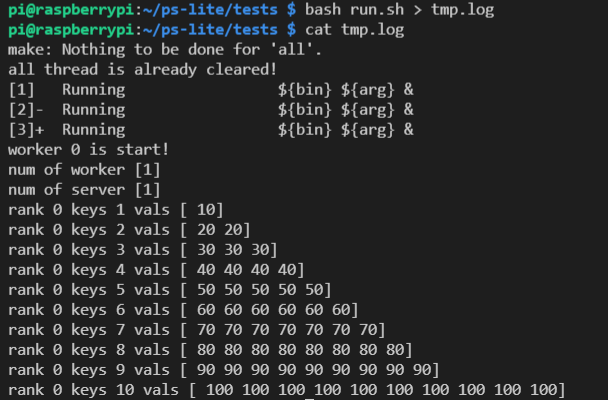

<!-- more -->

---


[github.com/dmlc/ps-lite](https://github.com/dmlc/ps-lite)

## 角色

ps-lite有三种不同角色：

- scheduler（一个），负责调度。
- server（多个），负责存储参数。
- worker（多个），负责计算。


worker可以通过以下接口与server进行通信：

- Push(keys, values)，push a list of (key, value) pairs to the server nodes.
- Pull(keys)，pull  the values from servers for a list of keys.
- Wait，wait until  a push or pull finished.

一个简单的例子：

```cpp
std::vector<uint64_t> key = {1, 3, 5};
std::vector<float> val = {1, 1, 1};
std::vector<float> recv_val;
ps::KVWorker<float> w;
w.Wait(w.Push(key, val));
w.Wait(w.Pull(key, &recv_val));
```


## Postoffice类

Postoffice时系统的中心（”邮局“），每个应用都会创建一个Postoffice全局单例类，Postoffice记录了每个节点的信息。


## Van类

Van主要负责通信，Postoffice在实例化的时候会创建一个Van实例（Van是虚基类，具体的实现为ZMQVan类）作为成员变量，生命周期和Postoffice一样。


Postoffice在实例化时，调用`Van::Start()`为每个节点分配ip和port，然后调用`Van::Connect()`（实际为`ZMQVan::Connect()`）建立彼此的连接。


## Customer类

Customer是通信的工具类，作为消息发送者负责跟踪发送请求的响应，生成请求和响应的时间戳，接收数据并加到消息接收队列中，供server和worker进行处理。


在实例化时，需要提供app_id, customer_id和消息处理函数`recv_handle_`, 同时启动消息接收线程`Customer::Receiving()`。

消息接收线程从消息接收队列`recv_queue_`中取出消息，调用`recv_handle_`对消息进行处理，同时更新请求的响应次数。


## Server/Worker类

Server和Worker都含有Customer实例obj_（继承自SimpleApp类），因此在实例化时需要为Customer执行消息处理函数。

server的消息处理函数为`KVServer::Process()`，主要将消息交给`request_handle_`进行处理，ps-lite提供一个默认的处理方式`KVServerDefaultHandle`，将pushed kv存储下来，用户也可以自定义处理方式。

Worker的消息处理函数为`KVWorker::Process()`，保存从server pull下的的消息。

另外worker还会设置`slicer`为`KVWorker::DefaultSlicer()`, 对push到server的keys按照ranges进行划分。


## Message类

Messge类封装了Worker和Server通信的消息。

每个消息都有一个Meta成员，描述了消息的元信息，包括app_id、customer_id、timestamp、sender、recver、消息请求类型（pull、push）。

Meta包含一个Control成员，描述了消息的控制信息，主要包含6中命令（Empty、Terminate、Add_node、Barrier、Ack、Heartbeat），以及控制信息涉及到的节点`vector<Node> node`。


## 线程管理

scheduler、server和worker会在Van启动的时候，创建消息接收线程`receiver_thread_`执行`Van::Receiving()`，内部调用`ZMQVan::RecvMsg`获取消息，然后根据消息的内容调用对应的`Van::Process`函数进行处理，其中`ProcessDataMsg()`将消息添加到Customer的消息队列`recv_queue_`中。

server和worker在实例化Customer时，会创建一个消息接收线程，从消息接收队列中读取数据，然后调用server和worker绑定的消息处理函数进行处理。

server和worker也会创建心跳线程`heartbeat_thread_`执行`Van::Heartbeat()`，定时的向scheduler发送心跳包。

## 类图



## 测试程序

```cpp
#include "ps/ps.h"
using namespace std;
using namespace ps;
template <typename Val>
struct KVServerHandle {
  void operator()(
      const KVMeta& req_meta, const KVPairs<Val>& req_data, KVServer<Val>* server) {
    size_t n = req_data.keys.size();
    KVPairs<Val> res;
    if (req_meta.push) { // push
      CHECK_EQ(n, req_data.lens.size());
    } else { // pull
      res.keys = req_data.keys; 
      res.lens.resize(res.keys.size());
    }
    int idx = 0;
    for (size_t i = 0; i < n; ++i) {
      Key key = req_data.keys[i];
      if (req_meta.push) {
        int len = req_data.lens[i];
        if (store.find(key) == store.end()) {
          store[key] = vector<Val>(len, 0);
        }
        for (int j = 0; j < len; ++j) {
          store[key][j] += req_data.vals[idx++];
        }
      } else {
        res.lens[i] = store[key].size();
        for (int j = 0; j < res.lens[i]; ++j) {
          res.vals.push_back(store[key][j]);
        }
      }
    }
    server->Response(req_meta, res);
  }
  std::unordered_map<Key, vector<Val>> store;
};

void StartServer() {
  if (!IsServer()) {
    return;
  }
  cout << "num of worker [" << NumWorkers() << "]" << endl;
  cout << "num of server [" << NumServers() << "]" << endl;
  auto server = new KVServer<float>(0);
  server->set_request_handle(KVServerHandle<float>());
  
  RegisterExitCallback([server]() {
    delete server;
  });
}

void RunWorker() {
  if (!IsWorker()) {
    return;
  }
  cout << "worker " << MyRank() << " is start!" << endl;
  KVWorker<float> kv(0, 0);
  int num = 10;
  vector<Key> keys(num);
  vector<int> lens(num);
  vector<float> vals;

  // init
  for (int i = 0; i < num; ++i) {
    keys[i] = i + 1;
    lens[i] = i + 1;
    for (int j = 0; j < lens[i]; ++j) {
      vals.push_back(i + 1);
    }
  }

  // push
  vector<int> ts;
  int repeat = 10;
  while (repeat--) {
    ts.push_back(kv.Push(keys, vals, lens));
  }
  for (auto t : ts) {
    kv.Wait(t);
  }

  // pull
  vector<float> ret_vals;
  vector<int> ret_lens;
  kv.Wait(kv.Pull(keys, &ret_vals, &ret_lens));
  CHECK_EQ(keys.size(), ret_lens.size());

  int idx = 0;
  for (int i = 0; i < num; ++i) {
    cout << "rank " << MyRank() << " keys " << keys[i] << " vals [";
    for (int j = 0; j < ret_lens[i]; ++j) {
      cout << " " << ret_vals[idx++];
    }
    cout << "]" << endl;
  }
}

int main() {

  Start(0);
  StartServer();
  RunWorker();
  Finalize(0, true);

  return 0;
}
```

运行结果如下：



<!-- Q.E.D. -->