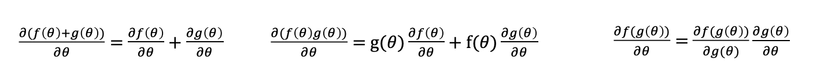

<!-- more -->

---

[课程官网 dlsyscourse.org](https://dlsyscourse.org/)    [Youtube Videos](https://www.youtube.com/channel/UC3-KIvmiIaZimgXMNt7F99g/videos)

## 2. Softmax Regression

[lecture02: softmax_regression](https://dlsyscourse.org/slides/softmax_regression.pdf)      [youtube linke](https://www.youtube.com/watch?v=MlivXhZFbNA)

Three ingredients of a machine learning algorithm:

1. The hypothesis class: describes how we map inputs to outputs.
2. The loss function: specifies how well a given hypothesis.
3. An optimization method: minimize the sum of losses over the training set.

> Softmax / cross-entropy loss

Use softmax function normalize every dim of output, get the probability of every classes.

$$
z_i = p(label = i) = \frac{exp(h_i(x))}{\sum_{j=1}^{k}exp(h_j(x))} \Longleftrightarrow z \equiv normalize(exp(h(x)))
$$
Define a loss to be the negative log probability of the true class, This is call **softmax or cross-entropy loss**.

$$
\ell_{ce}(h(x), y) = -log\ p(label = y) = -h_y(x) + log\sum_{j=1}^{k}exp(h_j(x))
$$
use gradient descent minmizing the average loss on the training set.

$$
\begin{aligned}
f(\theta)&=\mathop{minimize}_{\theta} \frac{1}{m}\sum_{i=1}^{m}\ell(h_{\theta}(x^{(i)}, y^{(i)}) \\
\theta :&= \theta - \alpha\nabla_{\theta}f(\theta) \\
batch\ version: \theta :&= \theta - \frac{\alpha}{B}\sum_{i=1}^{B}\nabla_{\theta}\ell(h_{\theta}(x^{(i)}, y^{(i)}) \\
\end{aligned}
$$

The gradient of the softmax objective.

$$
\begin{aligned}
\frac{\partial \ell_{ce}(h,y)}{\partial h_i} &= \frac{\partial}{\partial h_i}\left({-h_y + log \sum_{j=1}^k exp\ h_j}\right)\\
&=-1\{i=y\} + \frac{exp\ h_i}{\sum_{j=1}^k\ exp\ h_j}\\
\nabla_h\ell_{ce}(h,y)&=z-e_y,\ z = normalize(exp(h))
\end{aligned}
$$

How to compute the gradient $\nabla_{\theta}\ell_{ce}(\theta^{T}x, y)$?

Approach #1 (right way): Use matrix differential calculus, Jacobians, Kronecker products, and vectorization

Approach #2 (hacky quick way)：Pretend everything is a scalar, use the typical chain rule, and then rearrange/transpose matrices/vectors to make the sizes work (and check your answer numerically).

$$
\begin{aligned}
\frac{\partial}{\partial\theta}\ell_{ce}(\theta^{T}x, y) &= \frac{\partial \ell_{ce}(\theta^Tx, y)}{\partial \theta^{T}x}\frac{\partial\theta^{T}x}{\partial\theta}\\
&=(z-e_y) (x)
\end{aligned}
$$

$(z-e_y)$ is k-dimensional, x is n-dimensional, So to make the dimensions work...

$$
\nabla_\theta\ell_{ce}(\theta^Tx,y)\in \mathbb{R}^{n\times k}=x(z-e_y)^T
$$

Same process works if use "matrix batch" form of the loss.

$$
\nabla_{\theta}\ell_{ce}(X\theta,y) \in \mathbb{R}^{n\times k}=X^T(Z-I_y),\ Z = normalize(exp(X\theta))
$$

## 3. Manual Neural Networks / Backprop

[lecture 03:  Manual Neural Networks / Backprop](https://dlsyscourse.org/slides/manual_neural_nets.pdf) 

早期的框架使用Backprop算法在原始的计算图上计算梯度，目前主流的框架使用Reverse mode AD来计算梯度，即构建一个反向的计算图来计算梯度。

使用Reverse mode AD的好处：

- 可以计算梯度的梯度
- 可以对计算图做额外的优化（算子融合）

## 4. Automatic Differentiation

[4-automatic-differentiation](https://dlsyscourse.org/slides/4-automatic-differentiation.pdf)



Trere are many method to get differentiation.

### Numerical differentiation

Numerical differentiation is suffer from **numerical error** and **less efficient to compute** .

However, numerical differentiation is a powerful tool to **check an implement of an automatic differentiation algorithm** in unit test cases.

### Symbolic differentiation

Write down the formulas, derive the gradient by sum, product and chain rules.

Naively do so can result in wasted computations.

It cost $n(n-1)$ multiplies to compute all partial gradients.

### Forward mode AD

> Computaional graph

Each node represent an (intermediate) value in the computation. Edges present input output relations.

> Forward mode automatic differentiation (AD)

The limitation of forward mode AD: For $f: \R^n \rightarrow \R^k$，we need $n$ forward AD passes to get the gradient with respect to each input.

We mostly care about the cases where $k = 1$ and large $n$. In order to resolve the problem efficiently, we need to use another kind of AD.

### Reverse mode AD

> Reverse mode automatic differentiation (Reverse mode AD)

Derivation for the muliple pathway case.

> Reverse AD algorithm

> Difference between Backprop and Reverse mode AD

> Why we should take Reverse mode AD?

- Reverse mode is easy to do gradient of gradient by construct another compute graph.

- It also bring a lot more opportunities for underlying machine learning framework to do certain optimizations for the gradient computation.

## 5. 

## 6. Optimization

## 7. Neural Network Library Abstractions

## 8. 

<!-- Q.E.D. -->