<!-- more -->

---

## 图的表示

### 邻接矩阵

邻接矩阵(adjacency matrix)是一种方阵，用来表示有限图。每个元素表示各点之间是否有边相连。

简单图的邻接矩阵是(0,1)矩阵且对角线元素为零，无向图的邻接矩阵是对称矩阵。

| 图                                                           | 邻接矩阵                                                     |
| ------------------------------------------------------------ | ------------------------------------------------------------ |
| 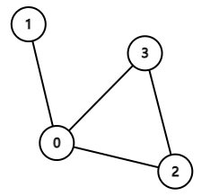 | 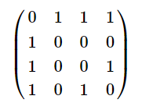 |
| 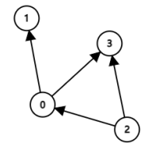 | 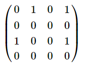 |

### 邻接表

邻接表(adjacency list)，是另一种图的表示形式，它相对于邻接矩阵的优点是节省空间。

| 图                                                           | 邻接表                                                       |
| ------------------------------------------------------------ | ------------------------------------------------------------ |
|  | 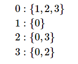 |
|  | 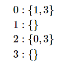 |

### 度矩阵

度矩阵是一个对角矩阵，表示每个点的度数。

| 图                                                           | 度矩阵                                                       |
| ------------------------------------------------------------ | ------------------------------------------------------------ |
|  | 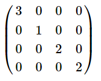 |

### 拉普拉斯矩阵

拉普拉斯矩阵(laplacian matrix)，也称为调和矩阵。

A是邻接矩阵，D是度矩阵，则拉普拉斯矩阵L的定义如下：

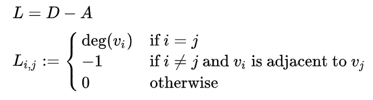

| 图                                                           | 度矩阵                                                       | 邻接矩阵                                                     | 拉普拉斯矩阵                                                 |
| ------------------------------------------------------------ | ------------------------------------------------------------ | ------------------------------------------------------------ | ------------------------------------------------------------ |
|  |  |  | 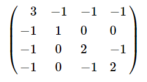 |

> 拉普拉斯矩阵的正则化

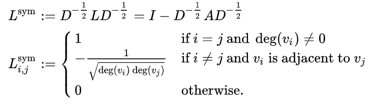

> 随机游走

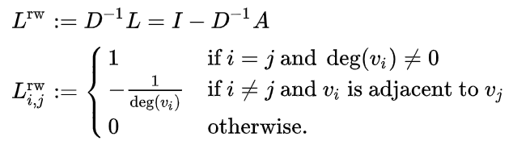

$D^{-1}A$是随机游走的转移矩阵，$D^{-1}L$是随机游走正则化的拉普拉斯矩阵。

## 图中心性 

### 度中心性

Degree Centrality.

根据节点的度数来衡量节点的中心性，强调单个节点的价值。

$deg(v)$表示节点的度数，n为图中节点的个数。

$$
C_D(v)=\frac{deg(v)}{n-1}
$$

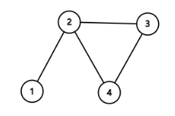

| v    | $C_D(v)$      |
| ---- | ------------- |
| 1    | $\frac{1}{3}$ |
| 2    | $\frac{3}{3}$ |
| 3    | $\frac{2}{3}$ |
| 4    | $\frac{2}{3}$ |

### 接近中心性 

Closeness Centrality.

根据节点到其他节点的最短路之和衡量节点的中心性，强调点在网络的价值，越大约在中心。

$d(u,v)$表示$u$和$v$之间的最短路。

$$
C(v)=\frac{1}{\sum_ud(u,v)}
$$

人们通常使用正则化的形式，即将上式乘以$n-1$，对于大图来说$n$和$n-1$不太重要，因此可以写为：

$$
C(v)=\frac{n}{\sum_ud(u,v)}
$$

| v    | $C(v)$            |
| ---- | ----------------- |
| 1    | $\frac{4}{1+2+2}$ |
| 2    | $\frac{4}{1+1+1}$ |
| 3    | $\frac{4}{1+1+2}$ |
| 4    | $\frac{4}{1+1+2}$ |

### 中介中心性 

Betweenness Centrality.

根据节点在其他两点间最短路中出现的频率来衡量节点中心性，强调节点的控制能力。

节点的中介中心性的公式为：

$$
g(v)=\sum\limits_{s\neq t\neq v}\frac{\sigma_{st}(v)}{\sigma_{st}}
$$

其中$\sigma_{st}$是节点$s$到节点$t$的所有最短路径个数之和，而$\sigma_{st}(v)$是这些路径经过$v$的次数。

一个节点的中介中心性和该网络中节点的个数有关，因此可以除以不包含$v$的节点对数以将计算结果标准化。使得$g\in[0,1]$，有向图除以$(n-1)(n-2)$，无向图除以$\frac{(n-1)(n-2)}{2}$，$n$为节点的个数。

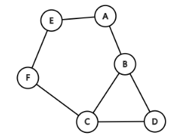

节点B的中介中心性：

| v    | $\sigma_{uw}$ | $\sigma_{uw}(v)$ | $\frac{\sigma_{uw}(v)}{\sigma_{uw}}$ |
| ---- | ------------- | ---------------- | ------------------------------------ |
| AC   | 1             | 1                | 1                                    |
| AD   | 1             | 1                | 1                                    |
| AE   | 1             | 0                | 0                                    |
| AF   | 1             | 0                | 1                                    |
| CD   | 1             | 0                | 0                                    |
| CE   | 1             | 0                | 0                                    |
| CF   | 1             | 0                | 0                                    |
| DE   | 2             | 1                | 0.5                                  |
| DF   | 1             | 0                | 0                                    |
| EF   | 1             | 0                | 0                                    |

$g(B) = \frac{2.5}{10} = 0.25$

### 特征向量中心性 

Eigenvector Centrality.

根据相邻点的重要性来衡量节点的中心性，首先计算邻接矩阵，然后计算邻接矩阵的特征向量，用近邻节点来决定节点的重要性，用于分析用户的潜在价值。

原理如下：

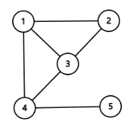

邻接矩阵为：

$$
A=
\begin{bmatrix}
   0 & 1 & 1 & 1 & 0 \\
   1 & 0 & 1 & 0 & 0 \\
   1 & 1 & 0 & 1 & 0 \\
   1 & 0 & 1 & 0 & 1 \\
   0 & 0 & 0 & 1 & 0
  \end{bmatrix}
$$

假设顶点初始的权重为$[3, 2, 3, 4, 1]^T$，那么经过一次计算更新为：

$$
\begin{bmatrix}
   0 & 1 & 1 & 1 & 0 \\
   1 & 0 & 1 & 0 & 0 \\
   1 & 1 & 0 & 1 & 0 \\
   1 & 0 & 1 & 0 & 1 \\
   0 & 0 & 0 & 1 & 0
\end{bmatrix}
\begin{bmatrix}
   3 \\
   2 \\
   3 \\
   3 \\
   1 \\
\end{bmatrix}
=
\begin{bmatrix}
   8 \\
   6 \\
   8 \\
   7 \\
   3 \\
\end{bmatrix}
$$

通过邻接矩阵$A$的传播，节点更新为相邻节点权重的和，如果不断的重复上述计算，每个节点及发送自己的权重，也接受来自其他节点的权重，那么最终会达到一个平衡的状态，即：

$$
Ax=\lambda x
$$

矩阵乘以向量得到一个成比例的向量。

在线性代数中向量$x$称为矩阵$A$的特征向量，$\lambda$称为矩阵$A$的特征值。

特征向量的求解如下：

$$
\begin{aligned}
Ax &= \lambda x \\
IAx &= I\lambda x \\
Ax &= (\lambda I)x \\
(A - \lambda I)x &= 0
\end{aligned}
$$

为了使方程有解，则：

$$
det(A-\lambda I) = 0
$$

## 网页排序算法

### PageRank

PageRank是用于衡量网页重要性的算法。

将网页抽象为有向图，每个网页是一个节点，网页中含有多个超链接，用户点击超链接进入下一个网页。

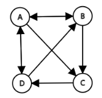

假设用户停留在其中一个网页上，跳转每个链接的概率相同，可以得到一个转移矩阵：

$$
A=
\begin{bmatrix}
   0 & \frac{1}{2} & 0 & \frac{1}{2} \\
   \frac{1}{3} & 0 & 0 & \frac{1}{2} \\
   \frac{1}{3} & \frac{1}{2} & 0 & 0 \\
   \frac{1}{3} & 0 & 1 & 0 \\
  \end{bmatrix}
$$

$A_{ij}$表示页面$j$指向页面$i$的概率。

假设每个节面的初始值为$[\frac{1}{4},\frac{1}{4},\frac{1}{4},\frac{1}{4}]^T$,经过一次迭代计算我们可以得到新的$rank$值。

$$
\begin{bmatrix}
   0 & \frac{1}{2} & 0 & \frac{1}{2} \\
   \frac{1}{3} & 0 & 0 & \frac{1}{2} \\
   \frac{1}{3} & \frac{1}{2} & 0 & 0 \\
   \frac{1}{3} & 0 & 1 & 0 \\
\end{bmatrix}
\begin{bmatrix}
   \frac{1}{4} \\
   \frac{1}{4} \\
   \frac{1}{4} \\
   \frac{1}{4} \\
\end{bmatrix}
=
\begin{bmatrix}
   \frac{1}{4} \\
   \frac{5}{24} \\
   \frac{5}{24} \\
   \frac{1}{3} \\
\end{bmatrix}
$$

PageRank的思想和特征向量中心性差不多，随着迭代的增加，整体的Rank值将保持一定的比例，达到稳定。

另外上述的计算存在一些问题，例如有两个网页，A链接到B，B无法链接A，对应的转移矩阵为：

$$
A=
\begin{bmatrix}
   0 & 0 \\
   1 & 0\\
  \end{bmatrix}
$$

经过不断的迭代计算，将得到一个0矩阵：

$$
iteration1:
\begin{bmatrix}
   0 & 0 \\
   1 & 0\\
\end{bmatrix}
\begin{bmatrix}
   \frac{1}{2} \\
   \frac{1}{2} \\
\end{bmatrix}
=
\begin{bmatrix}
   0 \\
   \frac{1}{2} \\
\end{bmatrix}
\\
iteration2:
\begin{bmatrix}
   0 & 0 \\
   1 & 0\\
\end{bmatrix}
\begin{bmatrix}
   0 \\
   \frac{1}{2} \\
\end{bmatrix}
=
\begin{bmatrix}
   0 \\
   0 \\
\end{bmatrix}
$$

这个结果是不合理的，因为链接B要比A重要，但是结果认为它们一样重要。

为了解决整个问题，引入了阻尼系数的概念，用户在访问下一个网页时，可能通过页面的超链接进行，也可能通过在地址栏输入链接进行。因此点击超链接有一定的概率，这里称为阻尼系数。

新的Rank值计算公式为：

$$
PR(u) = \frac{1-d}{N} + d\sum\limits_{v\in B_u}\frac{PR(v)}{L(v)}
$$

$N$为页面的个数，$d$为阻尼系数通常取0.85，$L(v)$为$v$的出站链接，$B_u$是所有链接到页面$u$的集合。

$$
0.85\times
\begin{bmatrix}
   0 & 0 \\
   1 & 0\\
\end{bmatrix}
\begin{bmatrix}
   \frac{1}{2} \\
   \frac{1}{2} \\
\end{bmatrix}
+
\begin{bmatrix}
   \frac{0.15}{2} \\
   \frac{0.15}{2} \\
\end{bmatrix}
=
\begin{bmatrix}
   \frac{0.15}{2} \\
   \frac{1}{2} \\
\end{bmatrix}
$$

### HITS

## ref

[PageRank](https://en.wikipedia.org/wiki/PageRank)

[图或网络中的中心性：点度中心性、中介中心性、接近中心性、特征向量中心性、PageRank](https://blog.csdn.net/yyl424525/article/details/103108506)

[画图工具：graph_editor](https://csacademy.com/app/graph_editor/)

<!-- Q.E.D. -->