<!-- more -->

---

中文笔记：https://mlc.ai/zh/

中文课表：https://mlc.ai/summer22-zh/schedule

课程代码：https://github.com/mlc-ai/notebooks

课后作业：https://github.com/Sanzo00/mlc-summer22


## 机器学习编译概述

机器学习模型的开发到部署存在很多复杂的变量：硬件（ARM 或 x86）、操作系统、容器执行环境、运行时计算库 (Runtime Libraries) 或所涉及的加速器类型的问题。

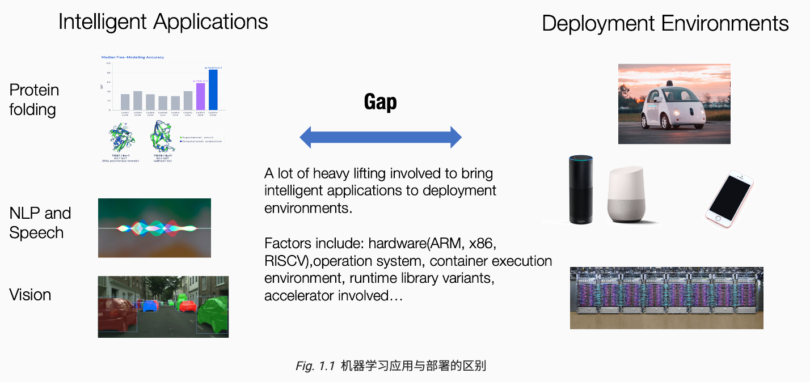


机器学习编译（machine learning compilation，MLC）：将机器学习算法从开发阶段，通过变换和优化算法，使其变成部署阶段。


机器学习编译不同于传统的编译，首先机器学习编译不一定涉及代码生成，例如，部署形式可以是一组预定义的库函数，ML编译只需要将开发阶段转换为对这些函数的调用。另外遇到的挑战和解决方案也不同。


> MLC 目标

机器学习编译的目标：

1. 集成与最小化依赖，代码集成和最小化依赖可以减小应用的大小，并且可以使应用程序部署到更多的环境。
2. 利用硬件加速，每个部署环境都有自己的一套原生加速技术，并且其中许多都是专门为机器学习开发的，机器学习编译的一个目标就是利用硬件本身的特性进行加速。具体可以通过构建调用原生加速库的部署代码或者利用原生指令的代码来实现。
3. 通用优化：以最小化内存使用和提高效率的方式转化模型执行。


> 关键要素

机器学习编译的关键要素：张量（Tensor），张量函数（Tensor Functions）

机器学习编译的过程就是将下图左侧的内容转化为右侧的内容，在不同的场景下这个过程可以是人工，也可以是一些自动转换工具，或者二者都有。

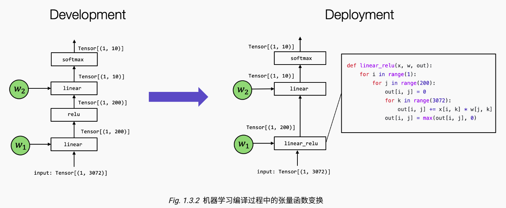


> 抽象和实现

MLC实际上是在相同或不同抽象下，转换和组装张量函数的过程，研究张量函数不同的抽象类型，以及他们是如何协同工作的。

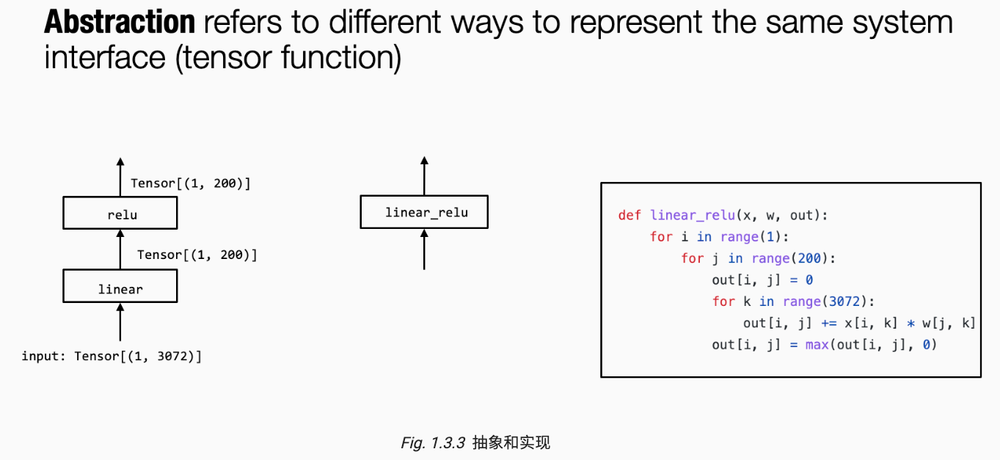


## 张量程序抽象

> 元张量函数

元张量函数表示机器学习模型中单个单元计算，例如`relu`,`linear`,`softmax`等。


张量程序抽象包含：

- 存储数据的多维数组
- 驱动张量计算的循环嵌套
- 计算部分本身

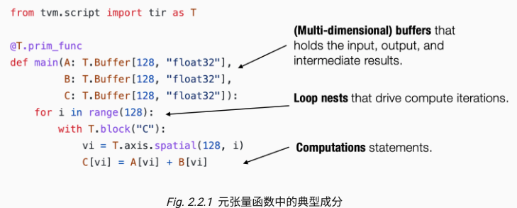


张量程序中的额外结构可以为程序变换提供更多的信息。

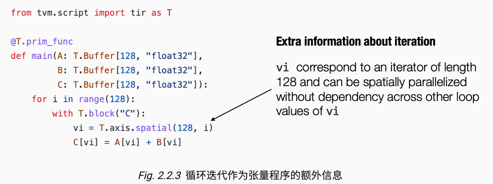


> 总结

- 元张量函数表示机器学习模型计算中的单个单元计算。
  - 一个机器学习编译过程可以有选择地转换元张量函数的实现。
- 张量程序是一个表示元张量函数的有效抽象。
  - 关键成分包括: 多维数组，循环嵌套，计算语句。
  - 程序变换可以被用于加速张量程序的执行。
  - 张量程序中额外的结构能够为程序变换提供更多的信息。


## TensorIR

```python
import numpy as np
import tvm
from tvm.ir.module import IRModule
from tvm.script import tir as T
```


> TensorIR


TensorIR是开源机器学习框架Apache TVM中使用的张量程序抽象。

下面以`mm_relu`函数举例：

这段代码是使用低级numpy实现的：

```python
def lnumpy_mm_relu(A: np.ndarray, B: np.ndarray, C: np.ndarray):
    Y = np.empty((128, 128), dtype="float32")
    for i in range(128):
        for j in range(128):
            for k in range(128):
                if k == 0:
                    Y[i, j] = 0
                Y[i, j] = Y[i, j] + A[i, k] * B[k, j]
    for i in range(128):
        for j in range(128):
            C[i, j] = max(Y[i, j], 0)
```


下面代码是使用TVMScript 的语言实现的，它是一种嵌入在 Python AST 中的特定领域方言。

```python
@tvm.script.ir_module
class MyModule:
    @T.prim_func
    def mm_relu(A: T.Buffer[(128, 128), "float32"],
                B: T.Buffer[(128, 128), "float32"],
                C: T.Buffer[(128, 128), "float32"]):
        T.func_attr({"global_symbol": "mm_relu", "tir.noalias": True})
        Y = T.alloc_buffer((128, 128), dtype="float32")
        for i, j, k in T.grid(128, 128, 128):
            with T.block("Y"):
                vi = T.axis.spatial(128, i)
                vj = T.axis.spatial(128, j)
                vk = T.axis.reduce(128, k)
                with T.init():
                    Y[vi, vj] = T.float32(0)
                Y[vi, vj] = Y[vi, vj] + A[vi, vk] * B[vk, vj]
        for i, j in T.grid(128, 128):
            with T.block("C"):
                vi = T.axis.spatial(128, i)
                vj = T.axis.spatial(128, j)
                C[vi, vj] = T.max(Y[vi, vj], T.float32(0))
```


其中`T.grid`是TensorIR中的语法糖，用来写多个嵌套的迭代器。

`T.block`是TensorIR中的基本计算单元，一个块包含了一组块轴`(vi, vj,vk)`和围绕他们的计算。


```python
vi = T.axis.spatial(128, i)
vj = T.axis.spatial(128, j)
vk = T.axis.reduce(128, k)

[block_axis] = T.axis.[axis_type]([axis_range], [mapped_value])
```


一个块轴包含以下信息：

- 定义了 `vi`、`vj`、`vk` 应被绑定到的位置（在本例中为 `i`、`j` 和 `k`）；
- 声明了 `vi`、`vj`、`vk` 的原始范围（`T.axis.spatial(128, i)` 中的 `128`）；
- 声明了块轴的属性（`spatial`, `reduce`）。


块轴的语法糖：`T.axis.remap`

```python
# SSR means the properties of each axes are "spatial", "spatial", "reduce"
vi, vj, vk = T.axis.remap("SSR", [i, j, k])

# 等价于

vi = T.axis.spatial(range_of_i, i)
vj = T.axis.spatial(range_of_j, j)
vk = T.axis.reduce(range_of_k, k)
```


> 变换

TensorIR 引入了一个名为 Schedule 的辅助结构帮助我们做程序变换。

原始的MyModule：

```python
@tvm.script.ir_module
class Module:
    @T.prim_func
    def mm_relu(A: T.Buffer[(128, 128), "float32"], B: T.Buffer[(128, 128), "float32"], C: T.Buffer[(128, 128), "float32"]) -> None:
        # function attr dict
        T.func_attr({"global_symbol": "mm_relu", "tir.noalias": True})
        # body
        # with T.block("root")
        Y = T.alloc_buffer([128, 128], dtype="float32")
        for i, j, k in T.grid(128, 128, 128):
            with T.block("Y"):
                vi, vj, vk = T.axis.remap("SSR", [i, j, k])
                T.reads(A[vi, vk], B[vk, vj])
                T.writes(Y[vi, vj])
                with T.init():
                    Y[vi, vj] = T.float32(0)
                Y[vi, vj] = Y[vi, vj] + A[vi, vk] * B[vk, vj]
        for i, j in T.grid(128, 128):
            with T.block("C"):
                vi, vj = T.axis.remap("SS", [i, j])
                T.reads(Y[vi, vj])
                T.writes(C[vi, vj])
                C[vi, vj] = T.max(Y[vi, vj], T.float32(0))
```


创建一个以给定的 MyModule 作为输入的 Schedule 辅助类，并获得对块 Y 和相应循环的引用

```python
sch = tvm.tir.Schedule(MyModule)

block_Y = sch.get_block("Y", func_name="mm_relu")
i, j, k = sch.get_loops(block_Y)
```


循环 j 分成两个循环，其中内部循环的长度为 4


```python
j0, j1 = sch.split(j, factors=[None, 4])
```


```python
@tvm.script.ir_module
class Module:
    @T.prim_func
    def mm_relu(A: T.Buffer[(128, 128), "float32"], B: T.Buffer[(128, 128), "float32"], C: T.Buffer[(128, 128), "float32"]) -> None:
        # function attr dict
        T.func_attr({"global_symbol": "mm_relu", "tir.noalias": True})
        # body
        # with T.block("root")
        Y = T.alloc_buffer([128, 128], dtype="float32")
        for i, j_0, j_1, k in T.grid(128, 32, 4, 128):
            with T.block("Y"):
                vi = T.axis.spatial(128, i)
                vj = T.axis.spatial(128, j_0 * 4 + j_1)
                vk = T.axis.reduce(128, k)
                T.reads(A[vi, vk], B[vk, vj])
                T.writes(Y[vi, vj])
                with T.init():
                    Y[vi, vj] = T.float32(0)
                Y[vi, vj] = Y[vi, vj] + A[vi, vk] * B[vk, vj]
        for i, j in T.grid(128, 128):
            with T.block("C"):
                vi, vj = T.axis.remap("SS", [i, j])
                T.reads(Y[vi, vj])
                T.writes(C[vi, vj])
                C[vi, vj] = T.max(Y[vi, vj], T.float32(0))
```


重新排序这两个循环

```python
sch.reorder(j0, k, j1)
```


```python
@tvm.script.ir_module
class Module:
    @T.prim_func
    def mm_relu(A: T.Buffer[(128, 128), "float32"], B: T.Buffer[(128, 128), "float32"], C: T.Buffer[(128, 128), "float32"]) -> None:
        # function attr dict
        T.func_attr({"global_symbol": "mm_relu", "tir.noalias": True})
        # body
        # with T.block("root")
        Y = T.alloc_buffer([128, 128], dtype="float32")
        for i, j_0, k, j_1 in T.grid(128, 32, 128, 4):
            with T.block("Y"):
                vi = T.axis.spatial(128, i)
                vj = T.axis.spatial(128, j_0 * 4 + j_1)
                vk = T.axis.reduce(128, k)
                T.reads(A[vi, vk], B[vk, vj])
                T.writes(Y[vi, vj])
                with T.init():
                    Y[vi, vj] = T.float32(0)
                Y[vi, vj] = Y[vi, vj] + A[vi, vk] * B[vk, vj]
        for i, j in T.grid(128, 128):
            with T.block("C"):
                vi, vj = T.axis.remap("SS", [i, j])
                T.reads(Y[vi, vj])
                T.writes(C[vi, vj])
                C[vi, vj] = T.max(Y[vi, vj], T.float32(0))

```


将块 C 移动到 Y 的内循环

```python
block_C = sch.get_block("C", "mm_relu")
sch.reverse_compute_at(block_C, j0)
```


```python
@tvm.script.ir_module
class Module:
    @T.prim_func
    def mm_relu(A: T.Buffer[(128, 128), "float32"], B: T.Buffer[(128, 128), "float32"], C: T.Buffer[(128, 128), "float32"]) -> None:
        # function attr dict
        T.func_attr({"global_symbol": "mm_relu", "tir.noalias": True})
        # body
        # with T.block("root")
        Y = T.alloc_buffer([128, 128], dtype="float32")
        for i, j_0 in T.grid(128, 32):
            for k, j_1 in T.grid(128, 4):
                with T.block("Y"):
                    vi = T.axis.spatial(128, i)
                    vj = T.axis.spatial(128, j_0 * 4 + j_1)
                    vk = T.axis.reduce(128, k)
                    T.reads(A[vi, vk], B[vk, vj])
                    T.writes(Y[vi, vj])
                    with T.init():
                        Y[vi, vj] = T.float32(0)
                    Y[vi, vj] = Y[vi, vj] + A[vi, vk] * B[vk, vj]
            for ax0 in T.serial(4):
                with T.block("C"):
                    vi = T.axis.spatial(128, i)
                    vj = T.axis.spatial(128, j_0 * 4 + ax0)
                    T.reads(Y[vi, vj])
                    T.writes(C[vi, vj])
                    C[vi, vj] = T.max(Y[vi, vj], T.float32(0))
```


将 Y 元素的初始化与归约更新分开

```python
sch.decompose_reduction(block_Y, k)
```

```python
@tvm.script.ir_module
class Module:
    @tir.prim_func
    def mm_relu(A: tir.Buffer[(128, 128), "float32"], B: tir.Buffer[(128, 128), "float32"], C: tir.Buffer[(128, 128), "float32"]) -> None:
        # function attr dict
        tir.func_attr({"global_symbol": "mm_relu", "tir.noalias": True})
        # body
        # with tir.block("root")
        Y = tir.alloc_buffer([128, 128], dtype="float32")
        for i, j_0 in tir.grid(128, 32):
            for j_1_init in tir.serial(4):
                with tir.block("Y_init"):
                    vi = tir.axis.spatial(128, i)
                    vj = tir.axis.spatial(128, j_0 * 4 + j_1_init)
                    tir.reads()
                    tir.writes(Y[vi, vj])
                    Y[vi, vj] = tir.float32(0)
            for k, j_1 in tir.grid(128, 4):
                with tir.block("Y_update"):
                    vi = tir.axis.spatial(128, i)
                    vj = tir.axis.spatial(128, j_0 * 4 + j_1)
                    vk = tir.axis.reduce(128, k)
                    tir.reads(Y[vi, vj], A[vi, vk], B[vk, vj])
                    tir.writes(Y[vi, vj])
                    Y[vi, vj] = Y[vi, vj] + A[vi, vk] * B[vk, vj]
            for ax0 in tir.serial(4):
                with tir.block("C"):
                    vi = tir.axis.spatial(128, i)
                    vj = tir.axis.spatial(128, j_0 * 4 + ax0)
                    tir.reads(Y[vi, vj])
                    tir.writes(C[vi, vj])
                    C[vi, vj] = tir.max(Y[vi, vj], tir.float32(0))
```


运行IRModule中得到的程序。

```python
# 调用构建函数将 IRModule 变换为 runtime.Module
rt_lib = tvm.build(MyModule, target="llvm")

# 创建三个用于保存输入和输出的 TVM NDArray
a_nd = tvm.nd.array(a_np)
b_nd = tvm.nd.array(b_np)
c_nd = tvm.nd.empty((128, 128), dtype="float32")

# 从 rt_lib 中获取可运行函数, 通过传递三个数组参数来执行它
func_mm_relu = rt_lib["mm_relu"]
func_mm_relu(a_nd, b_nd, c_nd)

np.testing.assert_allclose(c_mm_relu, c_nd.numpy(), rtol=1e-5)
```


性能对比：

```python
f_timer_before = rt_lib.time_evaluator("mm_relu", tvm.cpu())
print("Time cost of MyModule %g sec" % f_timer_before(a_nd, b_nd, c_nd).mean)
f_timer_after = rt_lib_after.time_evaluator("mm_relu", tvm.cpu())
print("Time cost of transformed sch.mod %g sec" % f_timer_after(a_nd, b_nd, c_nd).mean)
```

```bash
Time cost of MyModule 0.00330733 sec
Time cost of transformed sch.mod 0.00113919 sec
```

性能差距的原因跟CPU的缓存特性有一定的关系，CPU带有多级缓存，需要先将数据提取到缓冲中，CPU才能访问它，特别的访问已经在缓存中的数据要快得多。CPU采用cache line的策略，一次加载相邻的数据到缓存中。

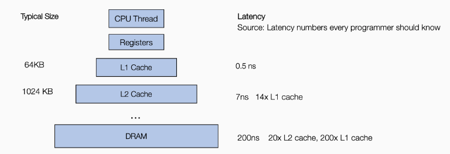


而程序变换得到的代码，对j1的迭代产生了对B元素的连续访问，另外使 `C` 的计算更接近 `Y`，从而实现更好的缓存行为。

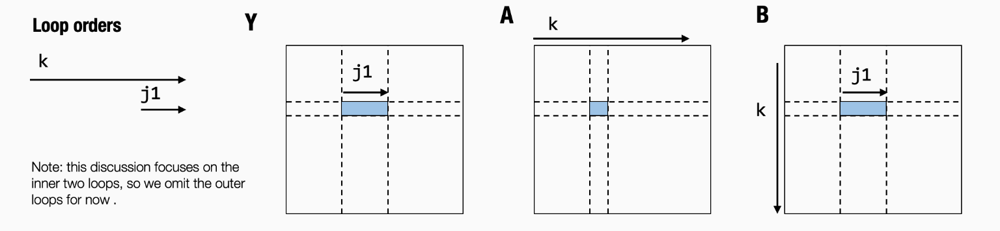


> 创建TensorIR的方式

我们可以通过，TVM Sccipt和张量表达式来创建TensorIR。

张量表达式 (TE) 是一种特定领域的语言，它通过 API 之类的表达式描述一系列计算。


```python
from tvm import te

A = te.placeholder((128, 128), "float32", name="A")
B = te.placeholder((128, 128), "float32", name="B")
k = te.reduce_axis((0, 128), "k")
Y = te.compute((128, 128), lambda i, j: te.sum(A[i, k] * B[k, j], axis=k), name="Y")
C = te.compute((128, 128), lambda i, j: te.max(Y[i, j], 0), name="C")
```

`te.compute` 采用签名 `te.compute(output_shape, fcompute)`。 `fcompute` 函数描述了对于给定的索引 `(i, j)` 我们要如何计算元素 `Y[i, j]` 的值。

```python
lambda i, j: te.sum(A[i, k] * B[k, j], axis=k)
```


创建一个具有两个输入参数（A，B）和一个输出参数（C）的函数

```python
te_func = te.create_prim_func([A, B, C]).with_attr({"global_symbol": "mm_relu"})
MyModuleFromTE = tvm.IRModule({"mm_relu": te_func})
```


```python
@tvm.script.ir_module
class Module:
    @T.prim_func
    def mm_relu(A: T.Buffer[(128, 128), "float32"], B: T.Buffer[(128, 128), "float32"], C: T.Buffer[(128, 128), "float32"]) -> None:
        # function attr dict
        T.func_attr({"global_symbol": "mm_relu", "tir.noalias": True})
        # body
        # with T.block("root")
        Y = T.alloc_buffer([128, 128], dtype="float32")
        for i0, i1, i2 in T.grid(128, 128, 128):
            with T.block("Y"):
                i, j, k = T.axis.remap("SSR", [i0, i1, i2])
                T.reads(A[i, k], B[k, j])
                T.writes(Y[i, j])
                with T.init():
                    Y[i, j] = T.float32(0)
                Y[i, j] = Y[i, j] + A[i, k] * B[k, j]
        for i0, i1 in T.grid(128, 128):
            with T.block("C"):
                i, j = T.axis.remap("SS", [i0, i1])
                T.reads(Y[i, j])
                T.writes(C[i, j])
                C[i, j] = T.max(Y[i, j], T.float32(0))
```


MLC流程：开发、变换、构建。

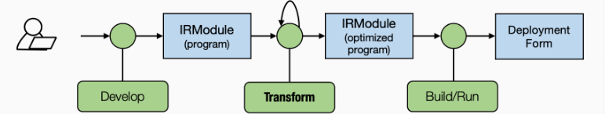


[2.4 TensorIR: 张量程序抽象案例研究.](https://github.com/Sanzo00/mlc-summer22/blob/master/2.4_case-study.ipynb)

[2.5 TensorIR 练习](https://github.com/Sanzo00/mlc-summer22/blob/master/2.5_tensorir-exercises.ipynb)


> 总结

- TensorIR 抽象
  - 包含循环、多维缓冲区等常用元素
  - 引入了一个封装循环计算要求的新结构**块**。
  - 可以在 Python AST 中构建（通过 TVMScript）
- 我们可以使用变换来创建不同的 TensorIR 变体。
- 通用 MLC 流程：开发、变换、构建。


## 端到端模型整合

以一个简单的模型为例子：

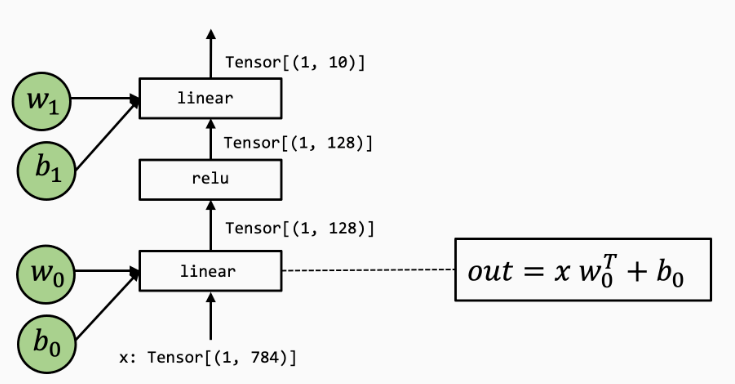


在TVMScript中构建端到端的IRModule：

```python
@tvm.script.ir_module
class MyModule:
    @T.prim_func
    def relu0(X: T.Buffer[(1, 128), "float32"],
              Y: T.Buffer[(1, 128), "float32"]):
        # function attr dict
        T.func_attr({"global_symbol": "relu0", "tir.noalias": True})
        for i, j in T.grid(1, 128):
            with T.block("Y"):
                vi, vj = T.axis.remap("SS", [i, j])
                Y[vi, vj] = T.max(X[vi, vj], T.float32(0))

    @T.prim_func
    def linear0(X: T.Buffer[(1, 784), "float32"],
                W: T.Buffer[(128, 784), "float32"],
                B: T.Buffer[(128,), "float32"],
                Z: T.Buffer[(1, 128), "float32"]):
        T.func_attr({"global_symbol": "linear0", "tir.noalias": True})
        Y = T.alloc_buffer((1, 128), "float32")
        for i, j, k in T.grid(1, 128, 784):
            with T.block("Y"):
                vi, vj, vk = T.axis.remap("SSR", [i, j, k])
                with T.init():
                    Y[vi, vj] = T.float32(0)
                Y[vi, vj] = Y[vi, vj] + X[vi, vk] * W[vj, vk]

        for i, j in T.grid(1, 128):
            with T.block("Z"):
                vi, vj = T.axis.remap("SS", [i, j])
                Z[vi, vj] =  Y[vi, vj] + B[vj]

    @T.prim_func
    def linear1(X: T.Buffer[(1, 128), "float32"],
                W: T.Buffer[(10, 128), "float32"],
                B: T.Buffer[(10,), "float32"],
                Z: T.Buffer[(1, 10), "float32"]):
        T.func_attr({"global_symbol": "linear1", "tir.noalias": True})
        Y = T.alloc_buffer((1, 10), "float32")
        for i, j, k in T.grid(1, 10, 128):
            with T.block("Y"):
                vi, vj, vk = T.axis.remap("SSR", [i, j, k])
                with T.init():
                    Y[vi, vj] = T.float32(0)
                Y[vi, vj] = Y[vi, vj] + X[vi, vk] * W[vj, vk]

        for i, j in T.grid(1, 10):
            with T.block("Z"):
                vi, vj = T.axis.remap("SS", [i, j])
                Z[vi, vj] = Y[vi, vj] + B[vj]

    @R.function
    def main(x: Tensor((1, 784), "float32"),
             w0: Tensor((128, 784), "float32"),
             b0: Tensor((128,), "float32"),
             w1: Tensor((10, 128), "float32"),
             b1: Tensor((10,), "float32")):
        with R.dataflow():
            lv0 = R.call_tir(linear0, (x, w0, b0), (1, 128), dtype="float32")
            lv1 = R.call_tir(relu0, (lv0,), (1, 128), dtype="float32")
            out = R.call_tir(linear1, (lv1, w1, b1), (1, 10), dtype="float32")
            R.output(out)
        return out
```


和之前不同的是，这里的IRModule有个新的函数，R.function，他是一个Relax函数，表示上层神经网络执行的全新抽象。


下面这个图是使用计算图表示模型执行的过程：

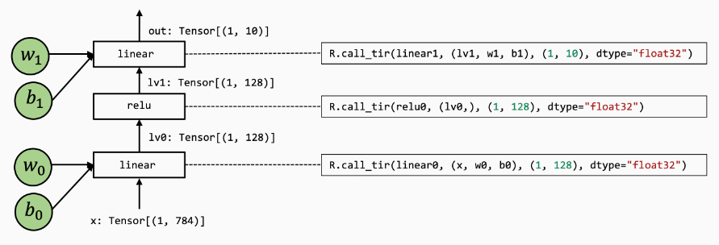


> R.call_tir

计算图中的每一个操作都包含一个R.call_tir操作。

```python
lv0 = R.call_tir(linear0, (x, w0, b0), (1, 128), dtype="float32")
```


和R.call_tir对应的numpy实现为：

```python
def lnumpy_call_tir(prim_func, inputs, shape, dtype):
    res = np.empty(shape, dtype=dtype)
    prim_func(*inputs, res)
    return res
```

简单来说，cal_tir接受一个元函数（prim_func）的输入列表，分配一个输出张量res，然后将输入和输出传递给prim_func，执行prim_func之后，结果填充到res，然后返回结果。

这种规定称为**目标传递（destination passing）**，将输入和输出在外部显示的分配并传递给底层元函数，这种风格通常用于底层库的实现，并不是所有的函数都可以写成这种形式，例如一些操作的输出形状取决于输入。这样写的一个好处是可以让高层框架处理内存分配。

当然也可以通过显示的分配中间结果并调用每个函数讲目标传递的函数组装在一起，但是很难将以下代码转换为计算图。

```python
def lnumpy_mlp(data, w0, b0, w1, b1):
    lv0 = np.empty((1, 128), dtype="float32")
    lnumpy_linear0(data, w0, b0, lv0)

    lv1 = np.empty((1, 128), dtype="float32")
    lnumpy_relu0(lv0, lv1)

    out = np.empty((1, 10), dtype="float32")
    lnumpy_linear1(lv1, w1, b1, out)
    return out
```


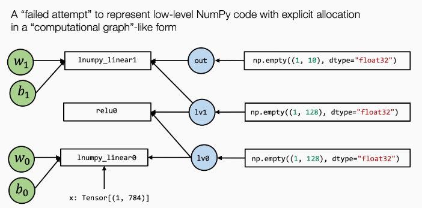


call_tir的关键思想是想要隐藏可能的分配或对函数的显式写入。 用更正式的术语来说，我们希望函数是 **pure** 或 **side-effect free**。


> Dataflow Block


```python
with R.dataflow():
    lv0 = R.call_tir(linear0, (x, w0, b0), (1, 128), dtype="float32")
    lv1 = R.call_tir(relu0, (lv0,), (1, 128), dtype="float32")
    out = R.call_tir(linear1, (lv1, w1, b1), (1, 10), dtype="float32")
    R.output(out)
```

dataflow block是标记程序计算图区域的一种方式，在dataflow block中，所有操作都需要side-effect free。 在dataflow block之外，操作可能包含side-effect。 下面的程序是一个包含两个dataflow block的示例程序。

```python
@R.function
def main(x: Tensor((1, 784), "float32"),
         w0: Tensor((128, 784), "float32"),
         b0: Tensor((128,), "float32"),
         w1: Tensor((10, 128), "float32"),
         b1: Tensor((10,), "float32")):

    with R.dataflow():
        lv0 = R.call_tir(linear0, (x, w0, b0), (1, 128), dtype="float32")
        gv0 = R.call_tir(relu0, (lv0,), (1, 128), dtype="float32")
        R.output(gv0)

    gv1 = R.alloc_tensor((1, 128), dtype="float32")

    with R.dataflow():
        out = R.call_tir(linear1, (gv0, gv1, b0), (1, 128), dtype="float32")
        R.output(out)
    return out
```


> 模型构建

build 函数会给我们一个可执行文件（是针对Relax VM设计的一种文件格式）。

```python
ex = relax.vm.build(MyModule, target="llvm")
type(ex)
```


初始化一个虚拟机执行器

```python
vm = relax.VirtualMachine(ex, tvm.cpu())
```


构建输入和权重数组

```python
data_nd = tvm.nd.array(img.reshape(1, 784))
nd_params = {k: tvm.nd.array(v) for k, v in mlp_params.items()}
```


传入输入参数和权重来运行 `main` 函数

```python
nd_res = vm["main"](data_nd,
                    nd_params["w0"],
                    nd_params["b0"],
                    nd_params["w1"],
                    nd_params["b1"])
print(nd_res)
```


> 集成现有的运行库

```python
@tvm.script.ir_module
class MyModuleWithExternCall:
    @R.function
    def main(x: Tensor((1, 784), "float32"),
             w0: Tensor((128, 784), "float32"),
             b0: Tensor((128,), "float32"),
             w1: Tensor((10, 128), "float32"),
             b1: Tensor((10,), "float32")):
        # block 0
        with R.dataflow():
            lv0 = R.call_tir("env.linear", (x, w0, b0), (1, 128), dtype="float32")
            lv1 = R.call_tir("env.relu", (lv0,), (1, 128), dtype="float32")
            out = R.call_tir("env.linear", (lv1, w1, b1), (1, 10), dtype="float32")
            R.output(out)
        return out
```


注册相应的函数:

```python
@tvm.register_func("env.linear", override=True)
def torch_linear(x: tvm.nd.NDArray,
                 w: tvm.nd.NDArray,
                 b: tvm.nd.NDArray,
                 out: tvm.nd.NDArray):
    x_torch = torch.from_dlpack(x)
    w_torch = torch.from_dlpack(w)
    b_torch = torch.from_dlpack(b)
    out_torch = torch.from_dlpack(out)
    torch.mm(x_torch, w_torch.T, out=out_torch)
    torch.add(out_torch, b_torch, out=out_torch)

@tvm.register_func("env.relu", override=True)
def lnumpy_relu(x: tvm.nd.NDArray,
                out: tvm.nd.NDArray):
    x_torch = torch.from_dlpack(x)
    out_torch = torch.from_dlpack(out)
    torch.maximum(x_torch, torch.Tensor([0.0]), out=out_torch)
```


在上面的代码中，我们使用 `from_dlpack` 将 TVM NDArray 转换为 torch NDArray。 请注意，这是一个零拷贝转换，这意味着 Torch 阵列与 TVM NDArray 共享底层内存。 DLPack 是一种通用的交换标准，允许不同的框架交换 Tensor/NDArray 而无需参与数据复制


构建运行：

```python
ex = relax.vm.build(MyModuleWithExternCall, target="llvm")
vm = relax.VirtualMachine(ex, tvm.cpu())

nd_res = vm["main"](data_nd,
                    nd_params["w0"],
                    nd_params["b0"],
                    nd_params["w1"],
                    nd_params["b1"])

pred_kind = np.argmax(nd_res.numpy(), axis=1)
print("MyModuleWithExternCall Prediction:", class_names[pred_kind[0]])
```


另外TensorIR也支持混合的表示形式：

```python
@tvm.script.ir_module
class MyModuleMixture:
    @T.prim_func
    def linear0(X: T.Buffer[(1, 784), "float32"],
                W: T.Buffer[(128, 784), "float32"],
                B: T.Buffer[(128,), "float32"],
                Z: T.Buffer[(1, 128), "float32"]):
        T.func_attr({"global_symbol": "linear0", "tir.noalias": True})
        Y = T.alloc_buffer((1, 128), "float32")
        for i, j, k in T.grid(1, 128, 784):
            with T.block("Y"):
                vi, vj, vk = T.axis.remap("SSR", [i, j, k])
                with T.init():
                    Y[vi, vj] = T.float32(0)
                Y[vi, vj] = Y[vi, vj] + X[vi, vk] * W[vj, vk]

        for i, j in T.grid(1, 128):
            with T.block("Z"):
                vi, vj = T.axis.remap("SS", [i, j])
                Z[vi, vj] =  Y[vi, vj] + B[vj]

    @R.function
    def main(x: Tensor((1, 784), "float32"),
             w0: Tensor((128, 784), "float32"),
             b0: Tensor((128,), "float32"),
             w1: Tensor((10, 128), "float32"),
             b1: Tensor((10,), "float32")):
        with R.dataflow():
            lv0 = R.call_tir(linear0, (x, w0, b0), (1, 128), dtype="float32")
            lv1 = R.call_tir("env.relu", (lv0,), (1, 128), dtype="float32")
            out = R.call_tir("env.linear", (lv1, w1, b1), (1, 10), dtype="float32")
            R.output(out)
        return out
```


> 绑定参数


在许多情况下，将参数绑定为附加到 IRModule 的常量通常会降低API的复杂程度。 以下代码通过将参数名称与 nd_params 中的键匹配来创建绑定。

```python
MyModuleWithParams = relax.transform.BindParams("main", nd_params)(MyModuleMixture)
IPython.display.Code(MyModuleWithParams.script(), language="python")
```


`meta[relay.Constant][0]`  对应于一个存储常量的隐式字典：

```python
@tvm.script.ir_module
class Module:
    @R.function
    def main(x: Tensor((1, 784), "float32")) -> Tensor(None, "float32", ndim = 2):
        # block 0
        with R.dataflow():
            lv0 = R.call_tir(linear0, (x, meta[relay.Constant][0], meta[relay.Constant][1]), (1, 128), dtype="float32")
            lv1 = R.call_tir("env.relu", (lv0,), (1, 128), dtype="float32")
            out = R.call_tir("env.linear", (lv1, meta[relay.Constant][2], meta[relay.Constant][3]), (1, 10), dtype="float32")
            R.output(out)
        return out

    @T.prim_func
    def linear0(X: T.Buffer[(1, 784), "float32"], W: T.Buffer[(128, 784), "float32"], B: T.Buffer[128, "float32"], Z: T.Buffer[(1, 128), "float32"]) -> None:
        # function attr dict
        T.func_attr({"global_symbol": "linear0", "tir.noalias": True})
        # body
        # with T.block("root")
        Y = T.alloc_buffer([1, 128], dtype="float32")
        for i, j, k in T.grid(1, 128, 784):
            with T.block("Y"):
                vi, vj, vk = T.axis.remap("SSR", [i, j, k])
                T.reads(X[vi, vk], W[vj, vk])
                T.writes(Y[vi, vj])
                with T.init():
                    Y[vi, vj] = T.float32(0)
                Y[vi, vj] = Y[vi, vj] + X[vi, vk] * W[vj, vk]
        for i, j in T.grid(1, 128):
            with T.block("Z"):
                vi, vj = T.axis.remap("SS", [i, j])
                T.reads(Y[vi, vj], B[vj])
                T.writes(Z[vi, vj])
                Z[vi, vj] = Y[vi, vj] + B[vj]
```


现在可以通过传入输入数据来调用该函数:

```python
ex = relax.vm.build(MyModuleWithParams, target="llvm")
vm = relax.VirtualMachine(ex, tvm.cpu())

nd_res = vm["main"](data_nd)

pred_kind = np.argmax(nd_res.numpy(), axis=1)
print("MyModuleWithParams Prediction:", class_names[pred_kind[0]])
```


> 总结

- 计算图抽象有助于将元张量函数拼接在一起以进行端到端执行。
- Relax 抽象的关键要素包括
  - call_tir 构造，将目标传递规范的元函数嵌入到计算图中
  - Dataflow block
- 计算图允许调用环境库函数和 `TensorIR` 函数。


[MLC 作业 1: 端到端模型执行](https://github.com/Sanzo00/mlc-summer22/blob/master/assignment1_zh.ipynb)


## 自动化程序优化


手动指定变换规则：

```python
def schedule_mm(sch: tvm.tir.Schedule, jfactor=4):
    block_C = sch.get_block("C", "main")
    i, j, k = sch.get_loops(block=block_C)
    j_0, j_1 = sch.split(loop=j, factors=[None, jfactor])
    sch.reorder(i, j_0, k, j_1)
    sch.decompose_reduction(block_C, k)
    return sch
```


随机指定变换规则：

```python
def stochastic_schedule_mm(sch: tvm.tir.Schedule):
    block_C = sch.get_block("C", "main")
    i, j, k = sch.get_loops(block=block_C)
    j_factors = sch.sample_perfect_tile(loop=j, n=2)
    j_0, j_1 = sch.split(loop=j, factors=j_factors)
    sch.reorder(i, j_0, k, j_1)
    sch.decompose_reduction(block_C, k)
    return sch
```


上面两段代码的主要的区别在j_factors的确定上，下面代码通过`sch.sample_perfect_tile(loop=j, n=2)`随机的生成两个factors。


追踪变换的过程：

```python
print(sch.trace)
```


`stochastic_schedule_mm` 创建了一个**可能程序的搜索空间**，具体取决于在每个采样步骤中做出的具体决定。


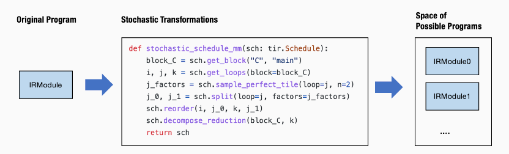


可以多次调用随机变换程序，记录运行时间最少的IRModule.

```python
def random_search(mod: tvm.IRModule, num_trials=5):
    best_result = None
    best_sch = None

    for i in range(num_trials):
        sch = stochastic_schedule_mm(tvm.tir.Schedule(mod))
        lib = tvm.build(sch.mod, target="llvm")
        f_timer_after = lib.time_evaluator("main", tvm.cpu())
        result = f_timer_after(a_nd, b_nd, c_nd).mean

        print("=====Attempt %d, time-cost: %.3f ms====" % (i, result * 1000))
        print(sch.trace)

        # book keep the best result so far
        if best_result is None or result < best_result:
            best_result = result
            best_sch = sch

    return best_sch

sch = random_search(MyModule)
```


TVM提供了更加智能的解决方法，`meta_schedule` 是支持搜索可能变换空间的命名空间。Meta-Schedule 在幕后做了很多额外的事情：

- 跨越多个进程的并行基准测试。
- 使用**代价模型** (cost model) 来避免每次都进行基准测试。
- 基于历史轨迹进行**遗传搜索** (evolutionary search)，而不是每次都随机采样。

关键思想是保持不变的：**使用随机变换来指定好的程序的搜索空间，使用 ``tune_tir`` API 帮助在搜索空间内搜索并找到最优的调度变换**。


```python
from tvm import meta_schedule as ms

sch_tuned = ms.tune_tir(
    mod=MyModule,
    target="llvm --num-cores=1",
    config=ms.TuneConfig(
      max_trials_global=64,
      num_trials_per_iter=64,
    ),
    space=ms.space_generator.ScheduleFn(stochastic_schedule_mm),
    work_dir="./tune_tmp",
    task_name="main"
)
```


其中space是用户定义的搜索空间，TVM内置了通用随机变换集合，称为自动调度，通过删除行 `space=ms.space_generator.ScheduleFn(stochastic_schedule_mm)` 来运行它。


```python
sch_tuned = ms.tune_tir(
    mod=MyModule,
    target="llvm --num-cores=1",
    config=ms.TuneConfig(
      max_trials_global=64,
      num_trials_per_iter=64,
    ),
    work_dir="./tune_tmp",
    task_name="main",
)
```


> 端到端模型执行

随机变换可以用于优化端到端的模型部署，我们可以针对某个元张量函数，进行搜索优化，然后替换掉之前的实现。

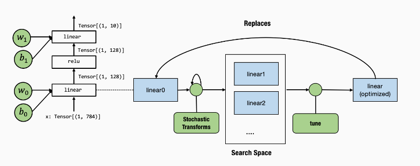


调优 API 只接受一个带有一个 `main` 函数的 IRModule，所以首先将 `linear0` 取出到另一个模块的 main 函数中并将其传递给 `tune_tir`。

```python
mod_linear = tvm.IRModule.from_expr(MyModuleMixture["linear0"].with_attr("global_symbol", "main"))

sch_tuned_linear = ms.tune_tir(
    mod=mod_linear,
    target="llvm --num-cores=1",
    config=ms.TuneConfig(
      max_trials_global=64,
      num_trials_per_iter=64,
    ),
    work_dir="./tune_tmp",
    task_name="main",
)
```

现在我们需要在调优后用新函数替换原来的 `linear0`。我们可以通过首先获得一个 `global_var`（一个指向 IRModule 中函数的 `pointer` 引用），然后调用 `update_func` 来用新的函数替换原本的函数。

```python
MyModuleWithParams2 = relax.transform.BindParams("main", nd_params)(MyModuleMixture)
new_func = sch_tuned_linear.mod["main"].with_attr("global_symbol", "linear0")
gv = MyModuleWithParams2.get_global_var("linear0")
MyModuleWithParams2.update_func(gv, new_func)
IPython.display.HTML(code2html(MyModuleWithParams2.script()))
```


> 总结

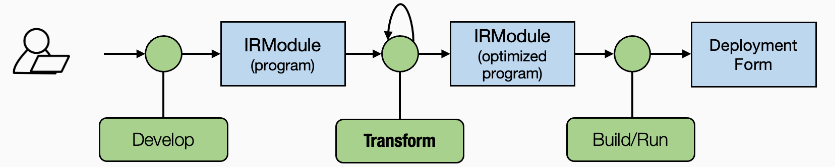


前两章关注的是**抽象**，而本章开始关注**变换**。随机变换指定了可以优化的内容，而无需显式地确定所有选择。Meta-Schedule API 帮助我们搜索可能的变换空间并选择最佳变换。

- 随机变换帮助我们指定可能程序的搜索空间。
- Meta-Schedule 在搜索空间中搜索，并找到优化后的程序。
- 我们可以使用另一种变换，将初始的元张量函数替换为优化后的函数，并更新的端到端执行流程。


## 与机器学习框架整合

本章主要讨论如何将机器学习模型从现有的机器学习框架引入到MLC流程。


### 张量表达式构造TensorIR

```python
from tvm import te

A = te.placeholder((128, 128), name="A", dtype="float32")
B = te.placeholder((128, 128), name="B", dtype="float32")

def te_matmul(A: te.Tensor, B: te.Tensor) -> te.Tensor:
    assert A.shape[1] == B.shape[0]
    n = A.shape[0]
    m = B.shape[1]
    k = te.reduce_axis((0, A.shape[1]), name="k")
    return te.compute((n, m), lambda i, j: te.sum(A[i, k] * B[k, j], axis=k), name="matmul")
```


调用 `te.create_prim_func` 并传入输入和输出值，来创建对应TensorIR函数。

```python
C = te_matmul(A, B)
te.create_prim_func([A, B, C]).show()
```

```bash
# from tvm.script import tir as T
@T.prim_func
def func(A: T.Buffer[(128, 128), "float32"], B: T.Buffer[(128, 128), "float32"], matmul: T.Buffer[(128, 128), "float32"]) -> None:
    # function attr dict
    T.func_attr({"global_symbol": "main", "tir.noalias": True})
    # body
    # with T.block("root")
    for i0, i1, i2 in T.grid(128, 128, 128):
        with T.block("matmul"):
            i, j, k = T.axis.remap("SSR", [i0, i1, i2])
            T.reads(A[i, k], B[k, j])
            T.writes(matmul[i, j])
            with T.init():
                matmul[i, j] = T.float32(0)
            matmul[i, j] = matmul[i, j] + A[i, k] * B[k, j]
```


relu的例子：

```python
def te_relu(A: te.Tensor) -> te.Tensor:
    return te.compute(A.shape, lambda *i: te.max(A(*i), 0), name="relu")
```


te API支持算子的融合，可以将matmul的结果再次应用到relu。

```python
C = te_matmul(A, B)
D = te_relu(C)
te.create_prim_func([A, B, D]).show()
```


```bash
# from tvm.script import tir as T
@T.prim_func
def func(A: T.Buffer[(128, 128), "float32"], B: T.Buffer[(128, 128), "float32"], relu: T.Buffer[(128, 128), "float32"]) -> None:
    # function attr dict
    T.func_attr({"global_symbol": "main", "tir.noalias": True})
    # body
    # with T.block("root")
    matmul = T.alloc_buffer([128, 128], dtype="float32")
    for i0, i1, i2 in T.grid(128, 128, 128):
        with T.block("matmul"):
            i, j, k = T.axis.remap("SSR", [i0, i1, i2])
            T.reads(A[i, k], B[k, j])
            T.writes(matmul[i, j])
            with T.init():
                matmul[i, j] = T.float32(0)
            matmul[i, j] = matmul[i, j] + A[i, k] * B[k, j]
    for i0, i1 in T.grid(128, 128):
        with T.block("relu"):
            i0_1, i1_1 = T.axis.remap("SS", [i0, i1])
            T.reads(matmul[i0_1, i1_1])
            T.writes(relu[i0_1, i1_1])
            relu[i0_1, i1_1] = T.max(matmul[i0_1, i1_1], T.float32(0))
```


当然也可以穿入中间变量C，但是建议只传入输入和输出，这样可以在里面进行更高级的融合。

```python
te.create_prim_func([A, B, C, D]).show()
```

```bash
# from tvm.script import tir as T
@T.prim_func
def func(A: T.Buffer[(128, 128), "float32"], B: T.Buffer[(128, 128), "float32"], matmul: T.Buffer[(128, 128), "float32"], relu: T.Buffer[(128, 128), "float32"]) -> None:
    # function attr dict
    T.func_attr({"global_symbol": "main", "tir.noalias": True})
    # body
    # with T.block("root")
    for i0, i1, i2 in T.grid(128, 128, 128):
        with T.block("matmul"):
            i, j, k = T.axis.remap("SSR", [i0, i1, i2])
            T.reads(A[i, k], B[k, j])
            T.writes(matmul[i, j])
            with T.init():
                matmul[i, j] = T.float32(0)
            matmul[i, j] = matmul[i, j] + A[i, k] * B[k, j]
    for i0, i1 in T.grid(128, 128):
        with T.block("relu"):
            i0_1, i1_1 = T.axis.remap("SS", [i0, i1])
            T.reads(matmul[i0_1, i1_1])
            T.writes(relu[i0_1, i1_1])
            relu[i0_1, i1_1] = T.max(matmul[i0_1, i1_1], T.float32(0))
```


### BlockBuilder构造IRModule

到目前为止我们有了若干个TensorIR函数，为了构建端到端的模型执行，需要通过计算图来链接多个TensorIR函数。

```python
A = relax.Var("A", (128, 128), relax.DynTensorType(2, "float32"))
B = relax.Var("B", (128, 128), relax.DynTensorType(2, "float32"))

bb = relax.BlockBuilder()
with bb.function("main"):
    with bb.dataflow():
        C = bb.emit_te(te_matmul, A, B)
        D = bb.emit_te(te_relu, C)
        R = bb.emit_output(D)
    bb.emit_func_output(R, params=[A, B])

MyModule = bb.get()
MyModule.show()
```


`bb.dataflow()` 创建一个 dataflow block，其中所有对 BlockBuilder 的调用都处在 dataflow block 的作用域中。

`bb.emit_te` 做了以下事情：

- 为 A 和 B 创建一个输入 `te.placeholder`，
- 通过 `te_matmul` 函数运行它们。
- 调用 `te.create_prim_func` 来创建一个 TensorIR 函数。
- 通过 `call_tir` 生成对函数的调用。


`bb.emit_output` 创建每个 dataflow block 的输出变量，表示这个变量可以被dataflow block之外引用。

最后，函数输出由 `bb.emit_func_output` 标记。可以在输出阶段指定函数的参数列表。 这样做在我们动态收集参数列表的情况下会有帮助。

```python
# method 1
with bb.function("main"):
    ...
    # specify parameters in the end
    bb.emit_func_output(R, params=[A, B])
    
    
# method 2
# specify parameters in the beginning.
with bb.function("main", params=[A, B]):
    ...
    bb.emit_func_output(R)    
```


```bash
@tvm.script.ir_module
class Module:
    @T.prim_func
    def te_matmul(rxplaceholder: T.Buffer[(128, 128), "float32"], rxplaceholder_1: T.Buffer[(128, 128), "float32"], matmul: T.Buffer[(128, 128), "float32"]) -> None:
        # function attr dict
        T.func_attr({"global_symbol": "te_matmul", "tir.noalias": True})
        # body
        # with T.block("root")
        for i0, i1, i2 in T.grid(128, 128, 128):
            with T.block("matmul"):
                i, j, k = T.axis.remap("SSR", [i0, i1, i2])
                T.reads(rxplaceholder[i, k], rxplaceholder_1[k, j])
                T.writes(matmul[i, j])
                with T.init():
                    matmul[i, j] = T.float32(0)
                matmul[i, j] = matmul[i, j] + rxplaceholder[i, k] * rxplaceholder_1[k, j]

    @T.prim_func
    def te_relu(rxplaceholder: T.Buffer[(128, 128), "float32"], relu: T.Buffer[(128, 128), "float32"]) -> None:
        # function attr dict
        T.func_attr({"global_symbol": "te_relu", "tir.noalias": True})
        # body
        # with T.block("root")
        for i0, i1 in T.grid(128, 128):
            with T.block("relu"):
                i0_1, i1_1 = T.axis.remap("SS", [i0, i1])
                T.reads(rxplaceholder[i0_1, i1_1])
                T.writes(relu[i0_1, i1_1])
                relu[i0_1, i1_1] = T.max(rxplaceholder[i0_1, i1_1], T.float32(0))

    @R.function
    def main(A: Tensor((128, 128), "float32"), B: Tensor((128, 128), "float32")) -> Tensor(None, "float32", ndim = 2):
        # block 0
        with R.dataflow():
            lv = R.call_tir(te_matmul, (A, B), (128, 128), dtype="float32")
            lv1 = R.call_tir(te_relu, (lv,), (128, 128), dtype="float32")
            gv: Tensor((128, 128), "float32") = lv1
            R.output(gv)
        return gv
```


### 从Pytorch导入模型

一个简单的nn.Module的例子：

```python
class MyModel(nn.Module):
    def __init__(self):
        super(MyModel, self).__init__()
        self.weight = nn.Parameter(torch.randn(128, 128))

    def forward(self, x):
        x = torch.matmul(x, self.weight)
        x = torch.relu(x)
        return x
```


通过TorchFX来表示Pytorch模型中的计算图。

```python
model = MyModel()
fx_module = fx.symbolic_trace(model)
fx_module.graph.print_tabular()
```

```bash
opcode         name    target                                                     args         kwargs
-------------  ------  ---------------------------------------------------------  -----------  --------
placeholder    x       x                                                          ()           {}
get_attr       weight  weight                                                     ()           {}
call_function  matmul  <built-in method matmul of type object at 0x7fe7fb16f980>  (x, weight)  {}
call_function  relu    <built-in method relu of type object at 0x7fe7fb16f980>    (matmul,)    {}
output         output  output                                                     (relu,)      {}
```


构建映射函数的过程，主要为：

- 创建一个 `node_map`，将 `fx.Node` 映射到相应的 `relax.Var`，该 `relax.Var` 代表 IRModule 中的已翻译节点。
- 以拓扑顺序迭代 FX 图中的节点。
- 给定映射输入，获取节点的映射输出。


```python
# 计算图中顶点的映射
def map_param(param: nn.Parameter):
    ndim = len(param.data.shape)
    return relax.const(
        param.data.cpu().numpy(), relax.DynTensorType(ndim, "float32")
    )

# 获取权重参数
def fetch_attr(fx_mod, target: str):
    """Helper function to fetch an attr"""
    target_atoms = target.split('.')
    attr_itr = fx_mod
    for i, atom in enumerate(target_atoms):
        if not hasattr(attr_itr, atom):
            raise RuntimeError(f"Node referenced nonexistant target {'.'.join(target_atoms[:i])}")
        attr_itr = getattr(attr_itr, atom)
    return attr_itr

# 具体的翻译逻辑，根据pytorch中不同的计算图节点，执行不同的翻译函数
def from_fx(fx_mod, input_shapes, call_function_map, call_module_map):
    input_index = 0
    node_map = {}
    named_modules = dict(fx_mod.named_modules())

    bb = relax.BlockBuilder()

    fn_inputs = []
    fn_output = None
    with bb.function("main"):
        with bb.dataflow():
            for node in fx_mod.graph.nodes:
                if node.op == "placeholder":
                    # create input placeholder
                    shape = input_shapes[input_index]
                    input_index += 1
                    input_var = relax.Var(
                        node.target, shape, relax.DynTensorType(len(shape), "float32")
                    )
                    fn_inputs.append(input_var)
                    node_map[node] = input_var
                elif node.op == "get_attr":
                    node_map[node] = map_param(fetch_attr(fx_mod, node.target))
                elif node.op == "call_function":
                    node_map[node] = call_function_map[node.target](bb, node_map, node)
                elif node.op == "call_module":
                    named_module = named_modules[node.target]
                    node_map[node] = call_module_map[type(named_module)](bb, node_map, node, named_module)
                elif node.op == "output":
                    output = node_map[node.args[0]]
                    assert fn_output is None
                    fn_output = bb.emit_output(output)
        # output and finalize the function
        bb.emit_func_output(output, fn_inputs)
    return bb.get()
```


通过emit_te API为每一个torch function指定对应的翻译规则。

```python
def map_matmul(bb, node_map, node: fx.Node):
    A = node_map[node.args[0]]
    B = node_map[node.args[1]]
    return bb.emit_te(te_matmul, A, B)

def map_relu(bb, node_map, node: fx.Node):
    A = node_map[node.args[0]]
    return bb.emit_te(te_relu, A)

MyModule = from_fx(
    fx_module,
    input_shapes = [(1, 128)],
    call_function_map = {
      torch.matmul: map_matmul,
      torch.relu: map_relu,
    },
    call_module_map={},
)

MyModule.show()
```

```bash
@tvm.script.ir_module
class Module:
    @T.prim_func
    def te_matmul(rxplaceholder: T.Buffer[(1, 128), "float32"], rxplaceholder_1: T.Buffer[(128, 128), "float32"], matmul: T.Buffer[(1, 128), "float32"]) -> None:
        # function attr dict
        T.func_attr({"global_symbol": "te_matmul", "tir.noalias": True})
        # body
        # with T.block("root")
        for i0, i1, i2 in T.grid(1, 128, 128):
            with T.block("matmul"):
                i, j, k = T.axis.remap("SSR", [i0, i1, i2])
                T.reads(rxplaceholder[i, k], rxplaceholder_1[k, j])
                T.writes(matmul[i, j])
                with T.init():
                    matmul[i, j] = T.float32(0)
                matmul[i, j] = matmul[i, j] + rxplaceholder[i, k] * rxplaceholder_1[k, j]

    @T.prim_func
    def te_relu(rxplaceholder: T.Buffer[(1, 128), "float32"], relu: T.Buffer[(1, 128), "float32"]) -> None:
        # function attr dict
        T.func_attr({"global_symbol": "te_relu", "tir.noalias": True})
        # body
        # with T.block("root")
        for i0, i1 in T.grid(1, 128):
            with T.block("relu"):
                i0_1, i1_1 = T.axis.remap("SS", [i0, i1])
                T.reads(rxplaceholder[i0_1, i1_1])
                T.writes(relu[i0_1, i1_1])
                relu[i0_1, i1_1] = T.max(rxplaceholder[i0_1, i1_1], T.float32(0))

    @R.function
    def main(x: Tensor((1, 128), "float32")) -> Tensor(None, "float32", ndim = 2):
        # block 0
        with R.dataflow():
            lv = R.call_tir(te_matmul, (x, meta[relay.Constant][0]), (1, 128), dtype="float32")
            lv1 = R.call_tir(te_relu, (lv,), (1, 128), dtype="float32")
            gv: Tensor((1, 128), "float32") = lv1
            R.output(gv)
        return lv1
```


下面是一个nn module的映射示例：

```python
class MLP(nn.Module):
    def __init__(self):
        super(MLP, self).__init__()
        self.linear0 = nn.Linear(784, 128, bias=True)
        self.relu = nn.ReLU()
        self.linear1 = nn.Linear(128, 10, bias=True)

    def forward(self, x):
        x = self.linear0(x)
        x = self.relu(x)
        x = self.linear1(x)
        return x
      
```


```python
from tvm import topi

def map_nn_linear(bb, node_map, node, nn_mod):
    x = node_map[node.args[0]]
    w = map_param(nn_mod.weight)
    if nn_mod.bias is not None:
        b = map_param(nn_mod.bias)
    y = bb.emit_te(topi.nn.dense, x, w)
    return bb.emit_te(topi.add, y, b)

def map_nn_relu(bb, node_map, node, nn_mod):
    return map_relu(bb, node_map, node)


MLPModule = from_fx(
    fx.symbolic_trace(mlp_model),
    input_shapes = [(1, 784)],
    call_function_map={
    },
    call_module_map={
        torch.nn.Linear: map_nn_linear,
        torch.nn.ReLU: map_nn_relu,
    },
)

MLPModule.show()
```


### 翻译为高层算子

我们可以使用那些内置的算子将模型导入为 IRModule 后的结果。这些内置算子是 **比 TensorIR 函数更高级别的抽象**。


```python
def map_nn_relu_op(bb, node_map, node, nn_mod):
    A = node_map[node.args[0]]
    return bb.emit(relax.op.relu(A))

def map_nn_linear_op(bb, node_map, node, nn_mod):
    x = node_map[node.args[0]]
    w = map_param(nn_mod.weight)
    if nn_mod.bias is not None:
        b = map_param(nn_mod.bias)
    y = bb.emit(relax.op.dense(x, w))
    return bb.emit(relax.op.add(y, b))

MLPModuleHighLevel = from_fx(
    fx.symbolic_trace(mlp_model),
    input_shapes = [(1, 784)],
    call_function_map={
    },
    call_module_map={
        torch.nn.Linear: map_nn_linear_op,
        torch.nn.ReLU: map_nn_relu_op,
    },
)

MLPModuleHighLevel.show()
```


```bash
@tvm.script.ir_module
class Module:
    @R.function
    def main(x: Tensor((1, 784), "float32")) -> Tensor(None, "float32", ndim = 2):
        # block 0
        with R.dataflow():
            lv: Tensor((1, 128), "float32") = relax.nn.dense(x, meta[relay.Constant][0])
            lv1: Tensor((1, 128), "float32") = relax.add(lv, meta[relay.Constant][1])
            lv2: Tensor((1, 128), "float32") = relax.nn.relu(lv1)
            lv3: Tensor((1, 10), "float32") = relax.nn.dense(lv2, meta[relay.Constant][2])
            lv4: Tensor((1, 10), "float32") = relax.add(lv3, meta[relay.Constant][3])
            gv: Tensor((1, 10), "float32") = lv4
            R.output(gv)
        return lv4
```


### 总结

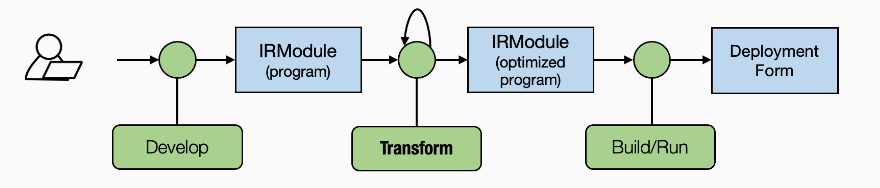


本章重点关注了 MLC 流程的 **开发** 部分。

- 张量表达式 API 允许我们创建原始的 TensorIR 函数。
- BlockBuilder API 通过 `emit_te` 和其他函数创建 IRModule。
- 通过将模型转换为 IRModule，实现与现有的机器学习框架的整合。


## GPU硬件加速

https://mlc.ai/zh/chapter_gpu_acceleration/part1.html

https://github.com/NVIDIA/cutlass/blob/master/media/docs/efficient_gemm.md


## 计算图优化：算子融合和内存优化


## 部署模型到服务环境


## 部署模型到边缘设备


<!-- Q.E.D. -->
