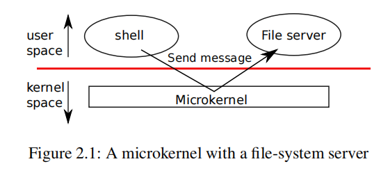
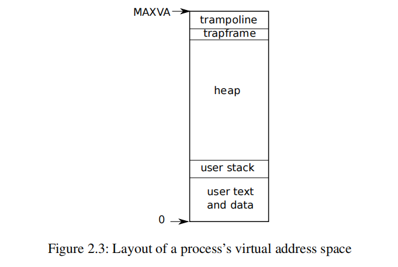

<!-- more -->

---

## lab02-System-calls

[Lab: system calls](https://pdos.csail.mit.edu/6.S081/2020/labs/syscall.html)

### Preparation read

操作系统要求同时运行多个进程，所以进程间的资源一定是time-share的，例如当进程数大于CPU数量时，操作系统要确保所有的进程都有机会运行。另外还需要确保一个进行执行失败不会影响其他的进程，因此需要隔离性，但是隔离性不能太强，因为进程间可能存在交互，例如pipelines。

因此操作系统要满足三个要求：

- multiplexing（多路复用）
- isolation（隔离性）
- interaction（交互性）

Xv6运行在多核的RISC-V微处理器上，RISC-V是一个64位CPU，xv6由“LP64”的C语言编写，"L"表示long，“P64”表示指针是64位。


> Abstracting physical resources

进程中的程序往往存在一些bug，如果每个进程都直接访问系统资源，就可能会影响到其他的进程。所以通常将资源抽象为服务，例如Unix系统只允许通过`open`，`read`，`write`和`close`与存储进行交互，将文件的读写交给操作系统，而不是直接从硬盘中读写。

另一个例子是，Unix进程使用`exec`构建memory image，而不是直接与物理内存进行交互，这就允许操作系统决定进程在内存中的位置，当内存资源紧张时，操作系统也可以将部分数据保存在硬盘上。


> user mode, supervisor mode and system calls

  RISC-V有三种执行指令的模式：

- machine mode：拥有完整的特权，CPU从mechine mode开始，主要用于配置计算机，之后切换到supervisor mode。
- supervisor mode：允许执行特权的执行，例如开启和停止中断，读写寄存器。
- user mode：只能执行user下的执行，如果执行特权执行，将切换到supervisor mode然后终止这个进程。


CPU提供一个特殊的指令`ecall`将CPU从user mode切换到supervisor mode，切换到supervisor mode之后，kernel需要验证系统调用的参数，判断是否允许执行。


> Kernel organization

操作系统的哪个部分应该运行在supervisor mode是设计的关键问题。

通常有两种组织内核的形式：

- monolithic kernel，将整个操作系统保留在内核中，所有的系统调用都运行在supervisor mode。monolithic kernel优点是设计者不需要考虑哪个部分不需要完整的权限，不同部分的系统调用接口比较复杂，因此开发者容易出错，在monolithic kernel下错误很严重，因为是在supervisor mode，所以会导致整个kernel fail，以至于计算机停止工作。（Xv6、Unix采用这种方式）

- microkernel，尽可能减少kernel中操作系统的代码数量，将大多数操作系统运行在user mode下。OS的服务以进程的形式运行，称之为server，另外提供一个内部的通信机制，当shell想访问文件系统时，先向文件服务器发送消息，然后等待回应。这种内核组织方式使内核相对简单。

  

> Process overview

进程是xv6和其他Unix操作系统的隔离单元。进程抽象的为程序提供一个其他进程不能读写的私有地址空间。

Xv6使用page table为每个进程提供自己的地址空间，RICS-V page table将虚拟地址映射到物理地址。




RISC-V的指针是64位，硬件使用低39位用来在page table中查找虚拟地址。xv6只是用其中的38位，因此最大的地址为$2^{38} - 1 =0\rm{x}3fffffffff$，地址最高的两个page trampoline和trapframe用于切换到kernel。

每个进程拥有两个栈：user stack和kernel stack，两者相互独立（user statck fail不会影响kernel stack）。

进程通过RISC-V的`ecall`指令执行系统调用，`ecall`提高硬件的权限，将程序计数器修改为内核定义的entry point，切换为jkernel stack并执行系统调用，当系统调用执行完毕，再切换回user space接着执行后续指令。


> xv6的启动和第一个进程

- 上电，将内核加载到内存的0x80000000（0x0到0x80000000是IO设备）。
- machine mode下CPU执行entry.S里的_entry，关闭硬件分页，虚拟地址直接映射到物理地址。
- 初始化栈`stack0`以运行start.c，寄存器`sp`指向`stack0+4096`，然后执行start.c里的`start()`。
- `start()`在machine mode下执行一些特许操作，然后切换到supervisor mode。
- 将main函数的地址写入到mepc，main函数主要初始化一些设备和子系统，然后调用proc.c中的userinit创建第一个进程。
- 进程执行initcode.S中的汇编代码，通过exec执行程序Init，进入shell等待用户输入。


> System call的执行过程

- user space执行系统调用，参数保存在寄存器a0-a5，将系统调用对应的num保存到寄存器a7。

- 通过`ecall`指令切换到内核执行a7对应的函数。
- 系统调用结束后，将返回值保存到寄存器a0。
- 如果返回多个数据，需要通过copyout将数据从kernel复制到user space。


### trace

> 实验内容

添加一个系统调用`trace`用于trace系统调用。

下面是`trace`的功能展示：

`trace`系统调用接收一个参数（数字），他的二进制位表示需要追踪的系统调用，对于这些系统调用你需要按照格式打印出它的进程号、进程名以及返回值。

```shell
$ trace 32 grep hello README
3: syscall read -> 1023
3: syscall read -> 966
3: syscall read -> 70
3: syscall read -> 0
$
```


> 实验思路

因为每个线程都由一个proc结构 (kernel/proc.h)，记录进程的状态信息，我们可以在调用`trace`系统调用之后，在进程的proc中记录需要跟踪的mask，然后在每次系统调用之后，判断当前系统调用是否在mask中，然后打印跟踪信息。


> 实验过程

xv6提供了`trace`的用户空间的代码`user/trace.c`，但是还不能通过编译，需要做以下配置：

- 在Makefile中的`UPROGS`后面添加新的条目

  ```
  $U/_trace\
  ```

  

- 在`user/user.h`中添加系统调用的声明。

  ```c
  int trace(int);
  ```

- 在`user/usys.pl`中添加一个entry，`usys.pl`负责生成`user/usys.S`汇编文件，由它进入内核，然后执行对应的系统调用。

  ```
  entry("trace");
  ```

- 在`kernel/syscall.h`中新增`trace`对应的系统调用编号，即 `usys.S`中 `ecall`的参数。

  ```c
  #define SYS_systrace 22
  ```


以上就完成了添加新系统调用后的依赖配置，此时可以通过编译，但是还不能运行`trace`命令，因为你还没有实现这个系统调用。

首先在`kernel/syscall.h`中新增系统调用声明。

```c
extern uint64 sys_trace(void);

static uint64 (*syscalls[])(void) = {
...

[SYS_trace]	sys_trace,	

...
};
```

在`kernel/proc.h`中的`proc`结构体添加一个`mask`标志。

```c
struct proc {
	...
    
  int mask;                    // trace mask  
};
```

然后在`kernel/syspro.c`中实现`sys_trace`系统调用函数。

```c
// set trace arg to proc mask
uint64
sys_trace(void)
{
  int arg;
  if (argint(0, &arg) < 0)
    return -1;
  myproc()->mask = arg;
  return 0;
}
```

接下来需要修改`kernel/syscall.c`中的系统调用函数逻辑，来打印对应的`trace`信息，需要注意的是`proc`结构体保存的是当前进程的名字，因此我们需要添加一个数组，记录系统调用号对应的名字。

```c
static char *num2name[] = {
[SYS_fork]    "fork",
[SYS_exit]    "exit",
[SYS_wait]    "wait",
[SYS_pipe]    "pipe",
[SYS_read]    "read",
[SYS_kill]    "kill",
[SYS_exec]    "exec",
[SYS_fstat]   "fstat",
[SYS_chdir]   "chdir",
[SYS_dup]     "dup",
[SYS_getpid]  "getpid",
[SYS_sbrk]    "sbrk",
[SYS_sleep]   "sleep",
[SYS_uptime]  "uptime",
[SYS_open]    "open",
[SYS_write]   "write",
[SYS_mknod]   "mknod",
[SYS_unlink]  "unlink",
[SYS_link]    "link",
[SYS_mkdir]   "mkdir",
[SYS_close]   "close",
[SYS_trace]   "trace",
};

void
syscall(void)
{
  int num;
  struct proc *p = myproc();

  num = p->trapframe->a7;
  if(num > 0 && num < NELEM(syscalls) && syscalls[num]) {
    p->trapframe->a0 = syscalls[num]();
    // print trace info
    if (p->mask & (1 << num)) {
      printf("%d: syscall %s -> %d\n", p->pid, num2name[num], p->trapframe->a0);
    }
  } else {
    printf("%d %s: unknown sys call %d\n",
            p->pid, p->name, num);
    p->trapframe->a0 = -1;
  }
}
```


最后一个test是测试fork下的trace，因此还需要修改`kernel/proc.c`中`fork`。

```c
int
fork(void) 
{
	...
	np->maks = p->mask;
	return 0;
}
```


```shell
$ ./grade-lab-syscall trace

== Test trace 32 grep == trace 32 grep: OK (1.9s) 
== Test trace all grep == trace all grep: OK (1.6s) 
== Test trace nothing == trace nothing: OK (1.6s) 
== Test trace children == trace children: OK (19.8s) 
    (Old xv6.out.trace_children failure log removed)
```


### sysinfo


> 实验内容

添加`sysinfo`系统调用，用来统计当前系统的状态，包括空闲的内存空间以及`UNUSED`状态的进程数量。

`sysinfo`系统调用接收一个结构体（kernel/sysinfo.h），你需要在内核中填充这个结构体，然后返回到用户空间。

```c
struct sysinfo {
  uint64 freemem;   // amount of free memory (bytes)
  uint64 nproc;     // number of process
};
```


> 实验思路

观察`kernel/kalloc.c`中的`kalloc()`和`kfree()`函数，进程在每次从`kem`中的`freelist`获取一个4k大小的空闲地址，在内存释放时，同样将地址加到`freelist`中，因此`freelist`中地址的个数对应空闲地址的数量，数量乘以4k就得到的空闲内存空间。

在`kernel/proc.c`中有一个proc数组，我们可以遍历这个数组，判断里面`proc`的状态，以此统计`UNUSED`状态的数量。


> 实验过程

首先参照上面的`trace`配置系统调的依赖环境。另外需要注意在`user/user.h`中添加`struct sysinfo;`的声明。


在`kernel/proc.c`添加`proc_count`函数。

```c
// count the num of UNSET state process
uint64
proc_count(void)
{
  int i;
  int cnt = 0;
  for (i = 0; i < NPROC; ++i) {
    if (proc[i].state != UNUSED) {
      cnt++;
    }
  }
  return cnt;
}

```


在`kernel/kalloc.c`中添加`mem_count`函数，同时添加`sysinfo`的头文件。

```c

uint64
mem_count(void)
{
  int cnt = 0;
  struct run *r;

  acquire(&kmem.lock);
  r = kmem.freelist;
  while (r) {
    cnt++;
    r = r->next;
  }
  release(&kmem.lock);
  
  return cnt * PGSIZE;
}
```


之后需要在`kenel/defs.h`中填加这两个函数的声明。

```c
// kalloc.c
...
uint64          mem_count(void);


// proc.c
...
uint64          proc_count(void);
```


```c
uint64
sys_sysinfo(void)
{
  
  uint64 addr;
  struct sysinfo sf;

  if (argaddr(0, &addr) < 0) // get user space arg address
    return -1;
  
  sf.freemem = mem_count();
  sf.nproc = proc_count();
  if (copyout(myproc()->pagetable, addr, (char*)&sf, sizeof(sf)) < 0)
    return -1;
  return 0;
}
```


```shell
$ ./grade-lab-syscall sysinfotest

make: 'kernel/kernel' is up to date.
== Test sysinfotest == sysinfotest: OK (4.1s) 
```


<!-- Q.E.D. -->