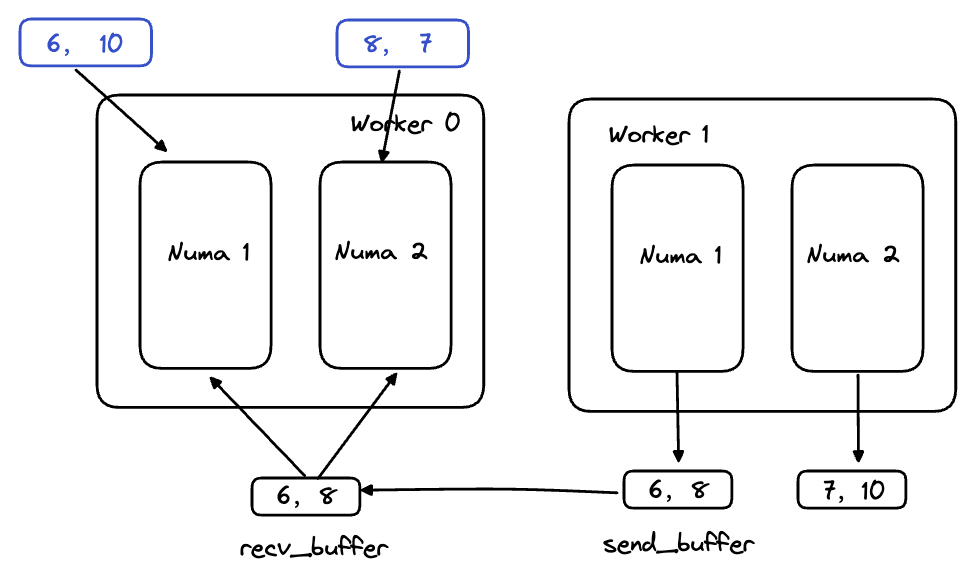

<!-- more -->

---

[Paper](https://www.usenix.org/system/files/conference/osdi16/osdi16-zhu.pdf) [Slides](https://www.usenix.org/sites/default/files/conference/protected-files/osdi16_slides_zhu.pdf) [Code](https://github.com/thu-pacman/GeminiGraph)

Gemini是发表在OSDI16的一篇关于图计算系统的文章。

之前写过一个Gemini论文笔记的blog：[Gemini论文笔记](https://blog.csdn.net/henuyh/article/details/114197800)，最近又重新看了下代码实现，在这里简单记录下Gemini的图结构和通信的设计与实现。

## 图结构

**stage 1** 

- Partition Graph along out_degrees fllow by (edges + nodes * alpha), alpha = alpha = 12 * (partitions + 1);
- eache partitions vertices num is dive by PAGESIZE (1024)
- read edge, compute outdegree, determine partition_offset

**Stage 2： Numa-Aware sub-chunking**

- outgoing_structure: each socket hold the edges tha dst belongs to and these edges partition by src.
- incoming_structure: each socket hold the edges tha src belongs to and these edges partition by dst.
- each worker read partial edge file and send edge to corresponding worker according to dst (outgoing) and src (incoming).

## 通信

Stage1: Eacher partition send socket's msg to other partitions

Stage2: each socket in the partition will handle all the message recv from other partition

## 代码

下面以SSSP算法在sparse模式下为例子，介绍下图结构和通信的实现细节。

### 图结构

确定每个分区的节点：

每个分区再进行一次numa-awre的划分，即确定每个socket负责的节点范围：

接下来是决定outgoing structure，gemini的图结构存储是站在mirror的角度考虑的。

首先是标记每个socket的入邻居（有哪些mirror指向我这个socket里面的节点）。

outgoing对应CSR结构，首先是获取offset数据（src指向本地点的偏移量）

有了offset之后，然后获取对应的dst点。

incomming的结构类似，这里就不再说明了。

tune_chunks函数的作用是对每个socket存储的图结构，再进行一次thread粒度的划分。

### 通信

每个worker创建发送和接收的buffer：

每个分区将本地活跃节点，通过sparse_signal产生一个消息，这个消息先是会到线程的buffer里面，然后再到socket对应的buffer里面。

通过MPI完成消息的发送和接收。

在GeminiPush模式下，Master首先将消息同步到Mirror端，然后mirror更新自己本地的出邻居（outgoing）。

在sparse-signal函数中，对于活跃点的产生消息这一步骤，是由多个线程并行完成的。

接收端处理消息时，对于发来的socket消息，本地的每个socket都会对这个消息进行处理，这样就确保图结构的完整性。

这个地方可能有点绕，举个例子：

<!-- Q.E.D. -->