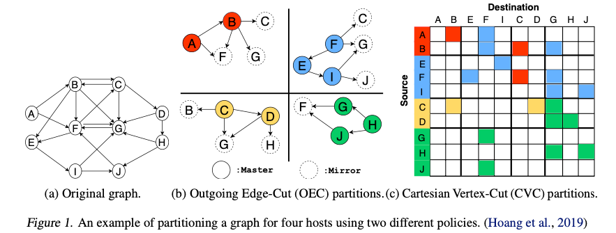
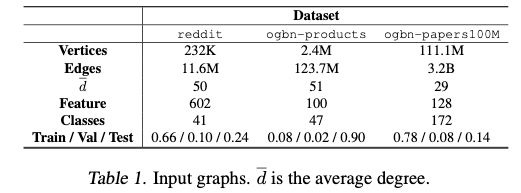
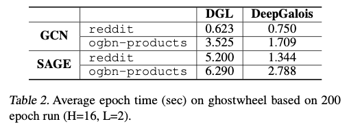
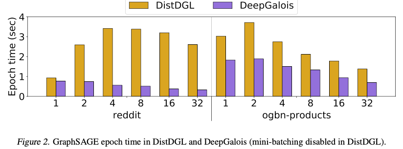
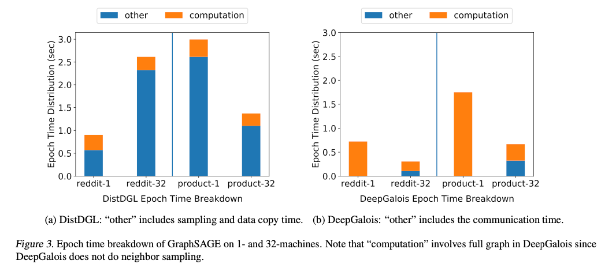
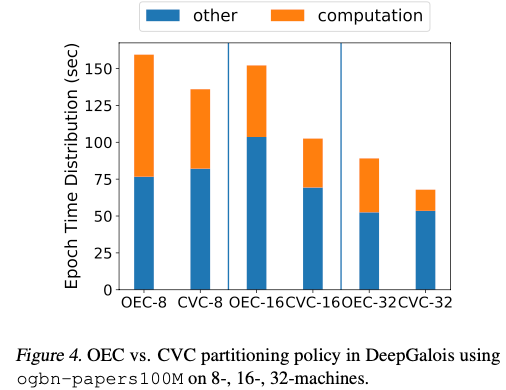
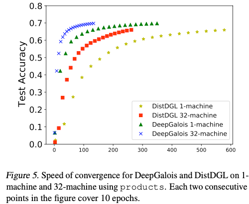

<!-- more -->

---

GNNSys21: [paper](https://www.cs.utexas.edu/~loc/papers/deepgalois_gnnsys.pdf) [post](https://gnnsys.github.io/posters/GNNSys21_poster_16.pdf) [code](https://github.com/l-hoang/Galois/tree/gnn-snap)

这篇论文被收录在GNNSys21，是一个GNN系统的Workshop。

这篇论文在Galois系统上设计实现了支持分布式GNN训练的系统DeepGalois，个人认为没有什么太大的创新点，感觉像是为Galois提供支持GNN的特性。实验方面和DGL以及DistDGL做了对比，在单机和分布式下都要快于DGL，同时分布式下的扩展性要远好于DistDGL。

> Graph Computation

GNN的计算主要包括图计算和NN计算，DeepGalois分别采用Galois处理图计算，使用BLAS库实现矩阵乘运算。DeepGalois的模块化设计，使得可以按照需求选择任何库。

> Graph Partitioning

DeepGalois采用CuSP提供的图画分，CuSP支持vertex cut，edge cut，hybrid-cut，用户可以按照需求针对分布式和不同的数据集选择不同的划分策略。

DeepGalois自称是第一个支持任意图分区的GNN系统 (thank to CuSP)。

通过实验看CVC更适合分布式GNN训练。

> Synchronization

DeepGalois采用Gluon作为分布式通信引擎。

DeepGalois在每个分区缓存了顶点的feature信息，因此本地在做feature aggregation的时候不需要额外的通信。DistDGL的vertex feture如果不在本地的话，需要从server端获取，因此会有一些server端的通信。

为了获取完整的aggregation结果，每个分区的mirror需要进行logic all reduce，mirror先reduce到master，然后master broadcast到mirror。这要求aggregation operation满足commutative and associative。

Gloun回将发送到同一台机器的顶点消息combine到一起（message aggregation），这样减少了通信开销。

图分区对系统的扩展性很重要，因为分区结果决定了通信的关系，采用2D的图分区策略（CVC）可以将通信的对象限制到一个子集。

每个分区保存完整的模型参数，因此需要对参数的梯度进行all reduce，这样才能保证收敛性。

> Evaluation

单机：Intel Xeon Gold 5120 2.2GHz 56 cores 4 sockets 187GB DRAM。

分布式：32台 Stampede2 supercomputer 48 Intel Skylake cores 2 socket 198G DRAM 100 Gb/s Intel Omni-Path network。

system：DeepGalois，DGL，DistDGL。

gnn model：GCN，GraphSAGE。

> 单机性能：DGL vs DeepGalois

这个实验说明DeepGalois的性能和现有的GNN实现comparable。

在GraphSAGE上，DeepGalois要比DGL快很多，是因为DeepGalois采用Eager的方式，根据维度变化来决定aggregation和update的顺序，DGL在GCN实现了Eager模式，但是GraphSAGE涉及了很多的aggregators，一些aggregator不支持Eager模式（LSTM）。可以在编译的时候来检查约束条件来选择是否使用Eager。

>  分布式性能

DeepGalois采用CVC的图划分（better than OEC）。

即使DistDGL使用采样，训练速度仍没有DeepGalois快，因为DeepGalois没有数据拷贝的开销。

总体上看DeepGalois的扩展性优于DistDGL，在Reddit dataset上32台的训练速度是1台的2.3x。

reddit dataset上DistDGL在32台的训练速度比单机慢2.6x，**这也说明中等规模数据集，分布式减少的计算量低不上数据通信的开销。**

DistDGL的采样和数据拷贝的开销非常大，DeepGalois的通信开销要远小于DistDGL数据拷贝的开销。可以看到DeepGalois在32台机器上有很大的加速比。

>  OEC vs IEC

计算量随着机器的增加而减少。

通信时间随着机器的增加而减少，虽然通信量多了，~~通信可以在多台机器上overlap？~~

CVC要比OEC的计算量小，因为OEC采用vertex cut（high degree）。

> Accuracy Convergence speed

DeepGalois的收敛更快是因为全采样，以及DeepGalois计算性能高于DistDGL。

<!-- Q.E.D. -->
