<!-- more -->

---

[paper](https://dl.acm.org/doi/pdf/10.1145/3458817.3480856) [code](https://github.com/dmlc/dgl/pull/2914)

DistGNN是在DGL上对full batch train的优化（mulit socket），和DGL对比在single socket下有3.7x提升，在128 socket下最多有97x的提升。

DistGNN主要提出了以下优化：

1. 针对Aggregation Primitive的优化

   - cache blocking
   - dynamic thread scheduling
   - loop reordering（LIBXSMM）
   - vectorization and JITing to reduce instruction count

2. 针对通信的优化

   delayed update algorithm
   
   - 0c - ignore split vertices aggregation from other socket/nodes
   - cd-0 - for the current epoch wait for partial aggregates from all split vertices to be available
   - cd-r - overlap communication with computation by doing a Hogwild-like delayed aggregation of split-vertex embeddings

## Optimal for Aggregation Primitive

> Aggregation Primitive in DGL

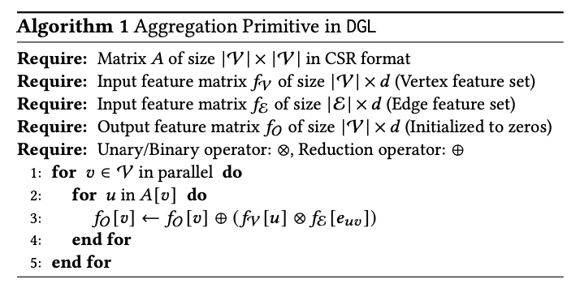

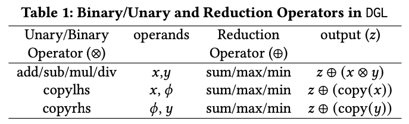

### cache blocking

在做feature的聚合操作时，内存的访问存在以下问题：

1. 邻居节点的feature$f_v[u]$的访问是内存不友好的，因为他们是不连续存储的，而且邻居顶点的feature可能被访问多次（公共邻居）。
2. 由于cache的大小限制，$f_v$可能被替换，造成多次加载的问题。

以上都会触发额外的内存请求，DistGNN提出了cache blocking的优化，以增加cache的复用。

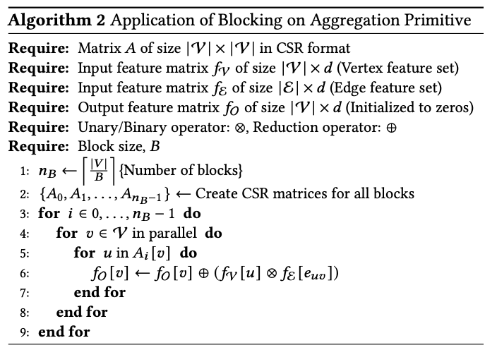

每次只处理一个block，$f_v$只需要遍历一次，不过$f_o$需要访问多次，所以应该在满足L2 cache大小要求下，尽可能最大化block size，以减少$f_o$

的遍历，对于稀疏图来说，可以有更大的block size，因为block可能只有部分的顶点活跃。

由于大多数图服从power law，block中的点可能触发很大的邻居节点，因此最有的block size的确定是个挑战。

### dynamic schedule

因为大多数图服从power law，每个顶点的邻居节点的数量差别很大，DistGNN用OpenMP完成动态的线程调度，每次将线程分配给连续的顶点范围。

### loop reordering

邻居聚合符合SIMD，DistGNN使用LIBXSMM对循环结构重组，确保$f_o[v]$只写一次。另外通过JITing生成优化过的汇编语言来减少代码执行的指令数。

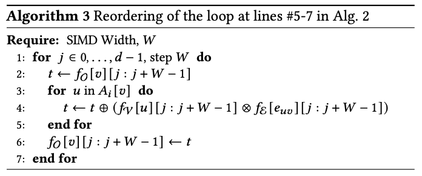

## Graph Partitioning

DistGNN使用Libra的图分区策略，采用vetex-cut，将边分配给负载小的分区。[libra](https://cx2.web.engr.illinois.edu/papers/nips2014.pdf) [powerlore](https://cx2.web.engr.illinois.edu/papers/powerlore.pdf)

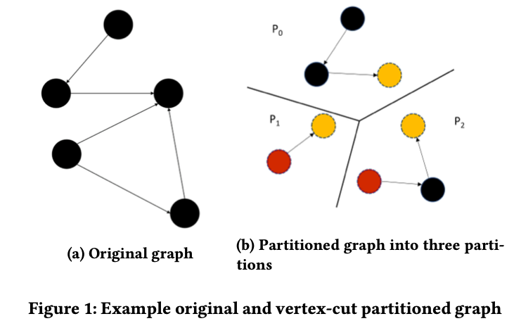

将图进行分区后，每个分区包含两种点：split-vertices and non-split vertices。

分区中的点有global id和local id，local id是从分区0到n-1进行分配。

vertex_map（数据结构）用来记录每个分区local id的范围，用来定位节点的分区。

使用一个数组保存split-vertex clone的local id。

## Delayed Remote Partial Aggregates

DistGNN针对分区后的split-vertex提出了三种通信方式：

- 0c：no commutation.
- cd-0：commutation delay 0.
- cd-r：commutation delay r.

> 0c

每个分区做local aggregate，忽略remote aggregate。0c是性能的上界，在准确度上也是乐观的。

> cd-0

普通的分布式通信方式，本地先聚合，然后与远端节点通信，拿到所有邻居的feature。cd-0是性能的下界，准确度和单socket一样。

> cd-r

带延迟更新的通信方式，每个split-vertex在epoch i开始通信，在epoch (i + r) 开始异步的接受并执行aggregate。

延迟更新的思想inspired by Hogwild！。

另外每次只通信一部分的split-vertex也能提升通信的性能。

通过实验，延迟更新的准确度与SOTA比控制在1%。

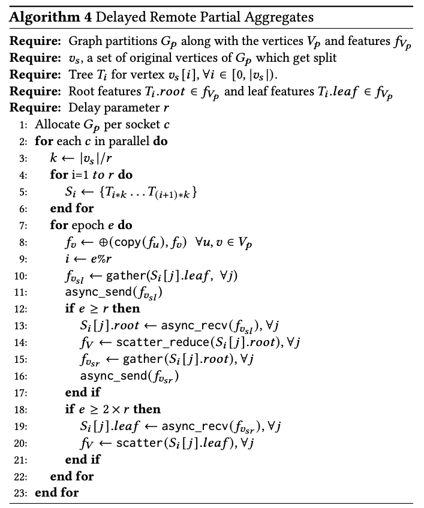

## Experiment Setup

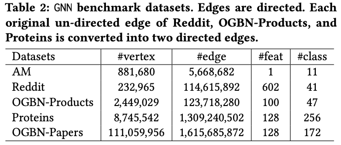

Single-socket：Intel Xeon 8380 CPU@2.70GHz 28 cores 98GB DRAM 128GB/s CentOS 7.6。(1.5TB for OGBN-Papers dataset)

Distribute：64 Intel Xeon 9242 CPU@2.30GHz 48 cores per socket dual-socket system 384GB.

### Single-socket performance

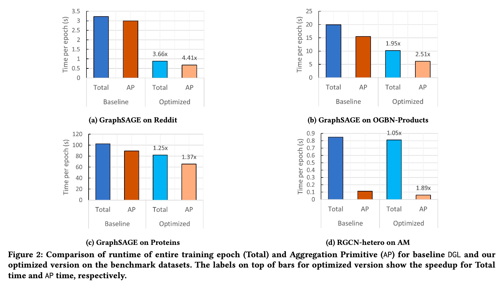

#### Effect of block size

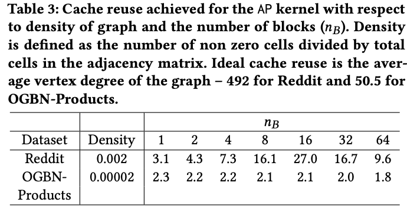

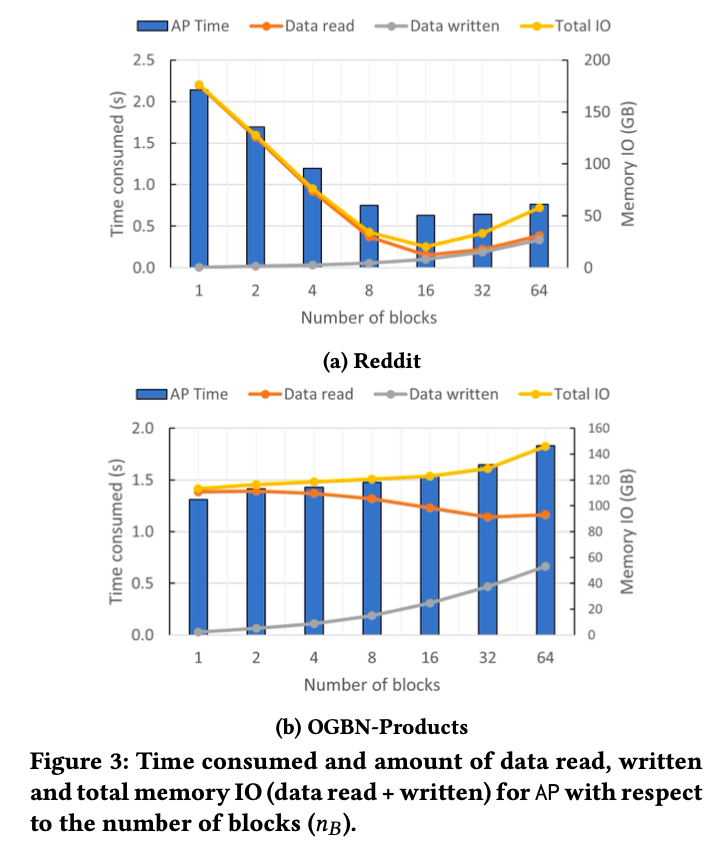

#### Breakup of speedup

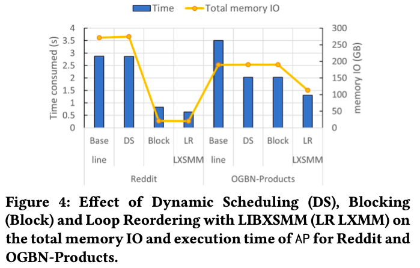

### Distributed Algorithm Performance

Reddit数据集相对比较密集，所以复制因子高一些。Proteins数据集原有cluster属性，复制因子相对低一些。

Products和Papers的平均顶点度数最小，他们的复制因子差不多。

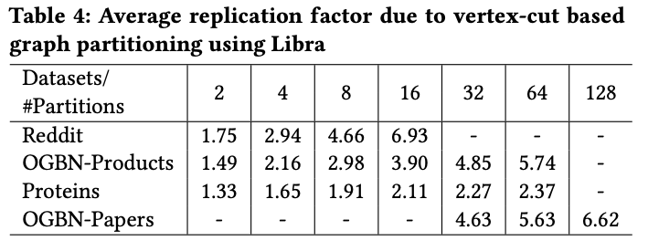

#### Scaling

Reddit数据集的优化sub-linear（高复制因子），和DGL single-socket对比有0.98，2.08，2.91x的提升。

Proteins随着分区增加，图的大小线性减少。

Products介于Reddit和Proteins之间。

single-socket性能低是由于numa内存访问的影响。

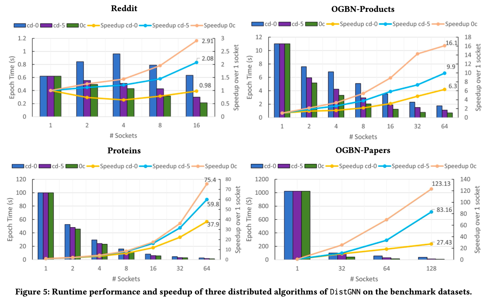

Local Aggregation不涉及通信，所以在0c，cd-0，cd-5开销一样，随着socket增加线性减少（reddit除外）。

Remote Aggregation的扩展性很差，这跟复制因子，split-vertex数量有关。

reddit和proteins，local agg主导remote agg。

products，remote占大部分时间影响扩展性。

papers，remote一直高于local。

remote高于local，出了reddit。

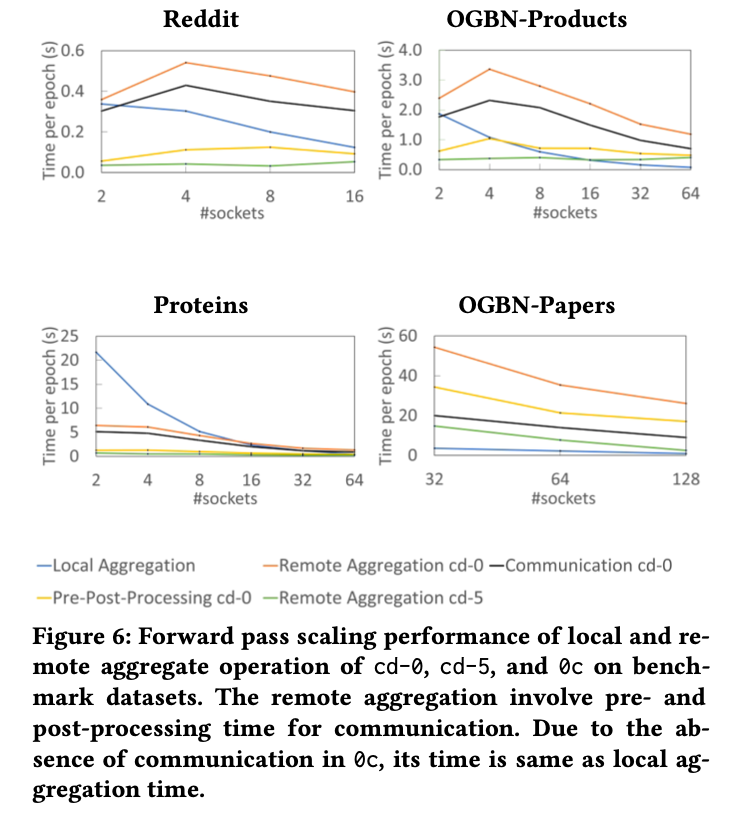

#### Accuracy

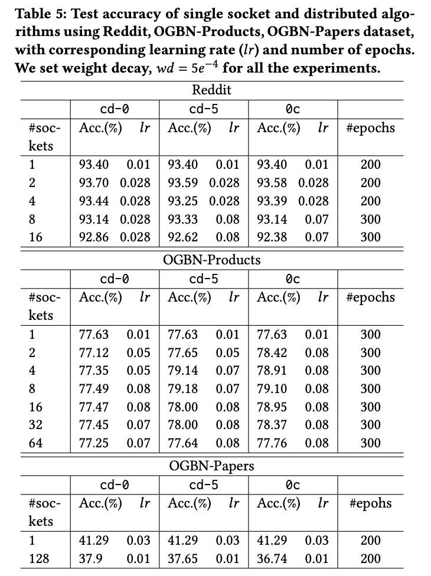

Proteins缺少label和feature，所以没做实验对比。

#### Memory and Communication

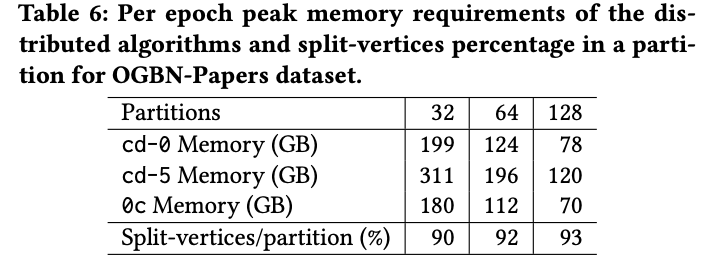

#### Comparison with Current Solutions

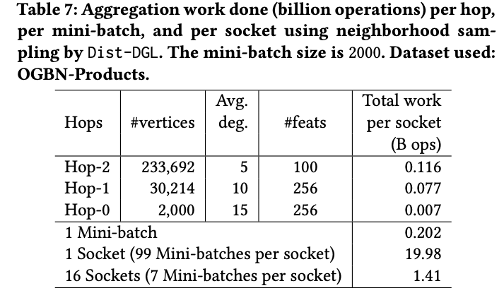

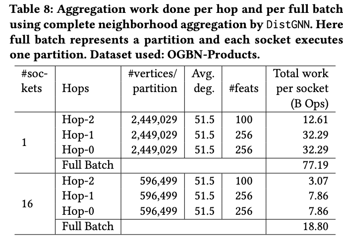

4x-128x的任务量，但是也比DistDGL好。

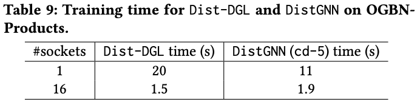

<!-- Q.E.D. -->
