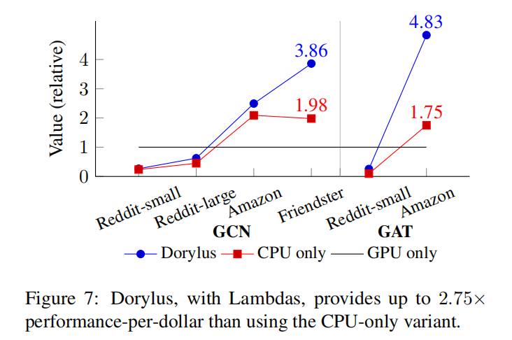

<!-- more -->

---

## Paper link

[Dorylus: Affordable, Scalable, and Accurate GNN Training withDistributed CPU Servers and Serverless Threads](http://web.cs.ucla.edu/~harryxu/papers/dorylus-osdi21.pdf)



## Introduction

Dorylus : Affordable, Scalable, and Accurate GNN Training with Distributed CPU Server and Serverless Threads

Dorylus是一个分布式GNN训练系统，支持数十亿边的图，使用CPU和Serverless Threads进行训练，大大降低了成本开销。

- 使用Lambdas比CPU only在单位价格下的性能高2.75x，比GPU only高4.83x
- 对比现有的基于采样的系统，Dorylus快3.8x，便宜10.7x

有两种主要的方法可以减少成本，提高GNN训练的扩展性，但是同时引入了新的缺点：

- CPU的计算成本低，但是CPU没有像GPU提供的并行计算能力，因此效率低
- 图采样技术通过减少图数据来提高扩展性
  - 需要在每个epoch进行采样计算，增加了时间开销
  - 降低了GNN训练的准确度

> 什么是Serverless

Serverless是无服务器计算，用户不需要自己维护服务器，例如[AWS的Lambda](https://aws.amazon.com/cn/lambda/features/)，它会执行计算资源的所有管理工作，包括服务器和操作系统的维护，容量与配置和自动扩展，用户只需要提供代码。其他的还有Google Cloud Functions、Azure Functions。

对于大量tensor计算的NN训练来说，Lambda的计算能力有限，如果把数据分为小批量数据可以减轻计算压力，但同时会增加网络开销，简单的使用Lambda做NN训练，与CPU相比速度减慢21x。

因此使用Lambda需要克服两个挑战：

- 如何使计算适合Lambda的计算能力？

  Dorylus将训练任务划分成细粒度的任务，GNN训练通常包括两种类别的任务：邻居传播（Gather、Scatter），NN操作（Apply），其中图计算输属于graph-parallel path在CPU实例上运行，tensor计算属于tensor-parallel path在Lambda上运行。

- 如何最小化Lambda的网络延迟带来的影响？

  为了不让通信成为瓶颈，Dorylus提出了bounded pipeline asynchronous computation(BPAC)，图计算和tesnor计算同时进行，并在参数更新和数据聚集引入异步来加快训练速度，同时使用不同的方法来限制异步的程度。

  - weight stashing
  - bounded staleness

    

## Design Overview

系统共分为三个部分Graph Server、Lambda Threads、Parameter Servers。

对输入图进行Edge cut保存在Graph Server中，GS用二维矩阵保存子图顶点的特征，用一维数组保存边的数据，另外每个GS有一个ghost buffer用来保存远端服务器scatter的数据。

GSes之间的通信发生在图计算期间分区间沿边发送和接收数据。

GSes与Lambda的通信发生在，图计算完成后，将数据发送给Lambda Threads进行tensor的计算。

Lambda和PSes的通信发生在，前向传播的参数读取和反向传播的参数梯度更新。

  

## Tasks and Pipelining

前向传播任务可以分为四个步骤：Gather、Scatter在图结构上进行计算，运行在GSes上，ApplyVertex、ApplyEdge负责特征矩阵和参数的相乘，运行在Lambdas上。

GS使用线程池（数量等于vCPUs）,当有空闲的线程时，从任务队列中取一个任务执行，GS的输出作为Lambda的tensor计算的输入。线程数通常情况下比任务数少，通过流水线将图计算和NN计算重叠以隐藏Lambda的通信延迟。

Dorylus的贡献是细粒度的任务划分和计算分离。

## Bounded Asynchrony

  

### Bounded Asynchrony at Weight Updates

在异步情况下，收敛速度慢的主要原因是，每个vertex interval的进度不同，在前向传播和反向传播时使用的weight版本不同。

Dorylus使用了PipeDream提出的weight stashing来限制参数更新的异步处理，每层的前向传播时使用最新的参数，并将缓存使用的参数，用于反向传播。

https://zhuanlan.zhihu.com/p/113416860

vertex interval可以在不同的Lambdas上执行，如果让Lambdas从不同的PSes上都可以读取参数，那么每个PS不仅要维护最新的权重，同时也要记录权重的版本，这个开销是非常大，而且系统会变得复杂。

Dorolus的做法是，PS仍然维护最新的参数，但是只维护部分vertex interval。即vertex interval的参数只保存在它第一次调度时读取参数的PS中，在反向传播时通过GS获取这个PS地址，这样前向和反向都在同一个PS上进行数据的读取。

### Bounded Asynchrony at Gather

图embedding中的vertex interval，进度快的interval可以比进度慢的interval领先S个epoch。

## Lambda Management

### Lambda Optimizations

每个GS运行一个Lambda控制器，负责加载Lambda，向Lambda发送数据，监控Lambda的状态。

每个Lambda使用[Open-BLAS](https://www.openblas.net/)做线性代数计算，Lambda与PSes和GSes的通信使用ZeroMQ完成。

随着Lambda的数量的增加，网络带宽就会降低，当Lambda达到100时，每个Lambada的带宽从800Mbps降到了200Mbps。

Dorylus提出了Lambdas的三个优化：

- task fusion

  将最后一层的AV和$\Delta AV$合并，减少Lambda和GSes的通信量

- tensor rematerialization

  现有的系统通过缓存前向传播的中间结果，在反向传播得以复用。
  Lambda负责运算，缓存就只能在GSes上，但是Lambda的网络通信延迟高，因此使用多个Lambda重新计算要比在GSes上读取更快。

- Lambda-internal streaming

  Lambda先读取数据的一般进行计算，计算的同时读取另一半，将计算和网络重叠在一起减少Lambda的响应时间。

  

### Autotuning Numbers of Lambdas

Lambda的数量支持动态调节，每个GS启动$min(intervals, 100)$Lambdas，同时周期的检查CPU的任务队列，如果CPU队列中有很多任务，Lambda将自动减少，否则增加。

## Evaluation

Dorylus定义的价值公式，T是运行时间，C是运行成本。
$$
V = \frac{1}{T \times C}
$$

前三个图带有特征和标签，最后一个是随机生成的图，Dorylus实现了两种GNN模型：GCN和GAT。

 ### Instance Selection

在实例选择中，对比了CPU的内存型r5和计算型c5，GPU的p2(K80)和p3(V100)，通过对比最终选择r5和p3作为实验的实例。

c5n：2vCPU、5.25GB RAM、25Gbps、$0.108/h

c5：2vCPU、4GB RAM、10Gbps、$0.085/h

p3：8vCPU(61GB memory)、1GPU(16GB memory)、$3.06/h

each lambda： 0.11vCPUs(192MB memory)、\$0.20/1M requests、\$0.01125/h

这里没有使用TPU，TPU是针对密集数据的优化，而GNN大多为稀疏矩阵的运算，不像DNN那样需要大量数据的聚合运算。

### Asynchrony

- Dorylus-pipe是同步的方式，只有当前层完成之后，才能进入下一层。
- Doryls-async（s=0）,允许使用当前epoch下不同层的节点信息。
- Doryls-async（s=1）,允许使用连续的两个epoch下的节点信息。

图5是不同模式在3中图下达到收敛需要的epochs数，异步的方式对比同步需要更多的迭代次数，s=0平均增加8%，s=1平均增加41%。

图六是GCN的每个epoch的时间开销，异步要比同步快15%，s=0要比s=1的表现好一些，s的取值越大，需要的迭迭代次数越多，但是每次迭代的时间开销下降的很慢，因此s=0是最好的选择。

### Effects of Lambdas

在5个图上分别跑3种不同模型的Dorylus，得到他们的运行时间和花费。

以GPU only作为基准的价值对比图，可以看到，GPUs适用于规模小或密集的图，Dorylus要比CPU-only的好，Dorylus更适合规模大或稀疏的图，

图8是三种模式下在不同数量的图服务器上规范化的GCN训练性能和价值的表现。

可以看到Dorylus在性能和价值上的扩张性都很出色，

Dorylus从4个server到16个server，速度提高了2.82x，成本只增加了5%，价值提高了2.68x。

4个server的Dorylus和8个server的CPU only性能相当，8个server的Dorylus性能比16个server的CPU only高。

因此对比CPU only，在相同的预算下，Dorylus是更好的选择。

其他的观察结果：

- 图越稀疏，Dorylus越有用。

  直觉是稀疏图的通信要比稠密图少，但是通过实验观察到Friendster和Amazon在Scatter阶段比Reddit-small和Reddit-large的执行时间多很多。

  首先Scatter是由ghost节点的vertex数量和分区间边的数量共同决定的，Reddit-small和Reddit-large他们的有很多的inter-partition edges，但是ghost vertex很少。

  其次，Scatter在GPU集群上的通信开销大于CPU上的通信开销。

- Lambda thread在GAT上的加速效果高于GCN。

  因为GAT比GCN多了AE task。

- Dorylus和使用两倍数量服务器的CPU only具有相当的性能。

### Comparisons with Existing Systems

NeuGraph和AGL没有开源，Roc不能很好的在作者的实验环境下运行（各种CUDA errors），而且Roc需要将整张图加载到内存中，因此不能运行数十亿边的图，因此Dorylus主要和DGL、AliGraph进行对比实验。

图9是不同系统在Reddit-small和Amazon上得到的准确度：

Dorylus可以达到95.44%、67.01%的准确度

DGL(non-sampling)可以达到94.01%的准确度

DGL(sampling)可以达到93.90%、65.78%的准确度

Dorylus可以达到91.12%、65.23%的准确度

通过对比可以得出：

在Reddit-smalll上，达到相同准确度（93.90%）下，Dorylus比DGL(sampling)快3.25x，Dorylus(GPU only)快5.9x。

在Amazon上，达到相同准确度（63.00%）下，Dorylus比DGL(sampling)快1.99x，Dorylus(GPU only)快1.37x。

表5是不同系统在达到目标准确度下的运行时间和成本开销。

通过观察可以发现，Dorylus单位价格下的性能是DGL(sampling)的17.7x，是AliGraph的8.6x。

### Breakdown of Perfomance and Costs

没有pipelining和overlapping lambdas，对比GPU速度减慢了1.9倍。

GA、AV、$\Delta AV$占据了主要的时间，GPU在执行tensor计算的AV步骤速度最快，其次是CPU、Lambda（less powerful comput and communication overhead）。

Lambda和CPU的成本几乎相同。

 

<!-- Q.E.D. -->