<!-- more -->

---

[LightNE: A Lightweight Graph Processing System for NetworkEmbedding](https://keg.cs.tsinghua.edu.cn/jietang/publications/SIGMOD21-Qiu-et-al-LightNE.pdf)



## Background and Algorithm

### Background

论文中用到的符号说明：

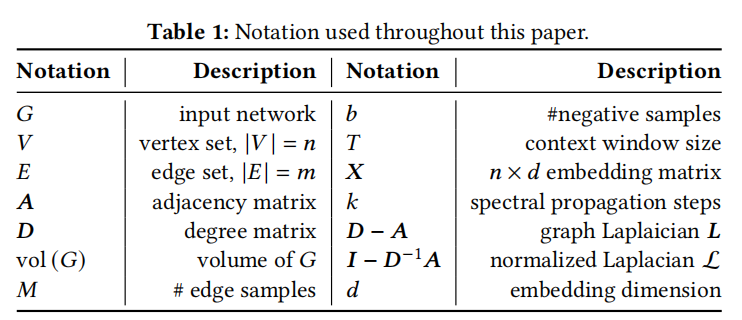

#### NetMF

矩阵分解方法可以应用于network embedding，DeepWalk的矩阵分解近似的公式如下：

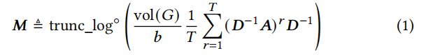

其中T表示random walk的步长(默认为10)，$trunc_log(x) = max(0, log(x))$，$vol(G) = 2m$，其中$(D^{-1}A)^r$是矩阵分解的瓶颈。

trunc_log对embedding的质量至关重要，不能被忽略。

#### NetSMF

[NetSMF: Large-Scale Network Embedding as Sparse MatrixFactorization](https://arxiv.org/pdf/1906.11156)

一个减轻公式1在构建矩阵的开销的方法是使用采样算法，r-step random walk的矩阵$(D^{-1}A)^r$可以近似表示为重复r次算法1。

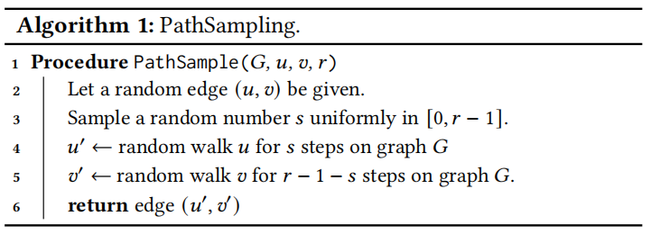

提高random walk的有效采样是lightNE的出发点。

#### ProNE

[ProNE: fast and scalable network representation learning](https://www.ijcai.org/proceedings/2019/0594.pdf)

Prone首先进行奇异值分解，对于给定的embedding矩阵，在归一化的拉普拉斯矩阵使用低次多项式对矩阵的每一列进行滤波。

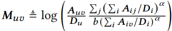

$b = 1,\alpha=0.75$

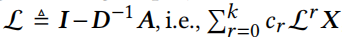

$c_r$是Chebyshev多项式的系数，$k$设置为10左右。

### LightNE Algorithm Design

LightNE的算法涉及包含两个步骤：

- 使用NetSMF新的edge downsampling算法，提高了采样的复杂性。
- 使用ProNE的spectral propagation来增强NetSMF的embedding。

#### NetSMF with Edge Downsampling

NetSMF提出使用路径采样算法近似r-step random walk矩阵$(D^{-1}A)^r$，时间复杂度为$O(m)$，对于数十亿数量级的边来说，仍然需要在保证理论优势的前提下减少采样的复杂性。

`Our approach is to downsample edges that will be added the sparsifier ???`。

对于每个采样边$e = (u, v)$，有一定概率$p_e$修改权重为$A_{u,v}/p_e$并添加到sparsifier中。

根据图的拉普拉斯算子，调整边权重确保downsampled graph是对原始图的unbiased estimation。

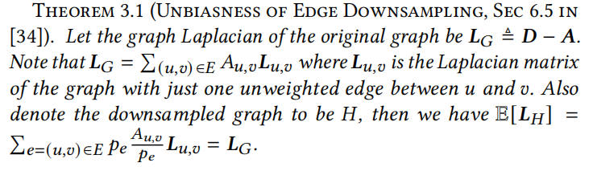

设置采样概率$p_e$作为effective resistance的上界，可以保证近似的准确度，$p_e \leftarrow min(1, CA_{u,v}R{U,v})$

#### Embedding Enhancement with spectral Propagation

## System Design

LightNE包含两步，NetSMF和spectral propagation，其中NetSMF可以分成两个sub-steps。

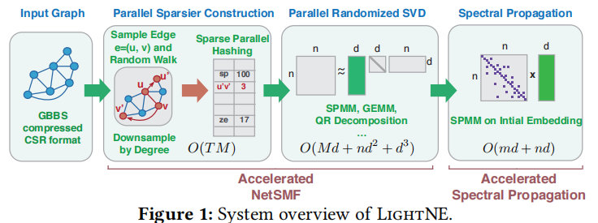

#### Sparse Parallel Graph Processing

LightNE是在建立在Graph Based Benchmark Suite(GBBS)上，GBBS扩展了Ligra的接口

关于数据的压缩通常使用的CSR格式，LightNE需要更好的压缩方法以减少内存的开销，这里采用的是[Ligra+](https://people.csail.mit.edu/jshun/ligra+.pdf)的parallel-byte格式。

sequential byte coding使用差分编码可以有效地进行压缩，但是对于度很大的顶点来说，抑制了并行性。

Ligra+将度数高的节点拆分成block，每个block内部进行差分编码。

LightNE是首个提出将GBBS和Ligra+用于解决network embedding。

#### Parallel Sparsifier Construction

Parallel Sparsifier的构造包含两个部分：

- 执行算法1的PathSampling生成大量的边采样。
- 聚集采样数据，计算每种采样出现的频率。

> Parallel Per Edge PathSampling by GBBS.

算法1需要对边进行随意访问，这对图数据的压缩带来很大的挑战。

简单的解决方法有：

- 将所有的边存储在数组中，这支持O(1)的查询。
- 对顶点度数的前缀和执行二叉搜素。

前者增加了内存的开销，后者可以提供O(logn)的查询。

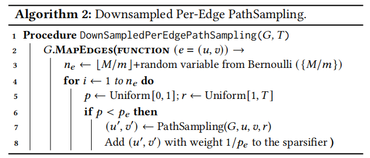

作者观察到，在共享内存中的random walk需要有效地获取边相关的顶点，这是因为使用parallel-byte格式对图进行存储，因此需要对block进行解码，通过实验权衡内存中图的压缩大小和加载任意边的延迟，最终设置block的大小为64。

> Sparse Parallel Hashing

对采样数据的聚集，使用并行的哈希表实现，为每个被采样的边存储一个不同的entry，同时存储一个计数。所有的线程可以并行的访问哈希表，通过XADD指令对计数进行原子操作，`XADD`要比`FETCH-AND-ADD`要快。

### Randomized SVD and Spectral Propagation

Randomized SVD采用的是Intel MKL library。

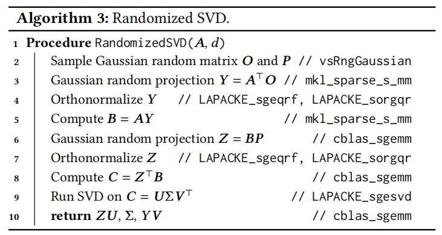

Spectral Propagation同样涉及到线性代数计算，但是不需要计算$L$高次幂，只是重复的计算Sparse Matrix-matrix multiplication(SPMM)，同样可以使用MKL Sparse BLAS进行计算。

## Evaluations

### Experimental Setup

LightNE实验在拥有两个Inter Xeon E5-2699 v4 CPUs(88 virtual cores)和1.5T内存的服务器上进行。

将LightNE和三个系统进行对比：

- PyTorch-BigGraph

  数据集：LiveJournal，任务：链接预测，评估：mean rank(MR)、mean reciprocal rank(MRR)、HITS。

- GraphVite

  数据集：Hyperlink-PLD, 任务：链接预测，评估：AUC。
  
- NetSMF、ProNE+

对于其他数据集，任务：顶点分类，评估：Mico/Macro F1

通过对系统运行时间和系统的开销评估系统的性能表现，环境使用Azure Cloud。

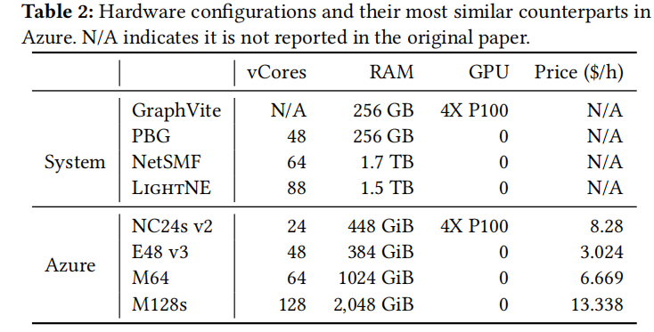

### Large Graphs

> Conparision with PyTorch-BigGraph

LightNE设置T=5和PBG在数据集LiveJorunal进行对比，可以看出LightNE在各个评测指标上都要优于PBG，同时速度比PBG快27x，花费少8x。

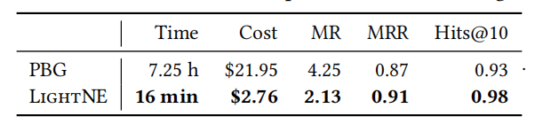

> Comparision with GraphVite

GraphVite支持在Hyperlink-PLD上的链接预测以及在Friendster上的节点分类，LightNE

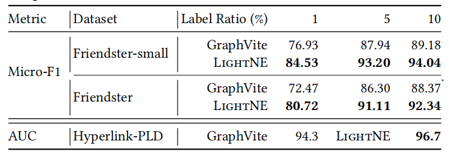

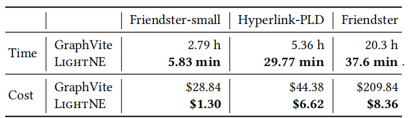

通过对比可以看出LightNE在准确度、时间和花费上都要优于GraphVite，速度上比GraphVite上快29x，11x，32x，花费少22x, 6.7x, 25x。

> Comparision with NetSMF and ProNE+

> Ablation Study on Running Time

> Ablation Study on Sample Size

### Very Large Graphs

### Small Graphs

<!-- Q.E.D. -->