<!-- more -->

---

Marius (OSDI 21) [paper](https://www.usenix.org/system/files/osdi21-mohoney.pdf) [code](https://github.com/marius-team/marius) [slide](https://www.usenix.org/system/files/osdi21_slides_mohoney.pdf) [talk](https://www.youtube.com/watch?v=XP9kUuipK1A)

> 主要工作

1. 表明数据从CPU和外存到GPU的移动是现有的graph embedding系统的主要瓶颈。
2. 提出Buffer-aware Edge Traversal Algorithm (**BETA**) 算法，确定数据加载的顺序来最小化IO swap次数。
3. 通过Pileline将BETA和**异步IO**结合，提出第一个利用完整内存层次结构（Disk-CPU-GPU）的图学习系统。

## 背景和相关工作

graph通常定义为$Graph = \{V, R, E\}$，其中V表示顶点集合，R表示边的类型，E表示边的集合。每条边$e = \{s,r,d\}\in E$，分别表示源顶点，关系，目标顶点。

下表是一些公开可获取的数据集，另外还有一些公司内部的数据集，例如Facebook有超过30亿的用户，如果对每个用户学习一个400维的embedding，就会有超过5TB的参数数据，这远远超过了CPU的内存。另外使用高维度的embedding可以提高下游训练的性能。由于GPU内存的限制，图嵌入系统就需要扩展到CPU或外寸上来支持这种大规模图的训练。	

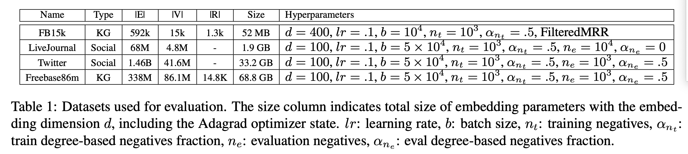

内存超过GPU的处理方法：

1. 使用CPU存储embedding的参数，DGL-KE将顶点的embedding存储在CPU，训练的时候CPU和GPU同步的进行。这种方法的缺点是：
   - 同步训练开销造成GPU计算资源的严重浪费。
   - CPU内存大小限制了训练规模。
2. 将节点划分为不相交的分区并存储在外存中，这解决了CPU内存大小的限制，PBG（Pytorch Big Graph）采用的这种方法，同步的从外存加载分区，采用分区的方法避免了内存的数据拷贝，但是从外存加载数据的时候仍会导致GPU资源的浪费。

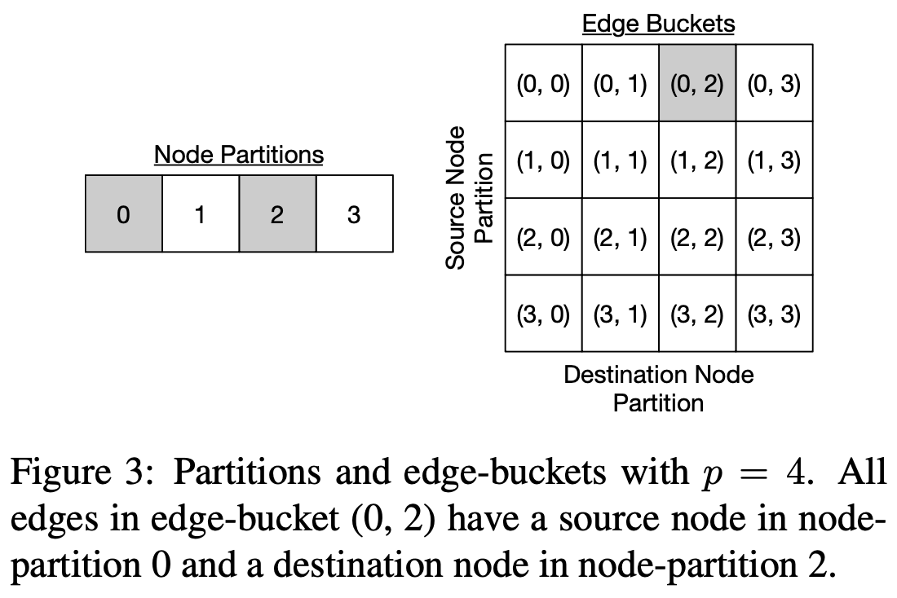

从下图可以看出，DGL-KE因为同步的通信开销，导致GPU利用率只有10%，PBG的GPU的平均利用率为28%，但是当存在分区swap时GPU利用率趋近于零。因此使用分区策略需要解决swap的开销问题。

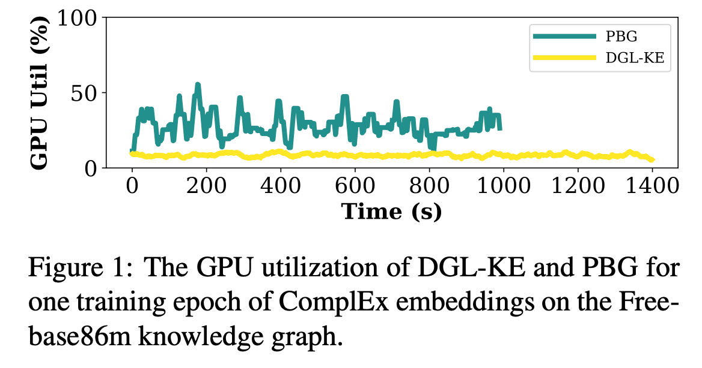

Mairus提出了三种方法来消除数据移动带来的开销：

1. 使用Pipeline和async IO来隐藏数据的移动。
2. 在CPU上设计一个partition buffer。
3. 提出最小化IO swap次数的Buffer-aware Edge Traversal Algorithm（BETA）算法。

## 流水线

Marius按照算法1，将流水线分为5步，其中四步是数据的移动（多线程），另外一个是GPU的计算（单线程）。

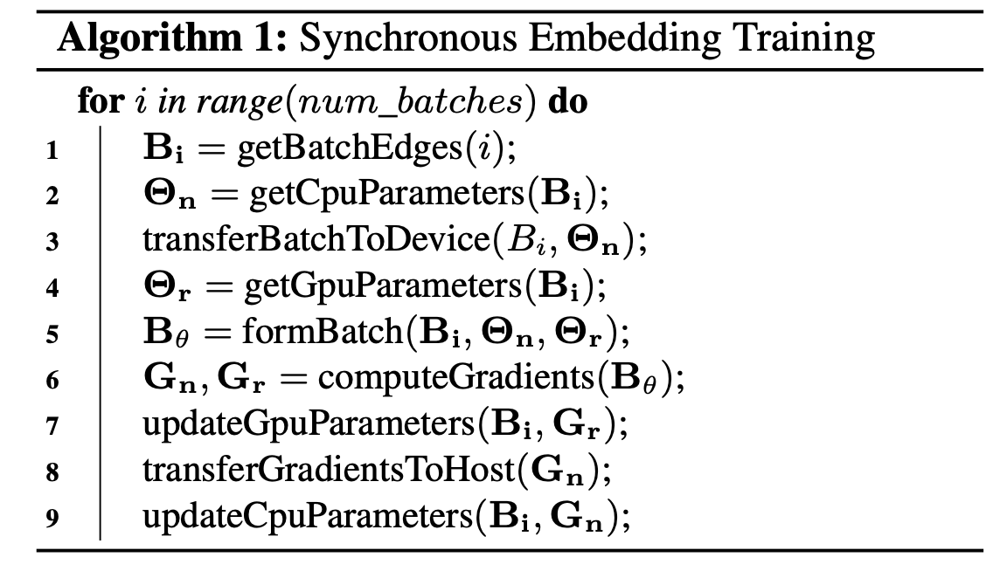

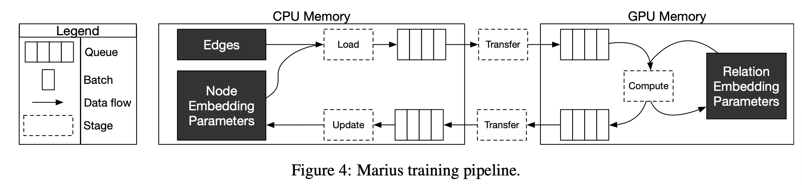

流水线带来的主要问题就是会使用旧的参数，Marius的做法是加一个Bound限制流水线的进度。

实际情况下**顶点的embedding的更新是非常稀疏**的，甚至实际上可能并不存在使用旧数据的情况。

| 数据集      | 顶点数     | batch | bound |
| ----------- | ---------- | ----- | ----- |
| Freebase86m | 86 million | 10k   | 16    |

每个batch中包括20k个点，pipeline同时最多有320k个embedding，不到总体的0.4%。但是对于边类型的更新并不适用，因为边的类别通常非常少（15K in Freebase86m)。因此Marius将关系的embedding放到GPU同步的进行更新。

## Edge Bucket Orderings

首先回顾下之前说的分区，通过分区可以处理超过CPU内存大小的模型。

每个epoch在做训练的时候，需要处理所有的Edge Bucket。在处理每个Edge Bucket的时候，对应顶点的分区如果不在内存中，需要从外存加载到内存中，这也是使用分区策略的问题所在。

值得注意的是，一旦Edge Buckets的顺序确定，我们就可以对buffer进行预取和缓存替换策略来优化性能。

接下来介绍下Marius如何确定Edge buckets的访问顺序，这也是这篇论文的最大的亮点。

首先在评判一个顺序的好坏，我们需要确定一个基准，也就是分区swap的下限。

假设分区为p，buffer的大小为c，那么swap的最优次数是：$\lceil\frac{\frac{p * (p-1)}{2}-\frac{c(c-1)}{2}}{c-1}\rceil$。

接下来介绍BETA算法的构造顺序：

1. 随机将c个分区加载到内存中。
2. 将磁盘中的分区依次和内存中的最后一个分区进行swap，每次交换得到一个新的顺序。
3. 将内存中前c-1个分区替换为磁盘中前c-1个分区，并在磁盘中删除这些分区。
4. 重复2，3直到磁盘为空。

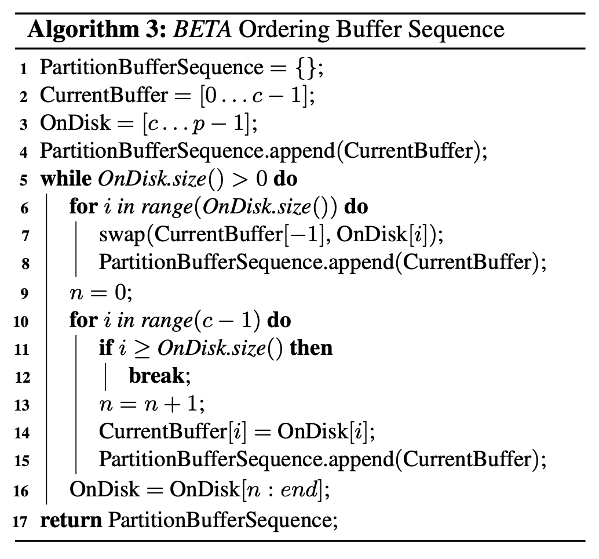

下面举一个分区为6，buffer大小为3的例子。

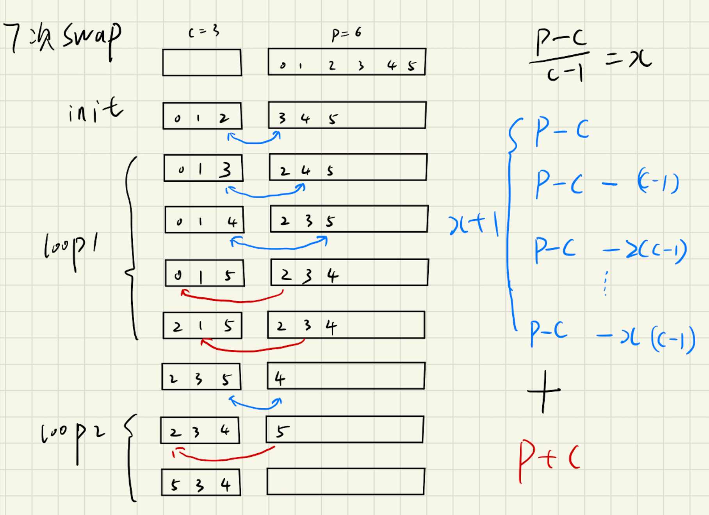

通过对上述序列求和，可得BETA产生的交换次数为：

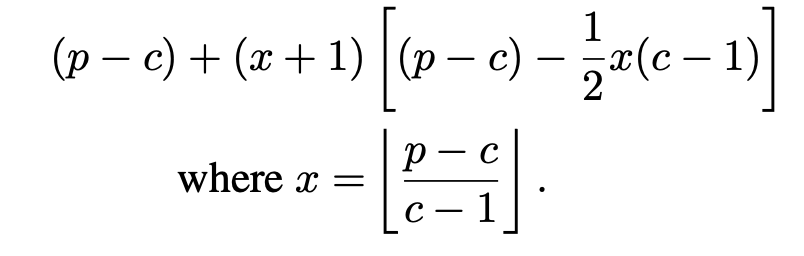

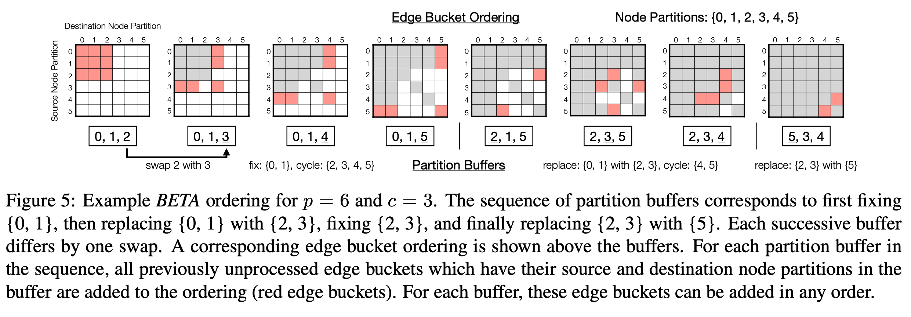

下图是Hilbert和BETA的对比，可以看出BETA swap次数远小于Hilbert。这是因为Hilbert只关注局部性并没有考虑分区和buffer大小这些信息。

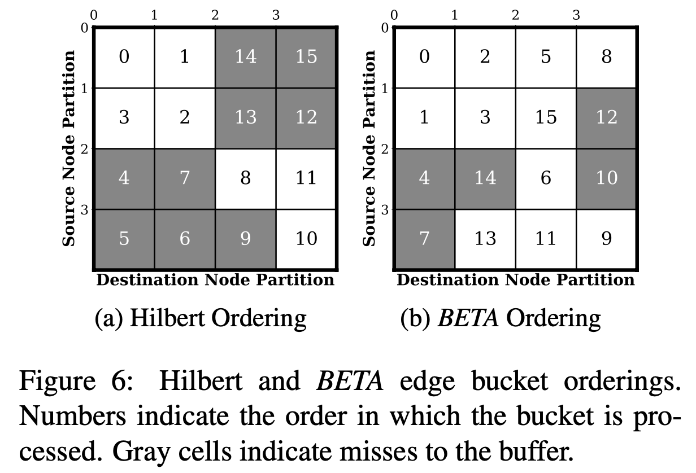

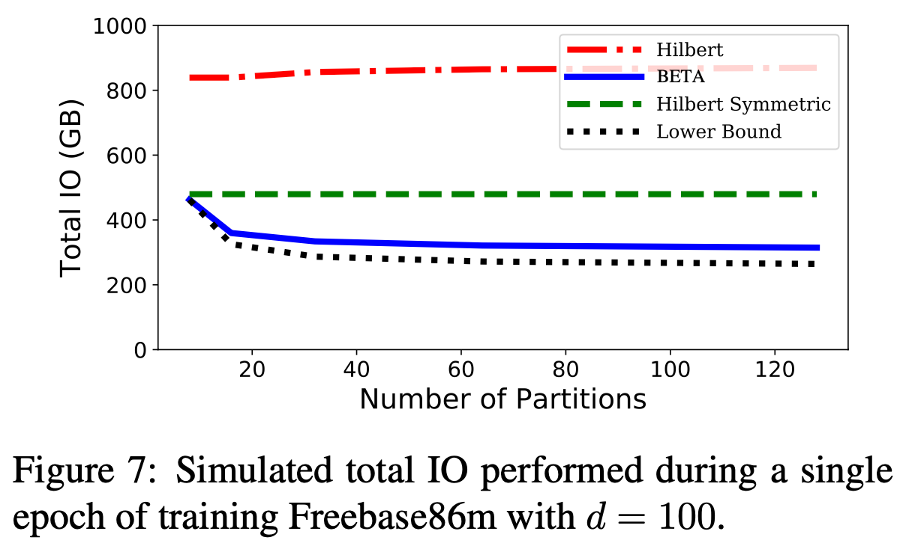

知道了分区加载的顺序之后，就可以根据算法4构建出Edge Bucket的顺序。

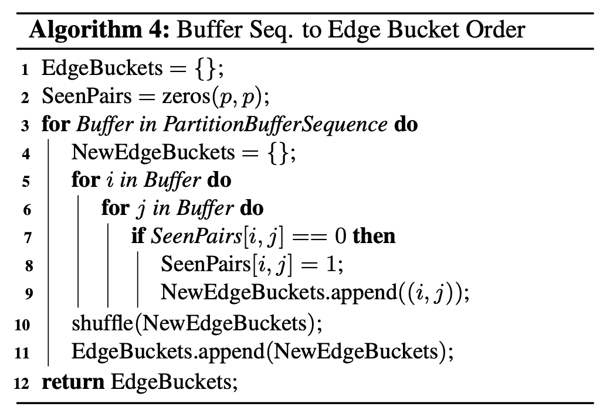

另外Marius根据BETA重新设计了缓存替换策略，利用prefetching thread和wirte thread来最小化swap的开销。

## 实验

> 实验环境

单机测试：AWS P3.2xLarge，1块16G Tesla V100，64G 8vCPUs，400MBps带宽。

多卡测试：AWS P3.16xLarge，8块16G Tesla V100，524G 64vCPUs。

多机测试：4台 c5a.8xLarge，69G 32vCPUs. 对于DGL- KE使用一块Telsa V100 GPU with 32 GB of memory and 200 CPUs with 500 GB of memory.

> 数据集

4个基准数据集，每个系统采用相同的超参数。

FB15K和LiveJournal可以放到GPU内存，因此没有数据移动的开销。

Twitter超过了GPU内存，FreeBase86m超过了CPU的内存限制，DGL-KE不支持，所以只跟PBG对比。

### SOTA系统对比

> FB15K

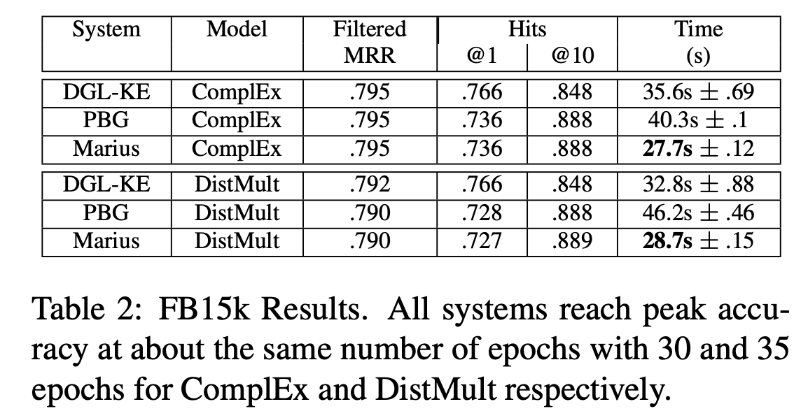

虽然Marius不是为小图设计的，但是通过实验可以看出，Marius可以达到和其他系统相当的准确度，同时训练实现最少。

> LiveJournal

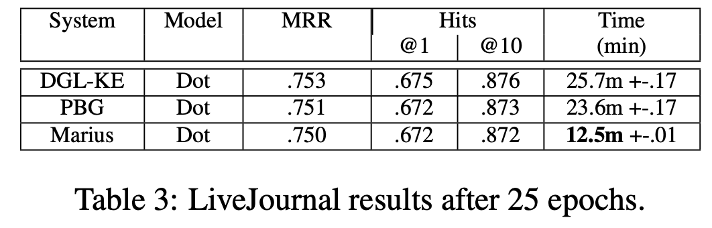

LiveJournal是一个社交网络图，规模是FB15K的两个数量级，同样Marius可以达到相当的准确度，同时训练时间最少。

运行时间的差别主要是因为实现不同，PBG在每个epoch之后需要对参数进行checkoutpoints，这在Marius和DGL-KE中是可选的。

> twitter

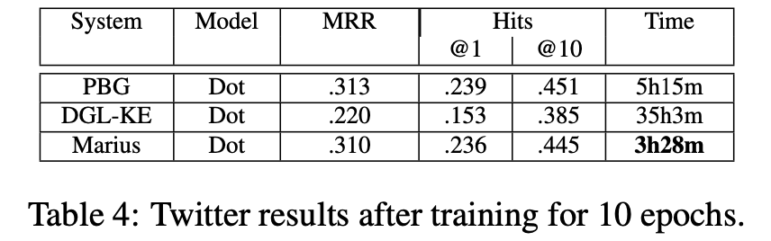

Twitter数据集，Marius训练时间比PBG和DGL-KE分别快1.5、10倍，可以达到和PBG相当的准确度，对于DGL的准确度为什么低，作者说是这跟系统实现的差异有关，因为他们使用的是相同的参数进行的测试。

> FreeBase86m

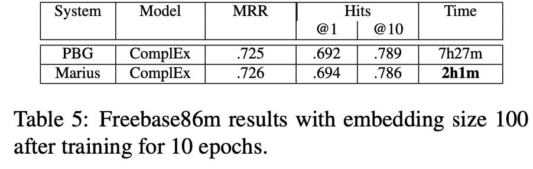

对于FreeBase86m，Marius比PBG快3.7倍，主要因为Marius比PBG更少的IO。

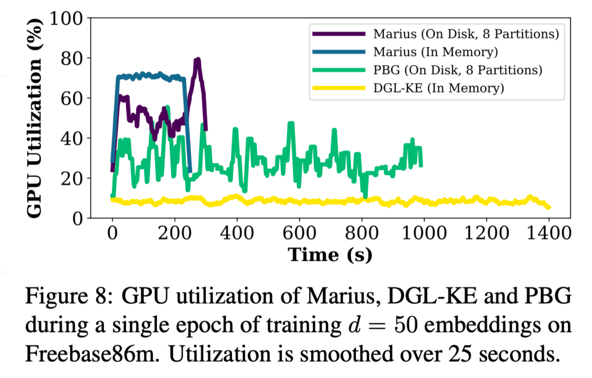

同时Marius的GPU利用率也要比PBG和DGL-KE要高，采用分区的Marius在swap的时候利用率只有轻微的下降。

Marius内存的版本利用率没到100%有两个原因：

- GPU操作使用默认的cuda stream（Pytorch的默认行为）
- CPU的潜在瓶颈

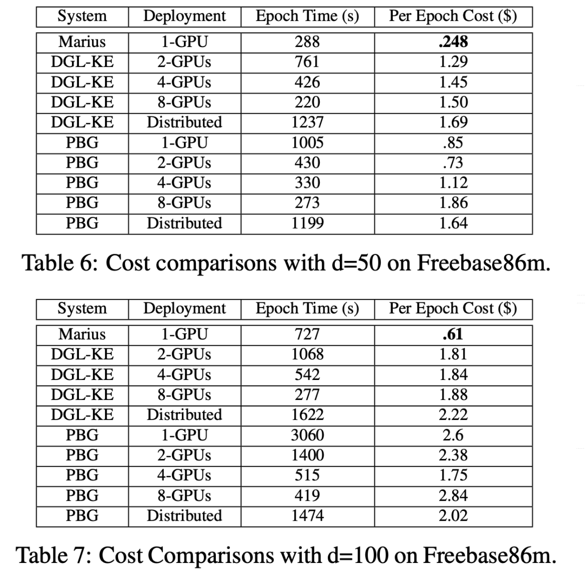

即使是和多GPU、分布式训练对比，Marius也有一定的可比性，另外Marius的花费最便宜。

### Partition Ordering

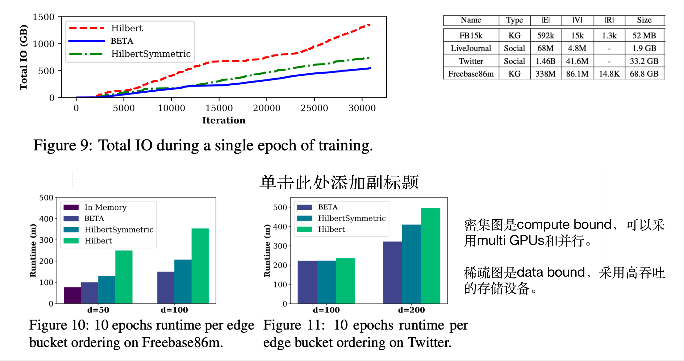

### Large Embeddings

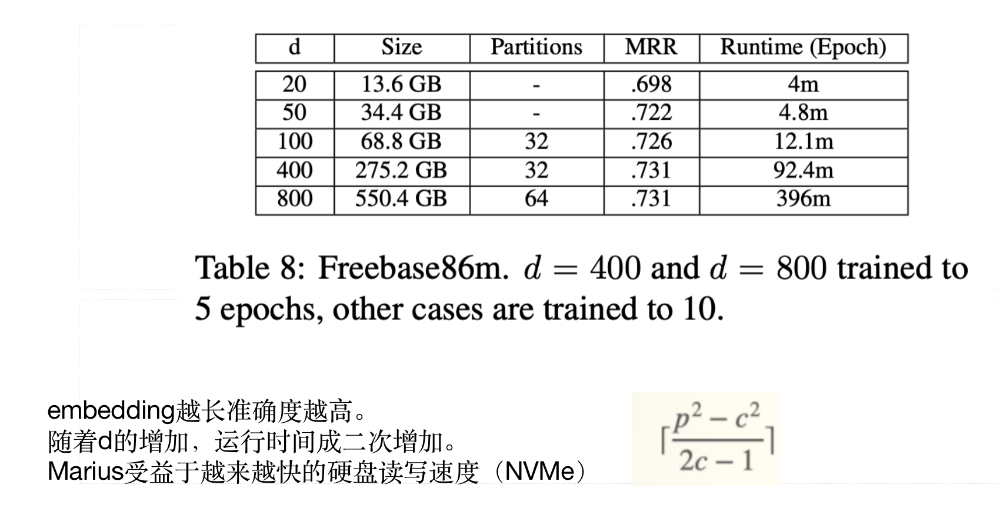

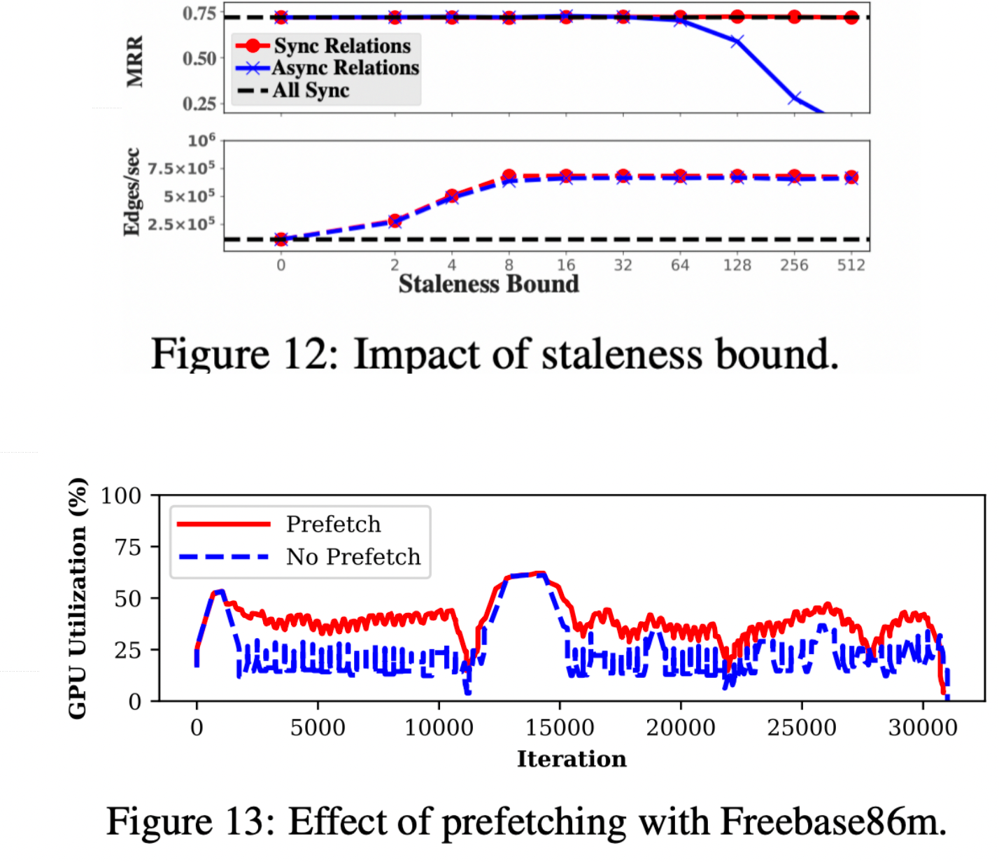

## Future work

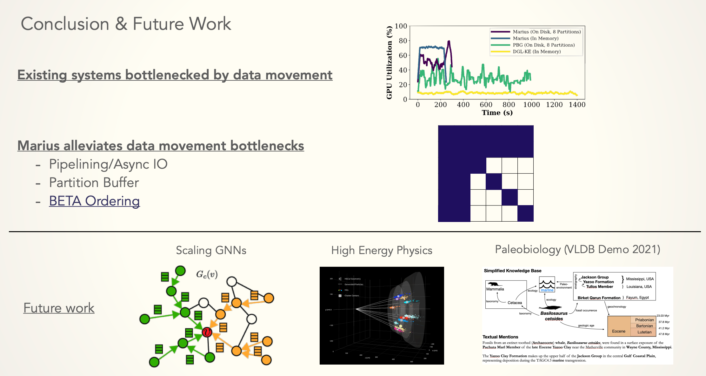

<!-- Q.E.D. -->
