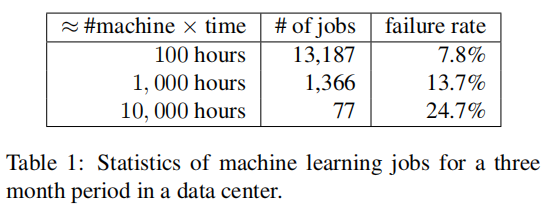
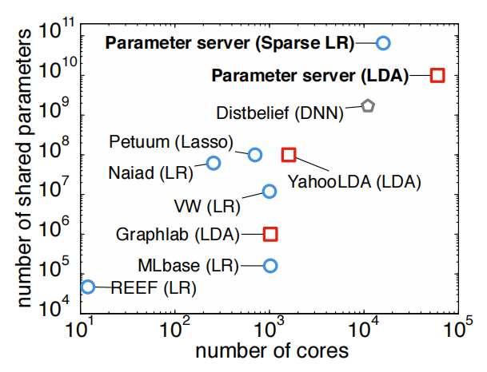
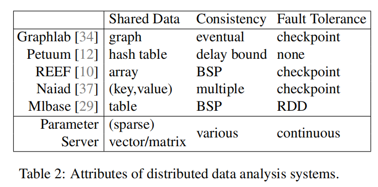
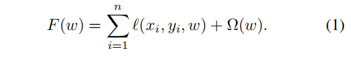
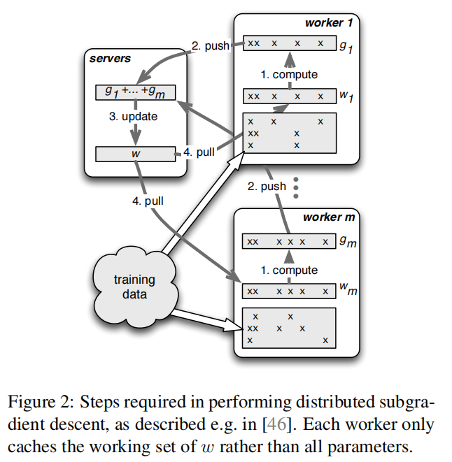
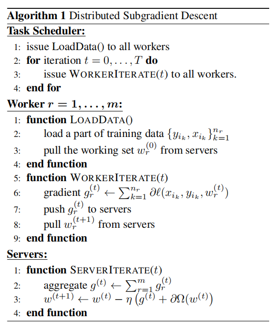
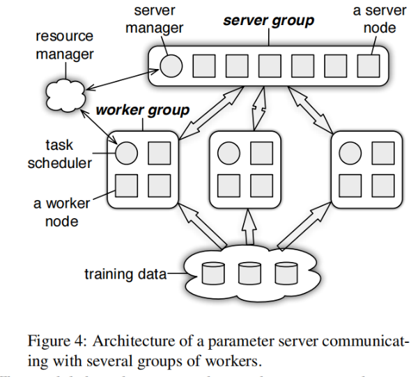
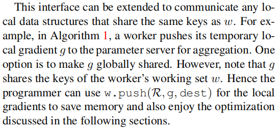
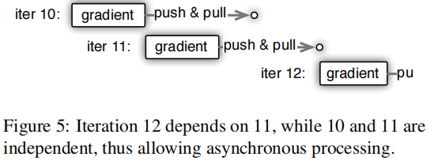
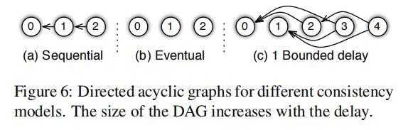

<!-- more -->

---

## 论文地址

[Scaling Distributed Machine Learning with the Parameter Server](http://www.cs.cmu.edu/~muli/file/parameter_server_osdi14.pdf)




## 介绍

分布式优化和推理正在成为解决大规模机器学习问题的先决条件，随着数据的增加产生的复杂模型，单机无法迅速的解决这些问题，而实现一个高效的分布式算法并非易事，密集的计算和通信数据量都需要精心的设计，现实生活中的训练数据可以达到1TB~1PB，各个worker需要频繁的访问这些模型参数，这就带来了三个挑战：

- 访问参数需要大量的带宽。

- 大多机器学习算法是线性的，同步和机器延迟严重形象了整体的性能。

- 在云环境下集群的训练，容错是至关重要的。

  

### 贡献

作者提出了参数服务器的第三代开源实现，重点关注于分布式推理的系统层面，为开发者带来了两种优势：

- 通过分解机器学习系统中常用的组件，使得特殊用途的代码保持简洁。
- 作为系统级别优化的共享平台，提供鲁棒性、通用性、高性能的实现，可以处理从sparse logistic regression到topic model和disributed sketching等各种类型的算法。

作者提出的参数服务器由5种关键特性：

- 高效的通信，采用异步的方式进行通信，减少了网络流量和开销。
- 灵活的一致性模型，宽松的一致性隐藏了同步的开销和延迟。
- 弹性的可伸缩性，可以方便的添加节点，而不需要重启正在运行的框架。
- 容错和持久性，从非灾难性机器故障可以在1s内恢复而不用中断计算，向量时钟保证分区和故障后定义良好的行为。
- 容易使用，全局共享参数表示为向量和矩阵的形式，方便机器学习应用的开发。

### 工程挑战

构建高性能的参数服务器有两个关键的挑战：

- 通信

  参数抽象为键值对的形式开销比较大，因为value通常很小(float、int)，很多学习算法表示为结构化的数学对象，例如向量和矩阵，在每次迭代，通常只有一部分需要更新，这为参数服务器在更新的通信、处理提供自动批处理的机会。

- 容错

  参数的实时复制支持热故障转移，故障切换和自动修复通过将机器的删除和添加视为故障和修复，从而支持动态的扩展。




上图是多个系统执行监督学习和无监督学习的实验规模总览，其中蓝圈表示sparse logistic regression，红框表示latent variable graphical models，灰色表示deep networks，通过对比可以看出在规模处理器下参数服务器可以覆盖更大数量级的数据。




表2概述了几种机器学习系统的主要特征，参数服务器在一致性上提供最大程度的灵活性，同时唯一提供连续容错性，采用的数据类型可以方便的用于数据分析。


### 相关工作

第一代参数服务器是由A. J. Smola and S. Narayanamurthy提出的 [An architecture for parallel topic models. In Very Large Databases](https://alex.smola.org/papers/2010/SmoNar10.pdf)将分布式缓存(key value)用于同步机制，YahooLDA在此基础上通过实现一个用户可定义的更新原语（set、get、update）的专用服务器和一个更有原则的负载分配算法改进了这个设计。

第二代专用的参数服务器可以在Distbelief（[Large scale distributed deep networks. In Neural Information Processing Systems](https://papers.nips.cc/paper/4687-large-scale-distributed-deep-networks)）中找到，其中的同步机制为[Parameter server for distributed machine learning](https://www.cs.cmu.edu/~muli/file/ps.pdf)。

基于Hadoop的Mahout和基于Spark的MLI都采用了MapReduce框架，MLI和Spark的关键点是保存迭代间的状态。

GraphLab使用图抽象的异步通信机制，缺少像基于map/reduce的可扩展性，同时依赖于粗粒度的快照恢复，两者阻碍了可伸缩性。

从某种角度来说，参数服务器的核心目标是捕获GraphLab的异步特性，同时减少它的结构限制。

Piccolo在机器之间共享和聚集状态，worker在本地聚集，然后同步到server端，但是缺少机器学习的特定优化：消息压缩、复制和通过依赖图的变量一致性模型。

## 机器学习

机器学习的目标通常是优化一个最小化模型，不断地根据梯度优化模型的参数，从而提高预测的准确度。



公式1是一个常见目标函数的求解，$l$表示损失函数，$\Omega$为参数的正则化。




图2描述了参数服务器的执行流程，每个worker只需要加载部分数据，每次从server获取新的参数，然后在本地进行计算，最后把梯度传到server，这样就完成了一次迭代。

算法的执行流程如下：




## 系统架构



server group中有多个server节点，每个server节点维持着全局共享参数的一部分，server节点相互通信以复制或迁移参数，来提高系统的可靠性和伸缩性。

server manager node维护server节点的元数据，例如节点的活跃和参数分区的分配。

每一个worker group跑一个应用，每个worker保存一部分训练数据在本地进行计算，worker只与server节点进行通信，用于更新和获取参数信息。

每个worker group都由一个task scheduler，负责给worker分配任务并监督他们的状态，如果添加或删除节点，它会重新调度未完成的任务。

参数服务器支持独立的参数命令空间，允许worker group隔离它们彼此的参数。

多个worker group也可以共享相同的参数名称空间，因为可能同时需要多个worker group处理相同的深度学习任务，以提高并行度。


### (key,value)向量

机器学习算法通常处理线性代数对象，参数服务器将模型共享的参数抽象为(key,value)形式的向量，同时使key有序排列。这减少了优化算法的编程工作，同时可以使用各种高效的线性代数算法库。


### Range Push and Pull

参数服务器提供Range的push和pull，方便程序员和提高计算和网络带宽的效率。

> 这个例子不太懂？




### User-Define Functions on the Server

server节点除了聚集来自worker的梯度，还可以执行用户自定义的函数，因为server端保存着最新的参数，可以执行很多其他的操作。

```bash
At the same time a more complicated proximal operator is solved by the servers to update the model in Algorithm 3. In the context of sketching (Sec. 5.3), almost all operations occur on the server side
```


### Asynchronous Tasks and Dependency

任务的异步是指，调用者在发出任务后立即执行进一步的计算。

调用者在收到被调用者的回复后，将任务标记为完成状态，回复可以是用于自定义函数的返回值、pull指令的（key，value），或是空的应答数据。

被调用者只有在任务返回而且所有的子任务都完成，才会将任务标记为完成状态。


默认情况下，被调用者并行的执行任务，调用者希望串行的执行任务，因为一些任务依赖另一个任务。



图5描述了WorkIterate三个迭代的例子，其中10和11相互独立，12依赖于11，11在10完成梯度计算后立即执行，而12需要等待11pull完成才能开始执行。


### Flexible Consistency

任务的独立性使得可以并行的执行多个任务，从而提高了系统的效率，但是这回造成数据的不一致性，对于图5来说，迭代11在10未更新前就开始计算梯度，即$g_r^{11} = g_r^{10}$，这种非一致性潜在的减慢了模型的收敛。

但是对于一些其他的算法可能对非一致性不太敏感，例如range的pull和push，不一致性只会影响range对应的参数。

系统性能和算法的收敛素的的权衡依赖于多个变量：算法对一致性的敏感程度、训练数据的特征相关性、硬件组件的差异，和其他机器学习强制用户采用特定的依赖性不同，参数服务器提供给算法设计者一个灵活的一致性模型。



图6描述了3中不同的依赖模型。

- Sequential，所有的任务按照顺序执行，通常也称为Bulk Synchronous Processiong。
- Eventual，所有的任务同时进行，只有在底层算法在延迟方面是健壮的才建议这样做。
- Bounded Delay，设置最大的延迟时间$\tau$，当前$\tau$个任务没有完成时，就会阻塞当前任务。$\tau = 0$为sequential一致性模型，$\tau = \infty$为Eventual一致性模型。

依赖图可以是动态的，调度器根据当前任务执行的情况，动态的调整$\tau$的大小。

> 这个地方不太懂?

```bash
the caller traverses the DAG. If the graph is static, the caller can send all tasks with the DAG to the callee to reduce synchronization cost.
```


### User-defined Filters

用户自定义过滤器可以对任务的数据一致性进行细粒度的控制。

例如一个significantly modified filter只push自上次同步以来更新超过阈值的参数。

第5.1节的KKT，只push’可能影响server权重的梯度。


## 实现


<!-- Q.E.D. -->

