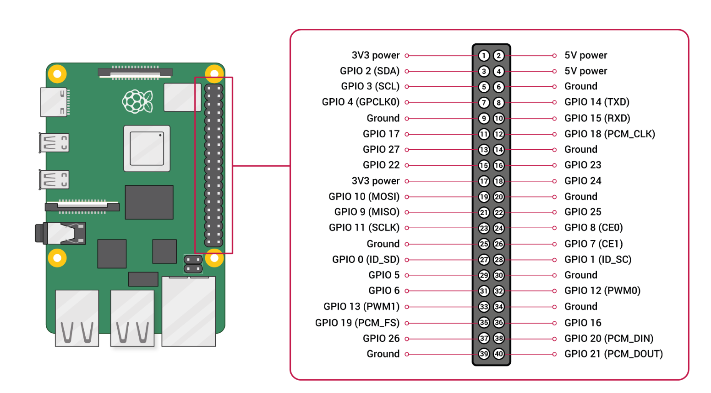
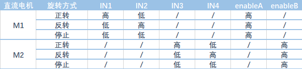

<!-- more -->


## GPIO




### pinout

```bash
sudo apt install python3-gpiozero
pinout
```


### gpio readall

```
wget https://project-downloads.drogon.net/wiringpi-latest.deb
sudo dpkg -i wiringpi-latest.deb
```


## 材料与安装

| 名称              | 数量 | 规格                         |
| ----------------- | ---- | ---------------------------- |
| 树莓派4B          | 1    | 4G                           |
| L298N电机驱动模块 | 1    |                              |
| 直流减速电机      | 4    | 工作电压：3-6V，减速比：1:48 |
| 神火18650         | 2    | 3.7V                         |
|                   |      |                              |
|                   |      |                              |


这里使用树莓派的GPIO的BCM编号。 

### L298N



IN1、IN2、IN3、IN4分别接到树莓派的5、6、13、19上。

ENA、ENB接到树莓派的20、21。


### 电源

这里采用的是树莓派和L298N都单独供电，树莓派使用的是5V3A的充电宝供电，L298N使用电池盒供电。

电池盒的正极和负极，分别接到L298N的+12V、GND。

因为都是单独供电，所以将L298N的GND和树莓派的GND相互连接，这样方便同步逻辑信号。


## 参考

```
# websocketd
http://websocketd.com/
https://github.com/joewalnes/websocketd
https://websockets.readthedocs.io/

# 

```


<!-- Q.E.D. -->