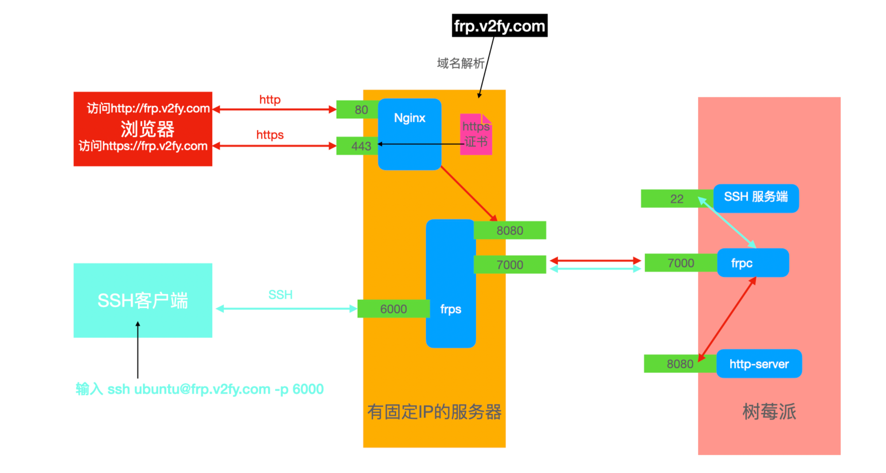

<!-- more -->

---


> 网络拓扑图

图片来自：https://cdn.fangyuanxiaozhan.com/assets/1633067238450eSkTFTi2.jpeg




## 服务器配置


### Nginx代理转发

```bash
sudo vim /etc/nginx/conf.d/your_server_domain.conf

# your_server_domain:80 => http://127.0.0.1:8080;
server {
    server_name      your_server_domain;
    listen           80;
    location / {
        proxy_pass http://0.0.0.0:8080;
        proxy_set_header Host $host:80;
        proxy_set_header X-Real-IP $remote_addr;
        proxy_set_header X-Forwarded-For $proxy_add_x_forwarded_for;
    }
    error_page 404 /404.html;
        location = /40x.html {
    }
}

# pi.sanoz.top => http://127.0.0.1:8080;
server {
    listen       443 ssl http2;
    listen       [::]:443 ssl http2;
    server_name  your_server_domain;
    location / {
        proxy_pass http://127.0.0.1:8080;
        proxy_set_header Host $host:443;
        proxy_set_header X-Real-IP $remote_addr;
        proxy_set_header X-Forwarded-For $proxy_add_x_forwarded_for;
    }

    ssl_certificate "your_crt_file";
    ssl_certificate_key "your_key_file";
    ssl_session_cache shared:SSL:1m;
    ssl_session_timeout  10m;
    ssl_ciphers HIGH:!aNULL:!MD5;
    ssl_prefer_server_ciphers on;

    # Load configuration files for the default server block.
    include /etc/nginx/default.d/*.conf;

    error_page 404 /404.html;
        location = /40x.html {
    }

    error_page 500 502 503 504 /50x.html;
        location = /50x.html {
    }
}


# 重启nginx服务
sudo nginx -t
sudo systemctl restart nginx
```


### frps

```bash
# install frp
wget https://github.com/fatedier/frp/releases/download/v0.39.0/frp_0.39.0_linux_386.tar.gz
tar xvf frp_0.39.0_linux_386.tar.gz

# 修改配置文件 frps.ini
[common]
bind_port = 7000
vhost_http_port = 8080 # 转发8080到客户端
```


### pm2

使用pm2管理守护进程。

```bash
sudo apt install npm
sudo npm i pm2 -g

# 创建脚本文件
vim start_frps.sh
./frps -c frps.ini

# 启动 pm2
pm2 start  /home/sanzo/frp_0.39.0_linux_386/start_frps.sh
pm2 save

# 开机自启
pm2 startup
```


## 树莓派配置


### frpc

```bash
# install frp
wget https://github.com/fatedier/frp/releases/download/v0.39.0/frp_0.39.0_linux_arm.tar.gz
tar xvf frp_0.39.0_linux_arm.tar.gz

#修改frpc.ini
[common]
server_addr = your_server_domain
server_port = 7000

[web]
type = http
local_ip = 127.0.0.1
local_port = 8080
custom_domains = your_server_domain

[ssh]
type = tcp
local_ip = 127.0.0.1
local_port = 22
remote_port = 6000

```


### pm2

```bash
# install node
sudo wget https://nodejs.org/dist/v14.18.0/node-v14.18.0-linux-arm64.tar.xz
sudo tar xvf node-v14.18.0-linux-arm64.tar.xz

vim ~/.bashrc
export NODE_HOME=/opt/node-v14.18.0-linux-arm64
export PATH=$NODE_HOME/bin:$PATH
source ~/.bashrc

# install pm2
npm install pm2 -g

vim start_frpc.sh
/opt/frp_0.37.0_linux_arm64/frpc -c /opt/frp_0.39.0_linux_arm/frpc.ini

# 启动pm2
pm2 start  /opt/frp_0.39.0_linux_arm/start_frpc.sh
pm2 save

# 开机自启
pm2 startup
```


### httpd服务

这里使用docker提供http的服务。

```bash
docker pull httpd

docker run -d --restart=always --name http_server -p 8080:80 -v /home/ubuntu/data:/usr/local/apache2/htdocs httpd
```


## 参考链接

https://www.runoob.com/docker/docker-install-apache.html

https://www.v2fy.com/p/2021-10-01-pi-server-1633066843000/


<!-- Q.E.D. -->
